
<strong>Curso Data Analysis - Módulo 3 PREWORK de Fundamentos de Python</strong>

<strong>PREWORK SESIÓN 1</strong>

### Introducción

¡Bienvenido al módulo de Procesamiento de Datos con Python! En esta primera sesión aprenderemos a usar algunas herramientas sumamente importantes que estaremos utilizando a través de todo el módulo. Empezaremos platicando rápidamente sobre el Procesamiento de Datos y por qué es tan importante. Después, aprenderemos acerca de Jupyter Notebooks y por qué son útiles para los científicos de datos. Además, aprenderemos algunas cosas básicas del lenguaje de programación Python.

#### Objetivos

1. Identificar la razón por la cual el Procesamiento de Datos es tan importante para la Ciencia de Datos.
2. Aprender a usar Google Colab y a leer archivos y datasets desde un Jupyter Notebook.
2. Aprender a utilizar Jupyter Notebooks.
3. Identificar y utilizar los principios básicos de Python.

### ¿Por qué es importante el Procesamiento de Datos?

Todo proyecto de Ciencia de Datos tiene una serie de pasos necesarios para ser realizado con éxito. Normalmente todo empieza con la identificación de un problema en el mundo real. Después de encontrar un problema que creemos que requiere una solución, el paso siguiente es entender el problema. Para entender el problema, necesitamos datos. Puede que ya exista una base de datos disponible que haya sido construida para recopilar instancias del proceso que estamos estudiando. Puede que esa base de datos aún no exista y primero necesitemos pensar sobre cómo recopilar esos datos. De cualquier manera, normalmente el proceso de recopilación y adquisición de los datos es un proceso algo confuso. La realidad no es ordenada, y nuestros datos van a ser un reflejo de esa realidad. Es muy probable que a la hora de obtener nuestra base de datos, nos demos cuenta de que está llena de errores: datos vacíos, formatos inadecuados, columnas innecesarias, tipos de datos incorrectos, la lista sigue y sigue y sigue.

Si intentamos hacer análisis estadístico o visualizaciones de datos con una base de datos desordenada, nos toparemos con muchos problemas. Nuestros análisis serán imprecisos y lo más probable es que terminemos con conclusiones incorrectas. Aquí es donde entra el Procesamiento de Datos. El Procesamiento de Datos reúne toda una serie de herramientas que sirven para explorar, limpiar, transformar, ordenar y estructurar los datos de manera que puedan ser útiles para su posterior análisis y visualización. En este módulo aprendemos cómo realizar estos procesos esenciales y nos prepararemos para poder realizar procesos aún más complejos en módulos posteriores.

### Clonar nuestro repositorio

Para poder realizar los ejercicios diseñados para este módulo es necesario que clones el repositorio del módulo a tu computadora. Probablemente ya hiciste esto en los módulos anteriores, pero en caso de que no lo hayas hecho, he aquí un tutorial.

=======
### Software que vamos a usar

Para realizar los ejercicios de este módulo vamos a usar Jupyter Notebooks, Google Drive y Google Colab. A continuación vamos a ver como realizar la preparación de estas herramientas para que puedas sacar el mejor provecho.

### Creando un Acceso Directo hacia los Datasets

Dado que este es un curso de Análisis de Datos, es obvio que vamos a estar usando muchos conjuntos de datos.

Para poder acceder a ellos durante el módulo, lo primero que necesitas es una cuenta de Google Drive. Si aún no tienes una puedes ir a [este link](https://accounts.google.com/signup/v2/webcreateaccount?service=writely&continue=https%3A%2F%2Faccounts.google.com%2FManageAccount%3Fnc%3D1&gmb=exp&biz=false&flowName=GlifWebSignIn&flowEntry=SignUp) para crear una. Ya que hayas creado tu cuenta, puedes proseguir con los siguientes pasos.

Los conjuntos de datos que vamos a usar se encuentran [aquí](https://drive.google.com/drive/u/1/folders/10xbeqUsp0HbvbWXMGBp5evnBsJ3j9NwQ). Accede al link para ir a la carpeta donde están guardados los datasets de la sesión. Verás algo como esto (puede ser un poco distinto):

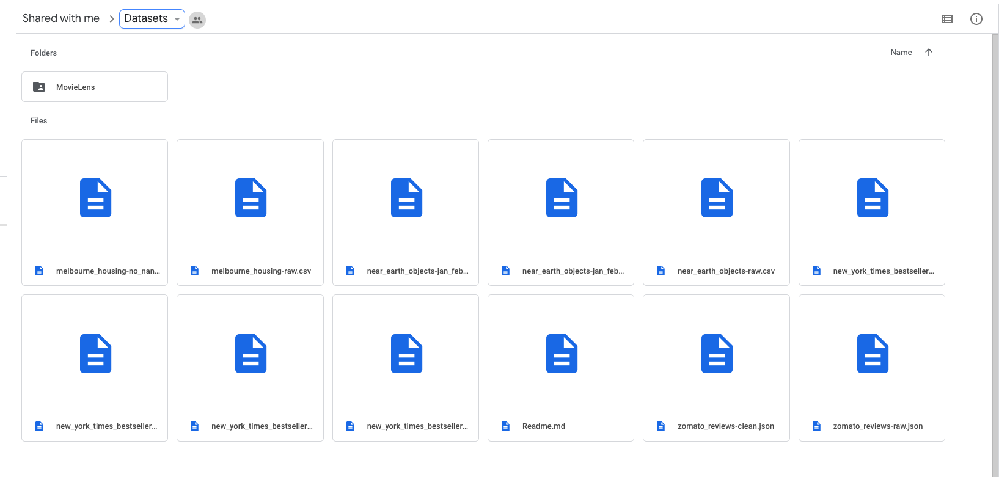

En caso de que no hayas hecho login en tu cuenta de Drive, hazlo ahora usando la cuenta que creaste en un paso anterior. Es importante que accedas a la carpeta de Datasets y hagas login desde tu cuenta para poder realizar los pasos siguientes.

Da click en la parte superior, donde está el nombre de la carpeta "Datasets". El siguiente menú se desplegará:

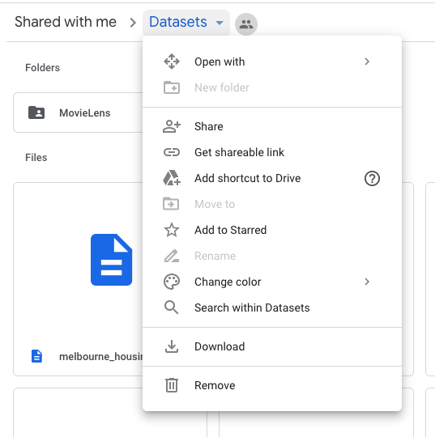

Ahora, lo único que vamos a hacer es agregar un Acceso Directo desde nuestro Drive a esta carpeta. Da click en "Add Shortcut To Drive" (o "Agrega Acceso a Directo a tu Drive") y verás esto:

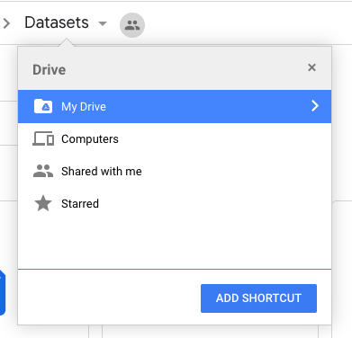

Elige el lugar en tu Drive donde quieres crear el Acesso Directo y da click en "Add Shortcut" (o "Agregar Acceso Directo"):

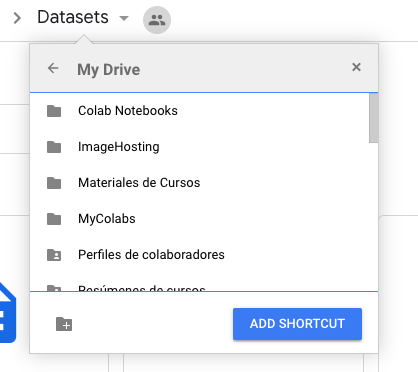

Listo, ahora puedes acceder a esta carpeta "Datasets" desde tu Google Drive.

Vamos a ver ahora cómo vamos a aprovechar esto desde Google Colab. Pero antes, hablaremos rápidamente de qué es un Jupyter Notebooks.

### Jupyter Notebooks

Un Jupyter Notebook es lo que se llama un REPL (Read-Eval-Print Loop), que es un entorno de programación computacional interactivo. ¡Woah! Suena muy complicado. En realidad es bastante simple. Veamos cómo se ve uno:

Como puedes ver, un Jupyter Notebook (a partir de ahora voy a llamarles JN) es algo parecido a un editor de texto. Una diferencia importante es que los JN están divididos en celdas. Una celda es un contenedor que puede tener dentro texto o código (de Python, por ejemplo). 

En nuestra imagen, vemos que nuestro JN comienza con una celda de texto que contiene un título, texto simple e incluso una lista. Estas celdas de texto se llaman celdas tipo Markdown, porque Markdown es el lenguaje que se usa para darles estilo.

Debajo de nuestras celdas de texto tenemos celdas de tipo código. En estas celdas escribimos código en un lenguaje de programación (en este caso Python), que podemos después "correr" para obtener un resultado. El resultado de una celda de código se "imprime" justo debajo de la celda (en el ejemplo puedes ver los resultados de la suma y la multiplicación "impresos" justo debajo de la celda que realizó las operaciones).

¿Ves? En realidad es bastante sencillo, ¿no es así?

Nosotros vamos a correr Jupyter Notebooks en la nube desde una plataforma gratuita que ofrece Google llamada Google Colab. No tenemos que realizar ninguna instalación. Simplemente sigue los pasos siguientes y estarás listo.

### Google Colab

#### Leyendo los Datasets desde Google Colab

Ve a [este link](https://colab.research.google.com/notebooks/intro.ipynb) para acceder a Google Colab.

Primero vamos a aprender cómo acceder a la carpeta Datasets desde Google Colab.

Da click en "File/New Notebook":

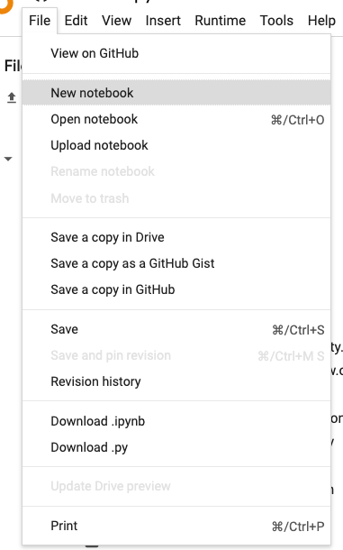

Acabas de crear un Jupyter Notebooks (no te preocupes, ya aprenderemos cómo usarlo).

Vamos a aprender a conectar nuestro Notebook con Google Drive.

Primero, da click en la carpetita que aparece en el menú de la izquierda:

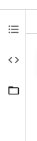

Aparecerá algo como esto:

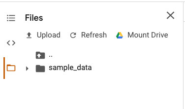

Da click en "Mount Drive" (o "Montar Drive") y una celda como la siguiente aparecerá:

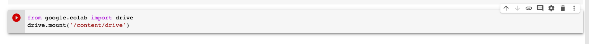

Da click en el botón de Play y obtendrás lo siguiente:

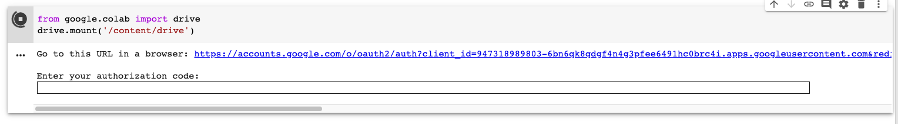

Sigue el "url" y has login con tu cuenta de Google:

Una vez que hagas login, verás una pantalla como ésta:

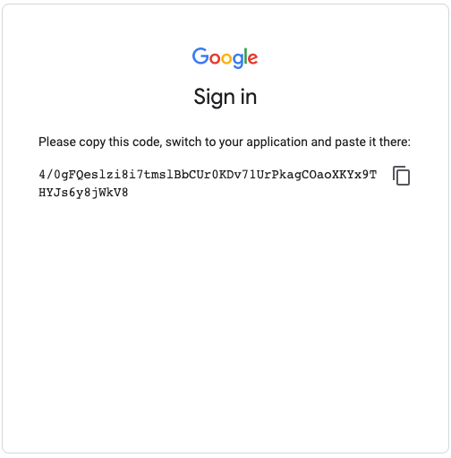

Copia el código y luego regresa a tu Jupyter Notebook. Pega el código en donde te piden que lo hagas y pulsa "Enter". Listo:

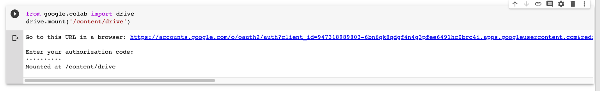

Ahora, en el menú de la izquierda pica "Refresh" o "Refrescar" y verás tu Drive montado:

Si vas a la ruta donde creaste tu Acceso Directo, ¡puedes ver que todos los datasets están disponibles desde ahí!

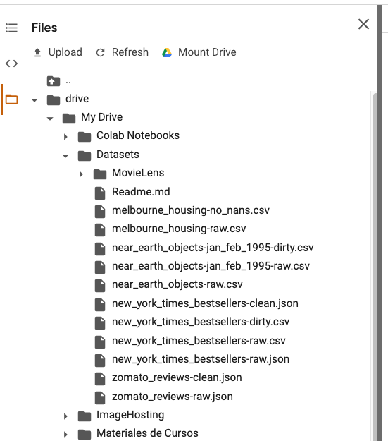

Esto todavía no te va a hacer mucho sentido, pero si yo quisiera leer un dataset desde mi programa, sólo tendría que hacer algo como esto:

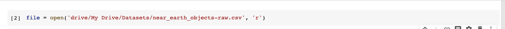

Ya aprendemos a leer archivos más adelante, pero lo importante es que sepas que ya tienes acceso desde Google Colab a todos los conjuntos de datos del módulo. Cada vez que abras un nuevo Jupyter Notebooks, tendrás que volver a realizar el montado de tu Google Drive.

#### Abriendo los Retos del módulo desde Google Colab

Vamos a ver ahora cómo vamos a abrir los Retos del módulo usando Google Colab. Es muy sencillo.

Primero que nada, necesitas el link del repositorio donde están guardados todos los Retos. El link es el siguiente: https://github.com/beduExpert/B1-Procesamiento-de-Datos-con-Python-2020.git.

Ahora, en Google Colab, da click en "File/Open Notebook":

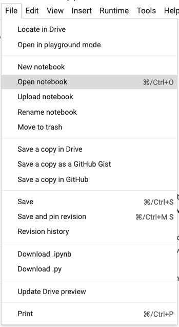

Verás algo como esto:

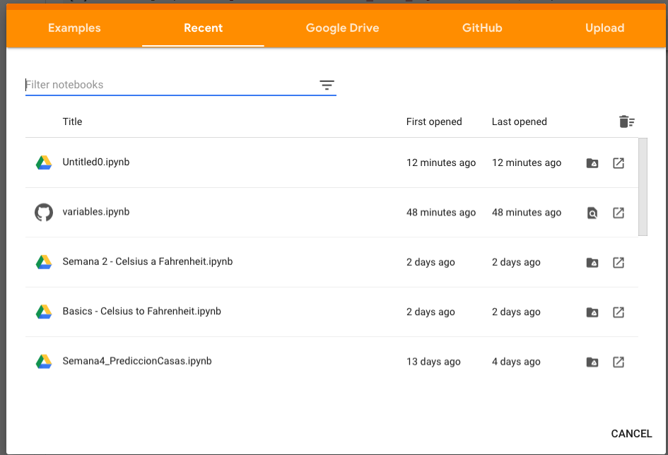

Da click en la pestaña de Github, pega el link del repositorio y da "Enter". Verás algo así:

Ahora puedes leer los archivos del repositorio desde Google Colab. ¡Genial! Para todos los ejercicios que hagas, asegúrante de elegir la branch "student", para que tengas acceso a los archivos correctos:

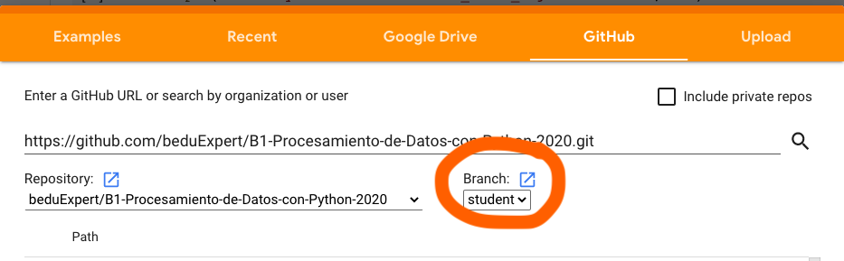

Ahora, simplemente tienes que elegir el archivo que quieras leer. Google Colab sólo puede leer achivos de tipo `.ipynb`. Por ejemplo, si quiero acceder al primer Reto de la Sesión 1, tendría que abrir este archivo:

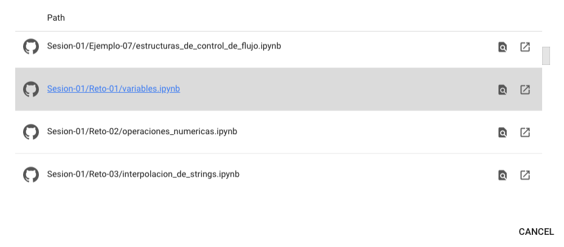

Si doy click, el Reto se abre y estoy listo:

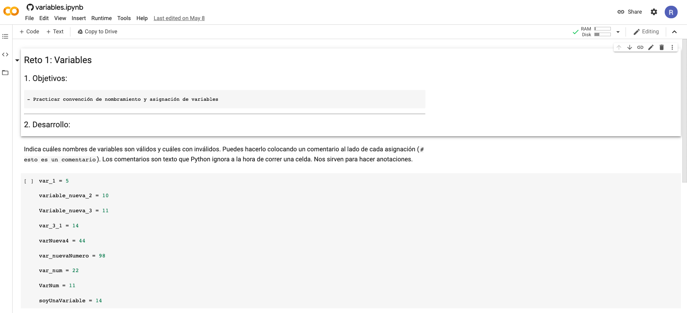

---

Ahora que ya sabes cómo acceder a los conjuntos de datos y a los Retos, vamos a aprender a usar Jupyter Notebooks.

**IMPORTANTE**: Los ejemplos de este módulo no fueron realizados en Google Colab. Se usaron Jupyter Notebooks corriendo localmente. Es por eso que las imágenes pueden verse algo distintas de lo que verás en Google Colab. El funcionamiento es idéntico, así que no te preocupes por eso.

### Usando Jupyter Notebooks

Ya hablamos acerca de la estructura de un JN, vamos a poner todo esto en práctica.

Esto en una celda:

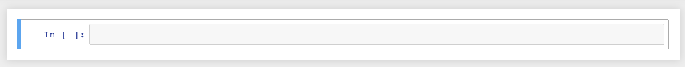

Si presionamos `return` en nuestro teclado, entraremos al `modo edición`, donde podemos realizar cambios a esa celda. Observa que el borde de la celda cambia a color verde:

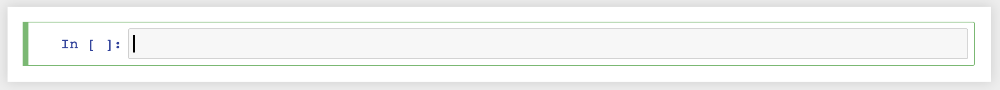

Para salir del modo edición, presionamos la tecla `esc`. Ahora estamos en lo que se llama `modo comandos`, y de indica con un borde azul alrededor de la celda:

Actualmente, nuestra celda es una `celda de código`, si queremos cambiarla a una `celda markdown` (de texto) presionamos las teclas `cmd + b + m` (para Mac, ahorita vemos para Windows) mientras estamos en el `modo comando`:

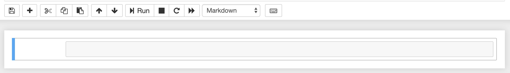

Todos los shortcuts en Google Colab empiezan con las siguiente combinación de teclas:

- Para Mac: Cmd + b
- Para Windows: Ctrl + b

Escribes esas dos teclas y luego el shortcut correspondiente. 

Ahora podemos escribir algo en nuestra celda. Las `celdas markdown` reconocen un lenguaje especial llamado `Markdown` que nos permite agregar estilos a nuestro texto usando algunos signos muy simples. (si quieres aprender más sobre lenguaje `Markdown`, puedes revisar este link: [Markdown Cheat Sheet](https://github.com/adam-p/markdown-here/wiki/Markdown-Cheatsheet)) Presiona `return` para entrar en `modo edición` y teclea lo siguiente:

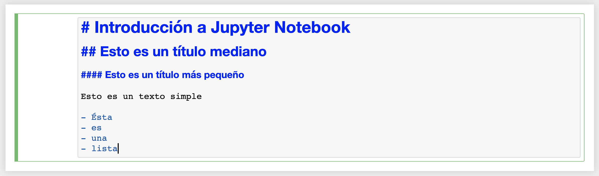

Los signos de numeral (`#`) sirven para escribir títulos en lenguaje Markdown.

Ahora, tenemos que "correr" la celda para que el lenguaje muestre los estilos que hemos definido. Para correr celdas en JN se usa el comando `shift + return`. Mira lo que pasa después de correr la celda:

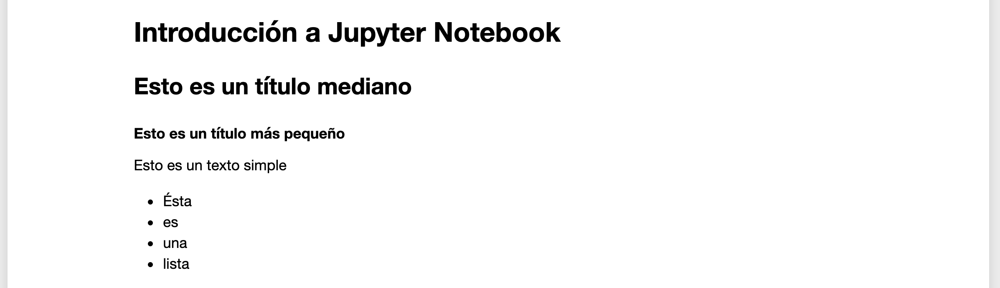

Ahora vamos a utilizar una celda de código. Para crear una nueva celda, entra en `modo comando`y presiona `cmd + b + b` para crear una celda justo debajo de la que está seleccionada. Las celdas nuevas se crean siempre siendo `celdas de código`, pero en el caso de que quieras convertir una `celda markdown` a `celda de código` puedes hacerlo entrando en `modo comando` y presionando la tecla `cmd + b + y`.

Ahora, habiendo seleccionado una `celda de código`, entra en `modo edición` y escribe lo siguiente:

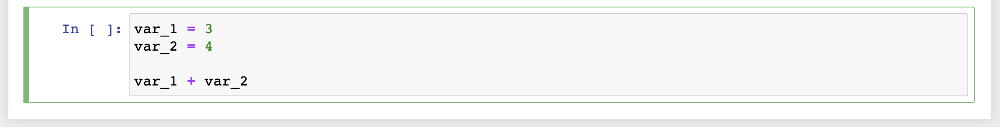

No importa que no entiendas el código aún. Lo importante es saber que para correr esta celda, también tenemos que presionar `shift + return`. Al correr la celda, podemos ver el resultado de nuestras operaciones debajo de la celda que acabamos de correr:

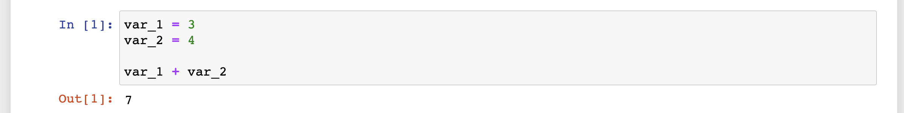

¿Ves el número que sale a la izquierda de la celda (`In [1]:`)? Eso es un contador que nos va diciendo cuántas celdas hemos corrido en nuestra sesión actual. Cada vez que corres una `celda de código`, el contador de esa celda tomará el valor del último contador + 1:

Si queremos volver a iniciar nuestro JN desde cero, podemos ir al menú y elegir la opción `Kernel/Restart & Clear Output`:

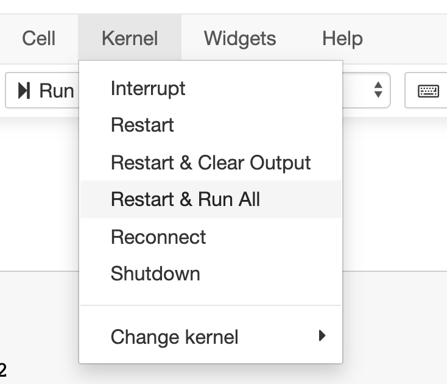

Ésta ha sido una rápida introducción a Jupyter Notebooks. Por supuesto queda mucho por aprender. A través del módulo irás entendiendo cada vez mejor cómo es que funciona este REPL tan útil. Mientras tanto, estamos listos para empezar a aprender el lenguaje de programación Python. ¡Sigamos adelante!

### Introducción a Python

En este prework vamos a hablar rápidamente acerca de algunos de los conocimientos fundamentales que necesitamos para programar en Python. Durante la clase presencial se realizarán numerosos ejercicios prácticos que te ayudarán a dominar estos temas. Por lo pronto, recomiendo ampliamente que vayas reescribiendo todo el código que veas aquí en tu propio JN. **NUNCA** hagas copy-paste. La única forma de aprender de verdad es escribir línea por línea, letra por letra, con tus propias manos.

#### Variables en Python

Los lenguajes de programación suelen incluir las famosas **variables**. Podemos pensar en las variables como "contenedores" de información a largo plazo. Son lugares en tu código donde puedes guardar cosas que quieres volver a utilizar después. Para poder crear una variable lo primero que tienes que hacer es elegir un nombre para la variable:

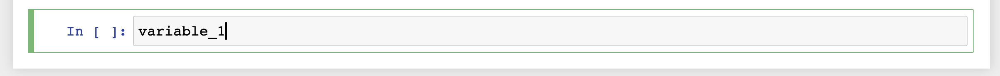

Después usas un `operador de asignación` que es un signo de "igual":

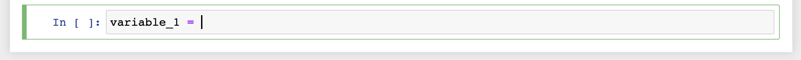

Y acto seguido, escribes el valor que quieres "asignar" a tu variable:

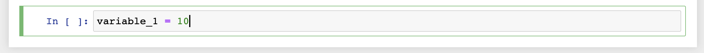

Entonces, el `operador de asignación` lo que hace es indicarle a Python que "el valor que está a la derecha del operador va a ser asignado a la variable que está a la izquierda del operador".

Si corro mi celda, la variable ha sido asignada, y ahora ese número `10`está "guardado" en mi variable `variable_1`. ¿Cómo accedo a ella? Basta con escribir el nombre de la variable y JN me muestra el valor como un `output` de mi celda:

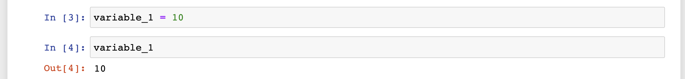

Puedo asignar cuantas variables quiera y Python va a "recordarlas" (cuando uso palabras entre comillas es porque el término que estoy usando no es técnicamente correcto, pero es una analogía útil para entender lo que está pasando) por mí:

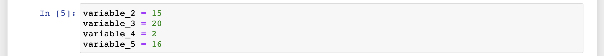

Hemos estado asignando varios números a estas nuevas variables, ¿ahora qué? ¿Qué podemos hacer con esos números? Dado que son números, ¡resulta que podemos realizar operaciones matemáticas con ellos!

#### Operadores matemáticos

Los operadores matemáticos en Python son exactamente los mismos que hemos aprendido en la escuela: `+`, `-`, `*`, `/`. Podemos usarlos para realizar operaciones matemáticas con nuestras variables (ya que nuestras variables tienen **números** asignados):

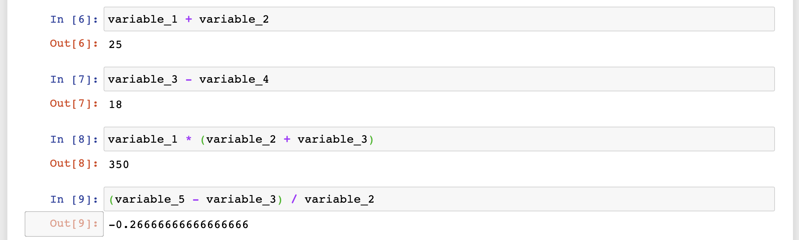

JN sólo me muestra el output de la última línea de código que hay en mi celda, así que si quiero ver el resultado de varias operaciones en la misma celda, tengo que usar un "comando" llamado `print`. `print` imprime lo que sea que reciba, para que podamos verlo con nuestros propios ojos:

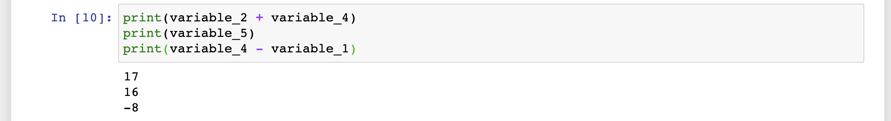

Para usar el comando `print` escribimos la palabra "print", después abrimos paréntesis `()` y escribimos dentro del paréntesis lo que queremos imprimir. Estos "comandos" en Python se llaman `funciones` y es así como les llamaremos a partir de ahora. Veremos más a detalle lo que son las funciones en una sesión posterior.

#### Tipos de datos

En Python y en cualquier otro lenguaje de programación podemos representar diferentes tipos de datos. Hasta ahora hemos trabajado solamente con números. Pero de hecho Python no les llama "números". Python tiene dos tipos de datos para representar distintos tipos de números:

- `int` para números enteros
- `float` para números decimales

Podemos usar la función `type` para "preguntarle" a Python qué tipo de dato tenemos en nuestras variables:

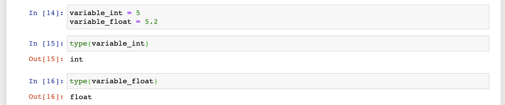

Si quisiéramos ver los dos tipos en la misma celda, simplemente tenemos que llamar las funciones `type` con los nombres de nuestras variables y después pasarle el resultado a nuestra función `print`:

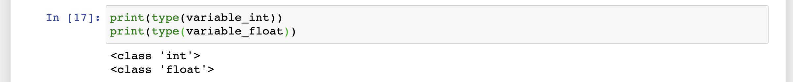

Otro tipo de datos muy importante es el que se llama `string`. Un `string` es una secuencia de carácteres, que podemos usar para representar texto:

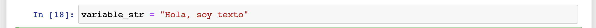

Para escribir texto en Python, tenemos que delimitar una secuencia de carácteres con el signo de comillas (`"`). Podemos imprimir `strings` para ir anotando los resultados de nuestro código:

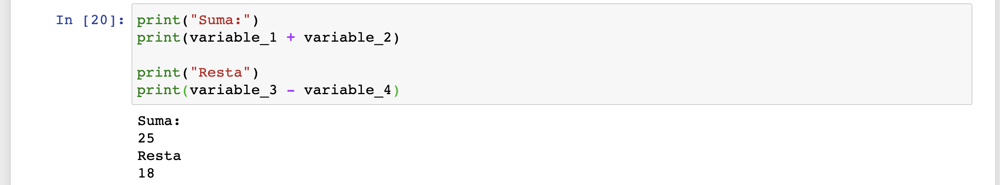

También podemos imprimir variables dentro de `strings` usando lo que se llama `interpolación de strings`. Eso funciona de la siguiente manera: Empezamos una `string` con la letra `f` antes de las comillas, luego abrimos las comillas, después escribimos texto y cuando queremos interpolar una variable, usamos llaves (`{}`) y escribimos el nombre de la variable dentro de las llaves; finalmente cerramos las comillas:

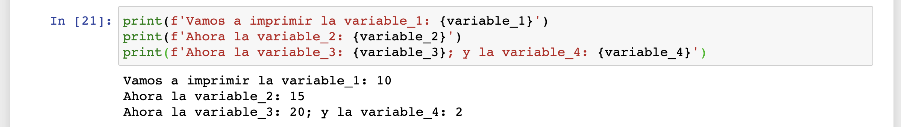

¡Facilísimo!

Hay un último tipo de dato que vamos a aprender, porque está muy relacionado con los temas que vienen más adelante. Este tipo de dato es lo que llamamos `booleano`. Un dato `booleando` sólo puede tener dos valores: `True` o `False` (verdadero o falso):

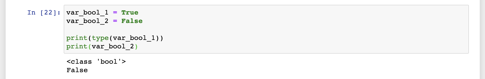

¿Te parece extraño que esto exista? Quedará mucho más claro por qué necesitamos `booleanos` en esta siguiente sección...

#### Comparaciones

Si escribiéramos un programa que sólo pudiera hacer una sola cosa, siempre, independientemente del `input` (los datos de entrada) que tuviera, ése programa no sería muy útil. Para automatizar procesos también tenemos que automatizar la toma de decisiones, y para esto necesitamos la capacidad de hacer comparaciones entre datos. Como cuando nosotros comparamos un helado de chocolate y un helado de frambuesa y elegimos el de chocolate porque resulta que:

1. Es más barato
2. Es más delicioso
3. Somos alérgicos a la frambuesa

Estamos comparando los helados para poder tomar una decisión de qué comprar.

Los `operadores de comparación` de Python nos permiten hacer exactamente esto. Por el momento no vamos a comparar helados, sino nuestros ya conocidos `ints` y `floats`:

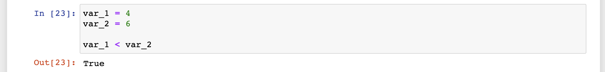

Basta con escribir la condición `var_1 < var_2` para que Python compare los valores contenidos en cada variable y te diga si efectivamente la `var_1` es más pequeña que la `var_2`. Este signo `<` se llama `menor que`. Python tiene varios operadores de comparación que podemos ver en la siguiente imagen:

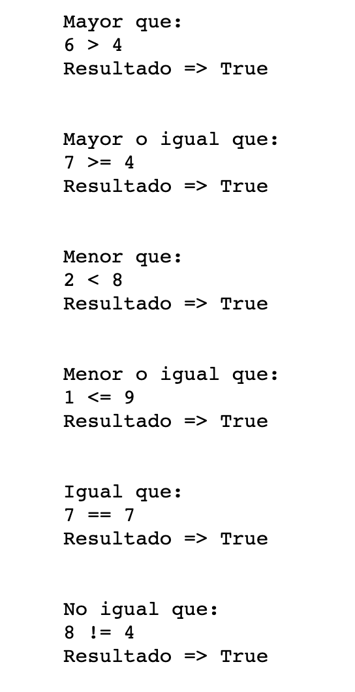

Como puedes imaginar, en este caso todos los resultados son `True` porque las comparaciones resulta que son ciertas. Pero si intercambiamos los números podemos hacer que todas sean `False`:

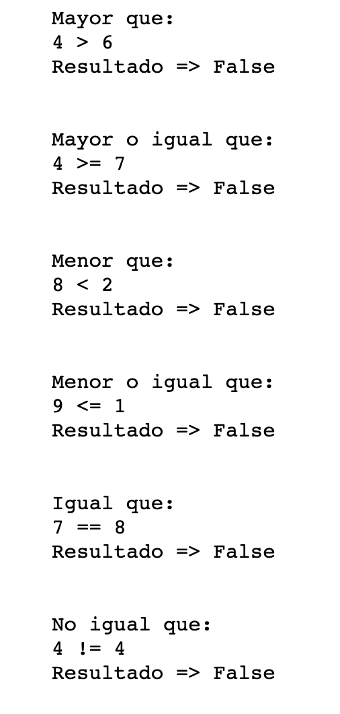

¿Por qué queremos hacer comparaciones? Pues para tomar decisiones. ¿Y cómo tomamos decisiones en código? Utilizando las llamadas estructuras de control de flujo:

#### Estructuras de control de flujo

Las estructuras de control de flujo nos permiten usar comparaciones para tomar decisiones acerca de qué pasos tomar en el futuro. La primera estructura de control es lo que llamamos `if`:

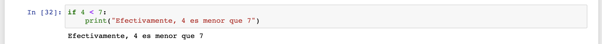

Le pido a Python que haga la comparación `4 < 7`, y si esta comparación resulta `True` entonces corro el código que tengo debajo. Presta atención al código de la segunda línea. Está indentado, ¿lo ves? Esto es muy importante. Para Python, todo el código que está indentado pertenece al bloque de la `sentencia if` y se correra si la comparación resulta ser `True`.

Veamos qué pasa si la condición no se cumple:

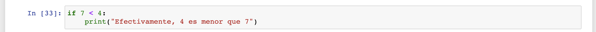

No se corre el bloque de la `sentencia if` porque la comparación es `False`. Pero si yo imprimo algo fuera de la `sentencia if`, eso se imprimirá de todas maneras, porque no pertenece al bloque y por lo tanto no depende de la comparación:

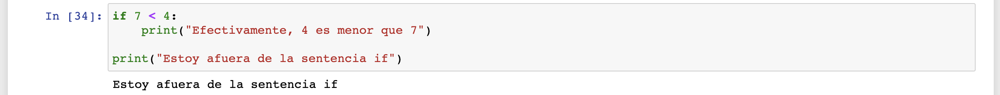

Podemos también agregar una condición `default` para decirle a Python: Si la comparación no se cumple, entonces corre este otro código. Esto lo hacemos usando el operador `else`:

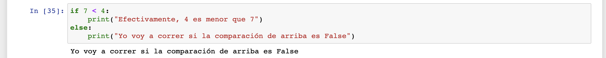

También podemos encadenar varias comparaciones, para cuando queramos tener múltiples condiciones que resulten en diferentes acciones. Esto se hace usando el operador `elif`:

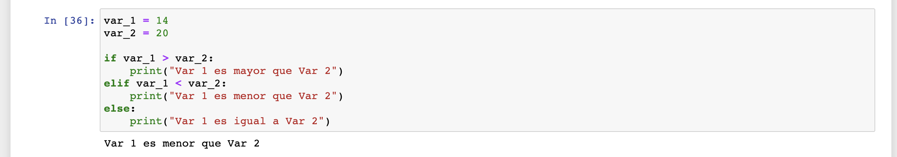

Veamos qué pasa si cambiamos los valores de las variables:

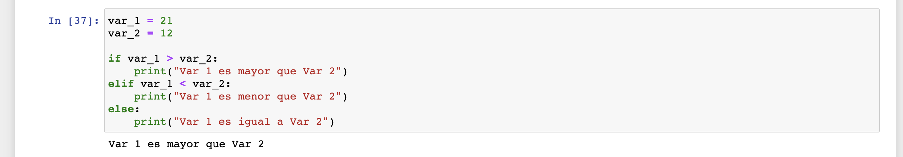

Y a ver este otro:

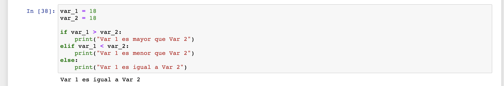

Efectivamente, si `var_1`no es menor ni mayor a `var_2`, ¡lo único que queda es que sean iguales!

Con eso damos por concluido nuestro Prework de esta sesión. ¡En el Work practicaremos mucho todo lo aprendido para afianzar todo este conocimiento!
