
<strong>Curso Data Analysis - Módulo 3 PREWORK de Estructuras de Datos y Funciones</strong>

<strong>PREWORK SESIÓN 2</strong>

### Introducción

En la sesión anterior aprendimos a usar Jupyter Notebooks y dimos un primer clavado al lenguaje de programación Python. Estuvo buenísimo. Ahora que ya tenemos un primer panorama de cómo funciona el lenguaje, es hora de entrarle a cosas más interesantes. En esta sesión hablaremos de las llamadas `estructuras de datos`, que son las formas que tiene Python de organizar datos para poderlos usar de manera eficiente. Después, aprenderemos a escribir y utilizar funciones de Python para hacer nuestro código reutilizable y modular. Dominando estas herramientas, estarás un paso más cerca de poder llamarte un desarrollador de Python. ¡Vamos!

#### Objetivos

- Conocer las dos principales estructuras de datos que son la base de la programación con Python.  
- Comparar dos diferentes maneras de estructurar datos y saber las ventajas y desventajas de cada una.  
- Reutilizar código y hacer nuestros programas más modulares.  
- Entender mejor el funcionamiento detrás de las funciones builtin de Python.  

### Estructuras de datos

Datos, datos, datos... Están en todas partes. Evidentemente, nosotros queremos aprender a analizarlos, así que entendemos su importancia. Cuando pensamos en datos solemos pensar en bases de datos, en archivos CSV, en  hojas de Excel, y otros. Cada uno de estos tiene su propia estructura de datos. Las computadoras necesitan estas estructuras de datos para organizar los datos de manera eficiente. Sin estructuras de datos, tendríamos todos nuestros datos "regados por ahí". Encontrar lo que estamos buscando sería imposible. Y todos nuestros procesos se harían de la forma más ineficiente posible.

El día de hoy conoceremos dos de las estructuras de datos más básicas e importantes que tiene Python: las listas y los diccionarios.

#### Listas

Las `listas` son colecciones ordenadas de elementos. ¿De qué elementos hablamos? Bueno, en el caso de Python, prácticamente de lo que sea. ¿Recuerdas los tipos de datos que aprendimos en la sesión anterior? Pues cualquiera de esos puede ser incluido dentro de una lista. Si tenemos una serie de elementos que queremos guardar de forma ordenada, podemos meterlos dentro de una lista. Para crear una lista, usamos corchetes (`[]`) y luego colocamos nuestros elementos dentro de los corchetes. Así:

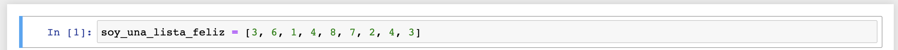

Como puedes ver, el orden lo determino yo. Es decir, los números no están ordenados de menor a mayor. Yo decido en qué orden ponerlos y así se quedan. También podemos observar que es posible repetir elementos idénticos en diferentes lugares de la lista. En este caso hicimos una lista de `ints`, pero, como ya dijimos, podemos tener listas de prácticamente cualquier cosa:

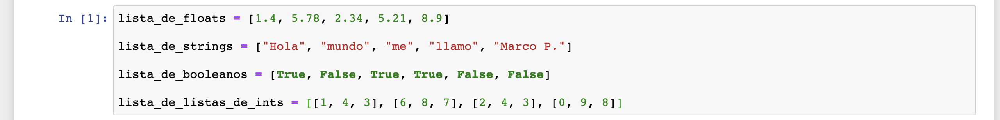

Sí, ¡incluso podemos tener listas de listas! ¡O listas de listas de listas! ¡O listas de listas de listas de listas! ¡O...! Ok, ya.

Como puedes observar, todas las listas que te acabo de mostrar tienen el mismo de dato. Es posible en Python hacer listas con diferentes tipos de datos. Se ven así:

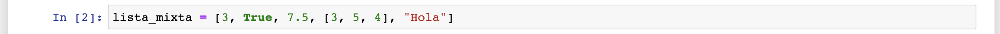

Aunque en principio es posible, mezclar diferentes tipos de dato en una misma lista es una mala idea. Al hacerlo estamos haciendo más complicado procesar los datos que tenemos en esa lista. Es decir, va en contra de una de las razones principales que tenemos para usar estructuras de datos: la eficiencia. A veces es inevitable, pero debemos de evitarlo siempre que sea posible.

Ok, ya tengo mi lista. ¿Ahora, cómo accedo a los elementos que tiene dentro?

Toda lista tiene un índice ligado a cada elemento que la conforma. Como las listas son ordenadas, el índice empieza con `0` para el primer elemento, y luego va ascendiendo de uno en uno para los elementos subsecuentes. Podemos revisar la lista usando el `operador de índice` (`[]`) y pasándole el índice del elemento al que quiero acceder:

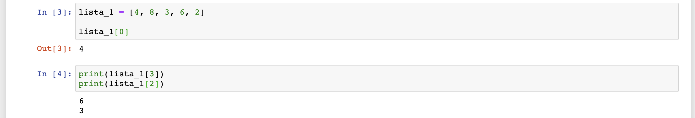

El orden de los elementos se mantiene a menos que algo lo modifique, así que la sentencia `lista_1[0]` me va a regresar siempre un `4` (el primer elemento de la lista), a menos que la lista sea modificada.

Es importante tener cuidado cuando accedemos a índices en una lista. Si pedimos un índice que no está ligado a ningún elemento (porque es un número mayor al índice máximo que existe en nuestra lista), vamos a obtener un error (algo que no es buena idea obtener, como podrán imaginarse):

Esto nos lleva a nuestra siguiente pregunta: ¿cómo es que modificamos una lista?

Vamos a aprender 2 métodos básicos para modificar listas en Python: append y pop.

##### Append

`append` agrega un elemento al final de la lista. Llamamos `append` como hemos llamado otras funciones (`print` o `type`), usando paréntesis y pasándole dentro del paréntesis el elemento que queremos agregar a la lista. La única diferencia es que esta función la llamamos desde el objeto de la lista, con la sintaxis `variable_que_contiene_tu_lista.append()`. Es decir, `variable_que_contiene_tu_lista + . + append + ()`. Porque esta función la llamamos desde el objeto de la lista, la nombramos `método` en vez de lista. No importa si no entiendes por qué en ese momento, pero yo voy a llamarles `métodos` a partir de ahora para ser correctos. Veamos `append` en acción:

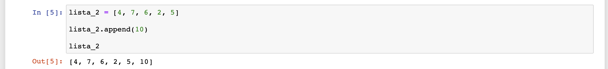

Una vez, agregada, podemos acceder a ella con su nuevo índice (el último de la lista):

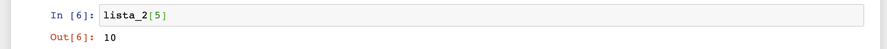

##### Pop

Ya tenemos un método que agrega elementos a la lista. Ahora queremos quitar elementos de la lista. `pop` se utiliza justamente para eso. Si llamamos este método sin pasarle nada, `pop` remueve el último elemento de la lista:

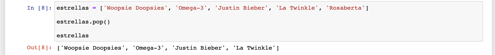

Podemos pasarle un índice a `pop` para que remueva el elemento que está en ese índice:

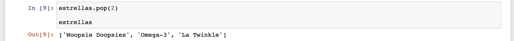

Como podrás imaginar, al remover elementos en índices intermedios, todos los elementos posteriores a ese índice tienen ahora un índice menor. Más exactamente `indice_anterior - 1`. Esto es importante porque las listas siempre deben de tener un índice secuencial. Si hubiera huecos en nuestro índice, sería imposible saber qué índices acceder y cuáles no. Esto quiere decir que para acceder a `La Twinkle` tenemos que usar el índice `2`, no el `3` como anteriormente:

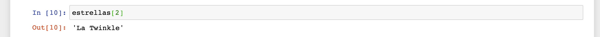

---

En el Work haremos múltiples Retos para poder entender todo el poder que tienen las listas. Por lo pronto, vamos a pasar a nuestra segunda estructura de datos del día de hoy: el diccionario

#### Diccionarios

Los diccionarios se parecen bastante a los diccionarios léxicos. En un diccionario léxico, tienes pares de palabra-significado. si quieres saber el significado de una palabra, vas y buscas la palabra. Esa palabra está ligada a su significado. Por lo tanto, los diccionarios están organizados por pares. De igual manera, los diccionarios en Python están organizados en pares "llave-valor". Cada llave tiene un valor asignado y para acceder al valor basta con pedir la llave. Una diferencia importante con los diccionarios léxicos es que los diccionarios en Python no están ordenados. Esto en realidad no importa demasiado, ya que buscar valores en un diccionario de Python es mucho más fácil y eficiente que en un diccionario léxico.

¿Y cómo es que creamos diccionarios? De esta manera:

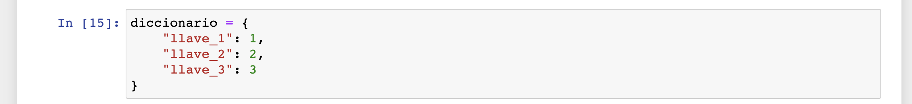

Como ves, para crear diccionarios usamos llaves (`{}`) en vez de corchetes. Después, escribimos el nombre de una llave y su respectivo valor separados por dos puntos (`:`). Cada par llave-valor está separado de los demás por comas. En este caso las llaves son strings, pero también podrían ser números:

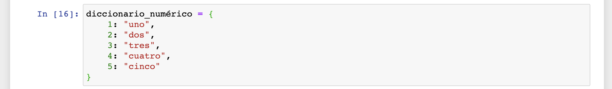

Ahora, cómo accedemos a los valores que hemos guardado en nuestro diccionario. Es simple: usamos corchetes como con las listas, pero en vez de pasar un índice, pasamos el nombre de la llave:

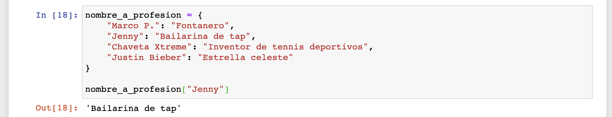

Fácil, ¿no?

##### Agregar datos

Agregar datos a nuestros diccionarios es bastante sencillo. Para agregar un dato, se realiza una asignación como ésta:

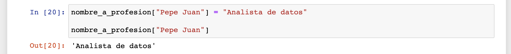

Como ves, "selecciono" la llave que aún no existe y simplemente le paso el valor que le quiero asignar. Como se ve en la imagen, esa llave ahora existe en mi diccionario y puedo acceder a ella.

##### Modificar datos

También puedo modificar datos que ya se encuentran en mi diccionario. Para hacer esto, simplemente vuelo a asignar el nuevo valor a la llave que quiero modificar. Por ejemplo, digamos que Jenny acaba de cambiar de profesión. Podemos actualizar nuestro diccionario de la siguiente manera:

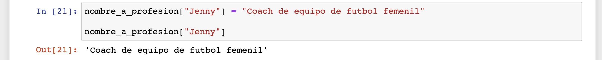

Los valores de los diccionarios también pueden ser listas u otros diccionarios (¡Inception!). Por ejemplo, mira esto:

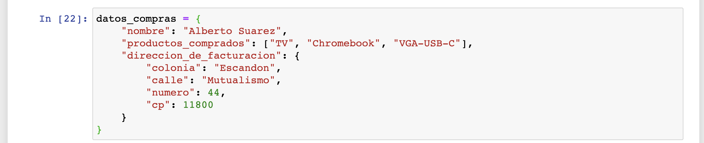

En un caso como éste, también es posible modificar la lista y el diccionario que hay dentro. Es tan simple como pedir el valor y luego modificar ese valor (la lista o diccionario) con las técnicas que ya conocemos:

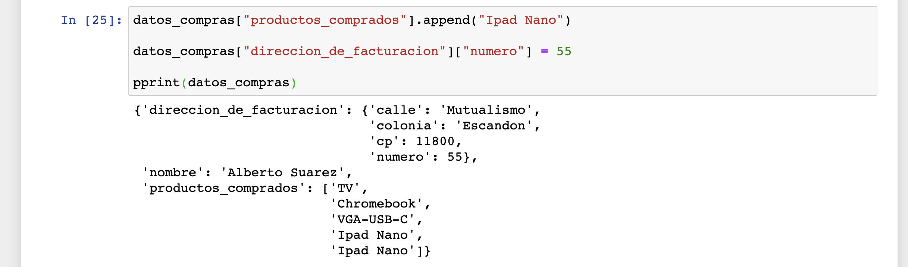

##### Eliminar datos

Para finalizar nuestra exploración de diccionarios aprenderemos a eliminar datos de un diccionario. Esto puede realizarse usando el método `pop` (¡sí, se llama igual al método `pop` de las listas!). A diferencia del método de listas, este `pop` recibe el nombre de la llave que queremos eliminar. Una vez llamado este método, nuestra llave deja de estar en nuestro diccionario:

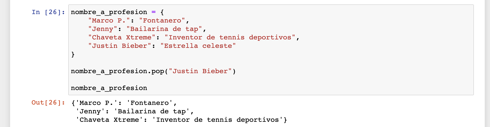

Lo siento estrella celeste "Justin Bieber", siempre estarás en nuestros corazones.

---

Con esto terminamos la sección de estructuras de datos. Pasemos ahora a una de las herramientas más famosas y utilizadas en el mundo de la programación: las funciones.

### Funciones

Imaginemos que tenemos un código como éste (bueno, no hace falta imaginarlo, podemos escribirlo en nuestro JN):

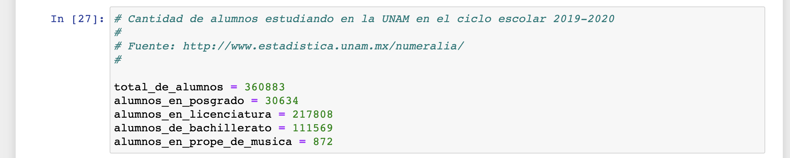

Queremos saber el porcentaje del total de alumnos que estudian en cada uno de los niveles distintos. Un primer acercamiento podría ser éste:

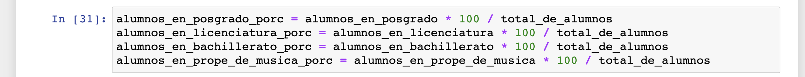

No se ve tan mal, ¿verdad? Pues en realidad hay un problema más o menos grave: Estamos repitiendo mucho código. Esa operación matemática para sacar el porcentaje, la regla de tres, ¡es exactamente igual siempre y la estamos escribiendo cuatro veces. Si quiero sacar el porcentaje de otra estadística, tendría que volver a escribir la regla de tres. ¿Qué solución tengo? Crear una especie de "contenedor" donde tenga la lógica de mi operación, para que pueda repetir el proceso varias veces sin tener que volver a escribirlo. Justamente para eso sirven las `funciones`.

#### Sintaxis

Para declarar una función empezamos con la palabra `def`:

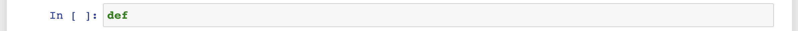

Después, elegimos un nombre para nuestra función (por favor nota que los nombres de las funciones también se escriben usando `camel_case` y siguen las mismas convenciones que los nombres de las variables):

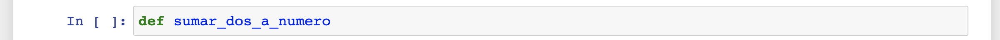

Después agregamos paréntesis:

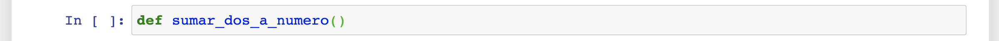

Ahora, dentro de los paréntesis agregamos los nombres de los `parámetros`. Estos `parámetros` son datos que la función requiere para funcionar correctamente (podemos pensarlos como los "ingredientes" de nuestro proceso):

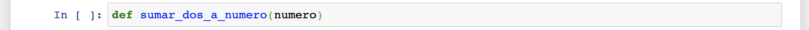

Ahora agregamos dos puntos:

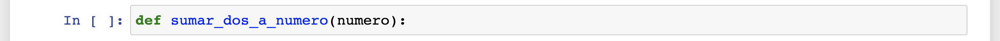

Después, pasamos a la siguiente línea y agregamos una indentación. Así como en las `sentencias if`, la indentación indica qué código es parte del `bloque` de la función. Una vez que escribimos una línea no indentada, estamos de nuevo fuera del `bloque` de la función:

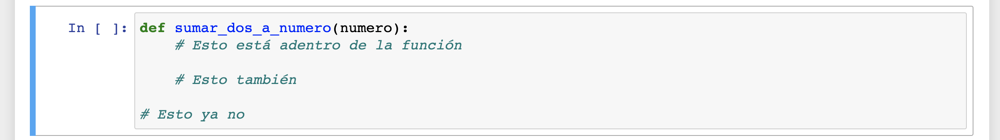

Ahora tenemos que escribir el proceso que queremos que esté contenido dentro de esta función para poderlo repetir fácilmente a través de nuestro programa:

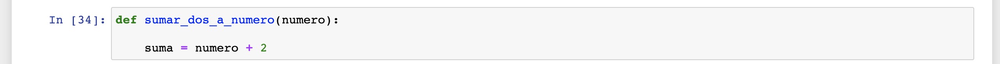

Si observas bien, estoy usando el parámetro que definí en la primera línea. Este "ingrediente" de mi función se lo voy a pasar yo cada vez que llame la función. Dentro de la función se puede usar como si fuera una variable que toma el valor del dato que le paso cada vez que llamo la función. El resultado de mi suma (`numero + 2`) lo estoy guardando en una variable llamada `suma`.

Ahora, si eso fuera todo, no podria acceder a ese resultado fuera de mi función. Para poder acceder al resultado, necesito `regresar` el resultado. Esto se hace usando la palabra `return`:

Usando la palabra `return` mi función regresa el resultado de su proceso para que pueda ser utilizado en otras partes de mi programa.

Vamos a utilizar esta función:

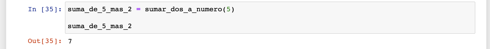

¿Qué pasó aquí? Tengo una variable llamada `suma_de_5_mas_2`. A esta variable voy a asignarle el resultado de llamar mi función `sumar_dos_a_numero` con un 5 como `argumento` (se llaman `parámetros` dentro de la función pero `argumentos` a la hora de pasarlos... es confuso, lo sé). Dicho de otra manera: Llamo mi función `sumar_dos_a_numero`; le paso un 5 para que le sume 2; regreso el resultado de esa suma (`7`) y asigno ese resultado a una variable llamada `suma_de_5_mas_2` que después puedo usar para lo que quiera (en este caso solamente estoy checando qué hay dentro de ella).

Lo interesante comienza cuando reutilizamos la función pasándole distintos argumentos:

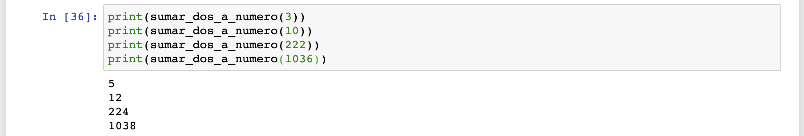

En este caso estoy imprimiendo los resultados de las llamadas a `sumar_dos_a_numero` sin asignarlos antes a una variable.

#### Función para cuantificar porcentajes

Regresemos entonces a nuestro problema original: calcular los porcentajes del total de alumnos de la UNAM que estudian en cada nivel.

Vamos a construir una función que realice esta operación:

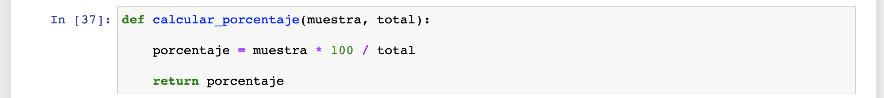

Estoy declarando esta función con dos parámetros: `muestra` y `total`. `muestra` es el subconjunto del total que quiero expresar en porcentajes; `total` es el total de la población de mi conjunto de datos. Puedo declarar funciones con un número indeterminado de parámetros, cuantos sea que necesite, pero en general se recomienda mantener el número de parámetros a lo mínimo necesario. Entre menos parámetros, mejor.

Ahora sí, vamos a utilizar nuestra función:

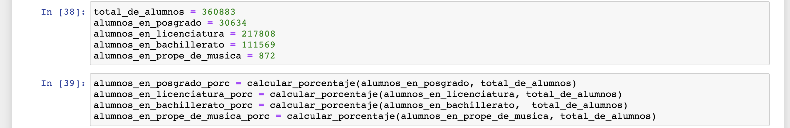

En este caso pareceiera que no estamos ahorrando tanto trabajo, ¿no? La cantidad de código que estamos escribiendo es prácticamente la misma. Pero imagina que el proceso de sacar porcentajes fuera mucho más largo y complicado. En ese caso tendría mucho más sentido. Además, tenemos otras ventajas que voy a enumerar a continuación.

##### Otras ventajas de las funciones además de la reutilización de código

1. Nuestra función tiene un nombre (`calcular porcentaje`). Por lo tanto, si alguien está leyendo nuestro código y no sabe que la operación para obtener el porcentaje es `muestra * 100 / total`, puede enterarse de ello a través del nombre de nuestra función. Es algo muy bueno hacer nuestro código lo más comprensible posible, ¡nunca sabemos quién más va a tener que leerlo y entenderlo además de nosotros!

2. En caso de que descubramos una operación más eficiente para calcular el porcentaje (en este caso es muy poco probable que suceda, pero puede suceder fácilmente con funciones más complejas), lo único que tenemos que hacer es ir a nuestra función y cambiar el código que hay dentro. Automáticamente, el resto de nuestro código que está utilizando esta función va a utilizar la función optimizada. Si no hubiéramos escrito una función, tendríamos que buscar todos los lugares donde realizamos esa operación para cambiarlos. Una regla de oro en la programación es: ¡Nunca repitas código! A la hora de corregir errores u optimizar tu código, vas a agradecer no repetir código.

3. En general es una buena idea pensar en nuestros programas `modularmente`. Esto significa pensarlo en los procesos más simples posibles y esos procesos encapsularlos en funciones (u otras estructuras). Separar nuestro código en "cachitos" va a hacerlo mucho más fácil de entender, corregir y aumentar.

En este momento no es necesario que entiendas por completo la importancia de estas ventajas. A través de tu carrera como analista de datos y programador irás comprendiendo por qué estas ideas son tan relevantes. Por el momento basta con entender que siempre que puedas meter un proceso dentro de una función, es una buena idea hacerlo.

#### Contexto de las variables

Para terminar este Prework, vamos a hablar de algo llamado `contexto` en Python. `contexto` se refiere al área en tu código donde cada variable puede ser accesada. No todas las variables en tu código pueden ser accesadas desde cualquier lugar. Vamos a ver:

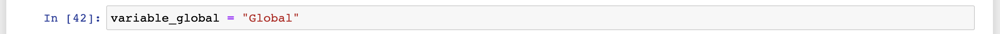

Tenemos una variable llamada `variable_global`. Esta variable fue asignada en lo que se llama el `contexto global`. Podemos saber que es el `contexto global` porque no hay ni un solo nivel de indentación antes del nombre de la variable. Al estar en el `contexto global`, está variable puede ser accedida desde cualquier lugar, en la misma celda en la que fue asignada o en alguna otra celda distinta:

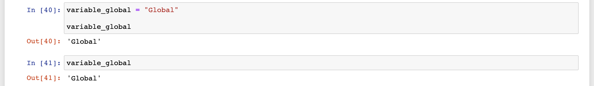

Vemos ahora qué pasa con una variable declarada dentro de una `sentencia if`:

Como puedes ver, podemos acceder a la variable `respuesta` desde cualquier lugar. Eso quiere decir que en Python una `sentencia if` no cambia el contexto actual. Seguimos estando en el contexto desde el cual se declaro la `sentencia if`. Como esta sentencia se declaro en el `contexto global`, las variables que asignemos dentro del bloque de la sentencia seguirán teniendo contexto global.

Pero veamos ahora qué pasa con las variables declaradas dentro de una función:

Ok, declaramos la función, corrimos la celda y no hemos podido acceder a ninguna de las variables (ni el parámetro `numero` ni la variable `suma` asignada dentro de la función). ¿Será porque no hemos llamado la función con algún valor como argumento? Veamos:

No, no tenemos acceso. ¿Qué está pasando? Lo que está pasando es que las funciones en Python **sí cambian el contexto de las variables que "viven" dentro de la función**. Todas las variables que viven dentro de la función, tanto parámetros como variables asignadas, sólo pueden ser accesadas desde dentro de la función. Su contexto dejó de ser global y se convierte en el contexto de la función que las contiene.

La única manera de acceder a los datos que hemos generado dentro de la función es a través del `return`:

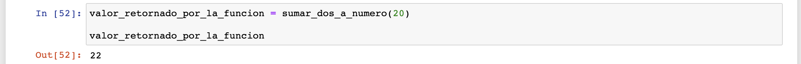

Los valores regresados en el `return`, "traspasan" contextos. Son como viajeros intergalácticos que pasan de una dimensión a otra a través de un hoyo negro. Igualito...

---

Hemos terminado el Prework de la Sesión 2. Ojalá y disfrutes mucho los Retos que haremos en el Work, están diseñados para que practiques y domines todos los conceptos que aprendimos hoy. ¡Mucha suerte!

---

## Quiz

1. ¿Qué método se utiliza para agregar elementos a una lista?

**a) append**
b) add
c) pop
d) agregízame.com
e) concat

2. ¿En qué se diferencia una lista de un diccionario?

a) La lista tiene orden, el diccionario no
b) Los diccionarios se organizan en pares llave-valor, las listas no
c) Las listas tienen espacio limitado, los diccionarios no
e) Las listas se definen usando corchetes, los diccionario se definen usando llaves
f) Las opciones a, b y c
**g) Las opciones a, b y e**
h) Las opciones b, c y e

3. ¿Qué palabra se utiliza para empezar la declaración de una función?

a) func
b) fun
**c) def**
d) dec
e) aquí_les_va_la_funcion

4. Una de las razones para usar funciones es:

a) Para ahorrar memoria RAM en la computadora
**b) Para modularizar nuestro código y poder reutilizarlo**
c) Porque las funciones aceleran la velocidad de nuestros programas
d) Para sentirnos súper acá

5. Describe con tus propias palabras que significa "Contexto de una variable".
