
<strong>Curso Data Analysis - Módulo 3 PREWORK de Programación funcional, operadores lógicos y funciones lambda</strong>

<strong>PREWORK SESIÓN 3</strong>

### Introducción

En la sesión pasada aprendimos sobre estructuras de datos y funciones, dos de los pilares más importantes de la programación. Ya sabemos entonces cómo organizar nuestros datos y cómo encapsular comportamiento de manera que sea reutilizable. En esta sesión usaremos nuestros dos pilares (estructuras de datos y funciones) para crear programas hechos y derechos. Te sorprenderá saber que los conocimientos que ya tienes en este momento bastan para realizar gran parte de los procesos que realiza un científico de datos en su día a día. Un programa es básicamente:

- Datos estructurados de una cierta manera
- Funciones que sirven para transformar datos
- Cadenas de procesos que utilizan funciones para transformar estructuras de datos

Con tan sólo estos ingredientes, podemos hacer cosas maravillosas. ¿Quieres ver?

#### Objetivos

- Sentirse cómodos con las 2 funciones más importantes de la programación funcional: map y filter.
- Utilizar `operadores lógicos` para "extender" la funcionalidad de los `operadores de comparación`.
- Usar `funciones lambda` para simplificar el uso de `map` y `filter`.

### Intro Parcial a Programación Funcional

A través de las décadas los programadores han ido desarrollando innumerables técnicas para hacer programas resilientes, comprensibles y fáciles de extender. Muchos de estos conocimientos han sido reunidos en los llamados `paradigmas de programación`. Un `paradigma de programación` es básicamente un conjunto de herramientas, métodos y reglas que se reunen cohesivamente y se utilizan para resolver problemas computacionales. Hay diferentes "perspectivas" acerca de cuál es la mejor manera de escribir un programa. Cada una de esas "perspectivas" está representada por un paradigma de programación.

En realidad, como somos científicos de datos, no ingenieros de software, no hace falta que dominemos estos paradigmas. Pero hay algunas métodos de un `paradigma` llamado `programación funcional` que nos pueden ser de mucha utilidad para entender mejor cómo funcionan algunas de las herramientas que utilizaremos constantemente como científicos de datos. Básicamente vamos a estudiar 2 funciones: `map` y `filter`. Estas 2 funciones nos permiten transformar nuestras estructuras de datos de una manera sumamente intuitiva y útil.

#### `map`

Espero que ya haya quedado clara la idea básica de cómo funciona un programa: tenemos estructuras de datos, tenemos funciones, y luego aplicamos esas funciones a nuestras estructuras de datos para transformar nuestros datos.

`map` es una función que nos ayuda a realizar este procedimiento muy fácilmente. Vamos a ver cómo funciona.

Digamos que tenemos una estructura de datos que se ve así:

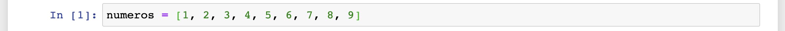

Esto es una simple `lista` con `ints` dentro. Ahora, digamos que queremos multiplicar cada uno de los elementos de esta lista por 2. Una manera horrible, lenta e impráctica de hacer esto sería lo siguiente:

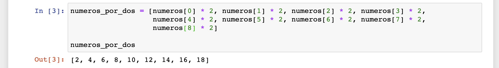

¿Por qué es tan horrible esta solución?

1. Para empezar, necesitamos escribir muchísimo código (y repetido). Ya aprendimos que una de las reglas de la programación es: si vas a repetir el mismo código múltiples veces, lo mejor sería encapsular ese código en una función.
2. Y en segunda, ¿qué pasaría si nuestra `lista` `numeros` cambia? Por ejemplo, podríamos agregar elementos o eliminar elementos. En ese caso, el código que estamos utilizando para crear `numeros_por_dos` podría fallar. Si `numeros` tiene menos elementos, entonces `numeros_por_dos` intentaría acceder a un índice que ya no existe y nos lanzaría un error. Si `numeros` tiene ahora más elementos, entonces `numeros_por_dos` va a estar incompleto.

Es una muy mala idea escribir este tipo de procesos "a mano", paso a paso. Vamos a ver ahora cómo podríamos simplificar este proceso usando `map`.

En primer lugar, vamos a encapsular nuestro proceso en una función:

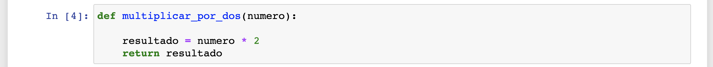

¡Listo!

Ahora, lo que hace `map` es lo siguiente:

1. Recibe una función que queremos aplicar a una `lista`.
2. Recibe una `lista`.
3. Aplica la función a la `lista` *elemento por elemento* y regresa una nueva `lista` que contiene los elementos de la `lista` anterior transformados.

Veamos:

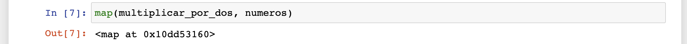

Ok, todavía no tenemos el output que queramos, ¿vdd? Esta función nos regresó un objeto que se llama `map` y alguna especie de número incomprensible. Bueno, veamos qué pasa cuando usamos otra función `list` y le pasamos este objeto `map`. `list` es una función que intente convertir cualquier cosa que le pases a una `lista`:

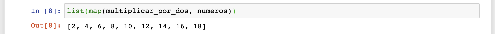

¡Lo logramos! ¿Ves qué diferencia? El resultado de este procedimiento puede ser asignado a una variable para ser utilizado después:

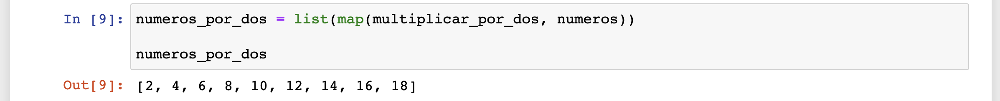

Ahora qué pasaría si nuestra lista `numeros` crece:

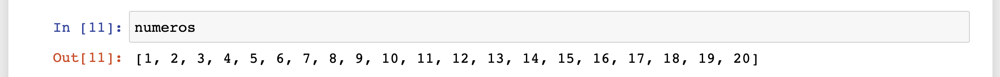

No tenemos que cambiar absolutamente nada. `map` aplica la función *elemento por elemento*, así que no le importa cuántos elementos haya. Simplemente va a recorrer todos los elementos que encuentre, transformarlos y regresarlos en una nueva lista:

¡Supongo que ya te puedes imaginar el potencial!

Ésta es una de las razones por las que establecimos que era una buena idea tener `listas` con un solo tipo de dato. A la hora de querer aplicar una función a toda la `lista`, las cosas se complican mucho cuando tenemos diversos tipos de datos en la misma estructura de datos.

Nuestra función puede ser tan complicada como queramos. Por ejemplo, mira esta función que transforma todos los datos nones en `0s`, mientras que los datos pares los regresa sin transformarlos:

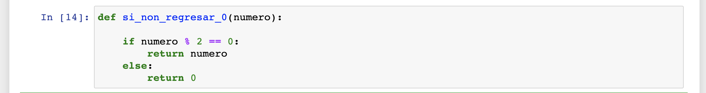

Veamos qué pasa si le aplicamos esta función a otra `lista`:

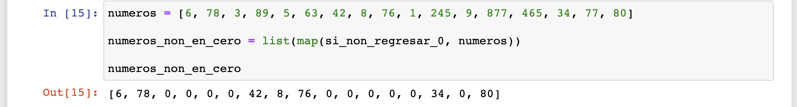

¡Qué genial!

También podemos transformar de un tipo de datos a otro. Por ejemplo, mira esta función que toma un número y lo regresa en forma de string con el signo de dinero añadido y la unidad `MXN`:

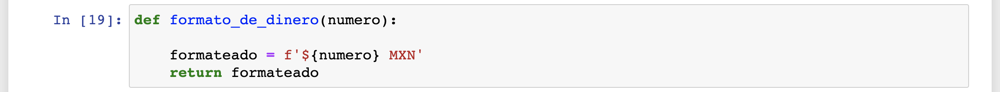

Vamos a verla en acción:

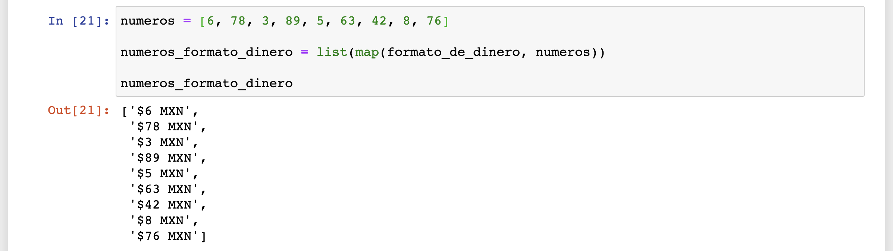

¿Cuánto a que te sientes poderoso? ¡Y apenas estamos empezando! Veamos nuestra siguiente función.

#### `filter`

El nombre de la función `filter` explica exactamente lo que la función hace: filtrar. ¿Filtrar qué? Pues elementos en una lista. Veamos cómo lo hace.

Tenemos una lista con números (perdón por estar duro y dale con las listas con números):

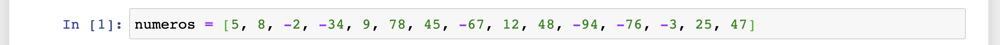

Ahora digamos que lo que queremos hacer con esta lista es filtrar todos los valores positivos. Esto significa que la lista resultante **solamente va a contener números positivos**.

¿Cómo vamos a hacer eso? Pues primero necesitamos una función que nos "avise" cuando un número es positivo:

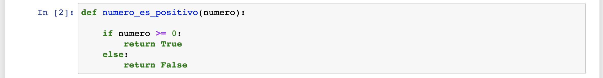

La función `numero_es_positivo` checa si el numero es mayor o igual a 0 (`if numero >= 0`); si esta condición se cumple regresa `True` (que básicamente es un "efectivamente, es positivo"). Si la condición no se cumple regresa `False` (que es un "nop, no es un número positivo").

Ahora veamos qué pasa si usamos `filter` con esta función y nuestra lista `numeros`:

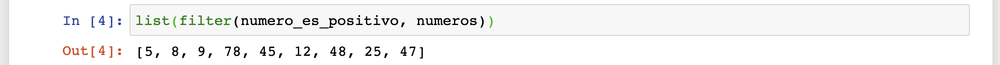

¡Interesante!

¿Qué está pasando aquí? `filter` funciona de la siguiente manera:

1. Recibe una función que regrese `True` o `False`.
2. Recibe una `lista`.
3. Va recorriendo la `lista` *elemento por elemento* y le aplica la función a cada elemento de la lista.
4. Cada vez que la función regresa `True`, `filter` agrega ese elemento a una nueva `lista` (la que vamos a obtener de regreso). Cada vez que la función regresa `False`, `filter` descarta ese elemento y no lo agrega a la nueva lista.

Es por eso que en nuestro ejemplo ya solamente tenemos los elementos que son positivos. Veamos qué pasaría si quisiéramos ahora filtrar los números negativos:

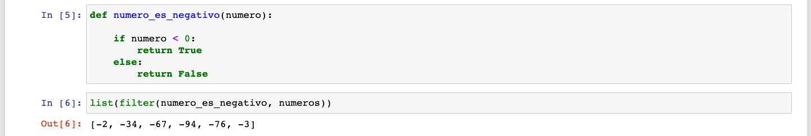

Ahora nuestra función regresa `True` cuando el número es negativo (`if numero < 0`). Por lo tanto, `filter` agrega a la nueva lista todos los números negativos y deja fuera los positivos.

Ahora, muchas veces vamos a necesitar usar más de un criterio al mismo tiempo para filtrar nuestros datos. ¿Cómo podríamos hacer algo así? Para lograr esto vamos a aprender tres nuevos operadores que utilizaremos muchísimo a través de todo el módulo: los `operadores lógicos`.

#### `Operadores lógicos`

Los `operadores lógicos` complementan las funcionalidades de los `operadores de comparación`. Podríamos decir que "extienden" las funcionalidades. Los `operadores lógicos` toman una o dos `sentencias de comparación` y regresan un valor (`booleano`) que depende del resultado de las comparaciones y del `operador lógico` que se esté usando. En Python tenemos 3 de estos operadores: `and`, `or` y `not`. Veamos cómo funcionan.

##### `and`

`and` une dos `sentencias de comparación` y regresa `True` sólo cuando **ambas** `sentencias` regresen `True`. En este primer ejemplo, estamos reemplazando las `sentencias` por simples `booleanos`, pero sólo lo hacemos para simplificar la lógica y hacer muy evidente el funcionamiento de `and`. En esta tablita los `1s` representan `True` y los `0s` representan `False`:

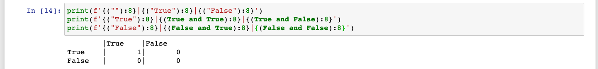

Veamos ahora que pasa si usamos `True` con algunas comparaciones:

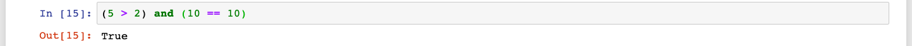

En este ejemplo, ambas comparaciones son verdaderas (`True`); por lo tanto la `sentencia and` regresa `True`. Veamos ahora unas comparaciones que resultan en `False`. En esta primera, la primera comparación es `True` pero la segunda es `False`:

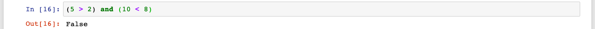

Ahora, la primera es `False` mientras que la segunda es `True`:

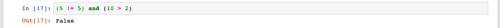

Ahora, las dos son `False`:

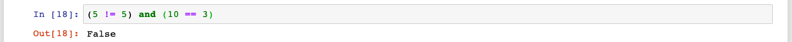

Veamos entonces cómo podríamos utilizar el operador `and` en la función `filter`. Tenemos la siguiente `lista`:

Lo que queremos es filtrar todos los números que sean nones **y** menores o iguales a 50. Eso quiere decir que queremos quedarnos sólo con números que sean pares **y** mayores a 50. Primero tenemos que hacer dos funciones para identificar los números que queremos que permanezcan:

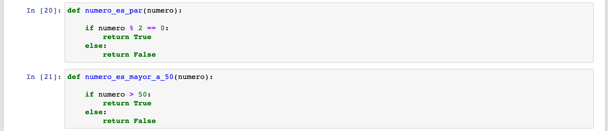

Ahora, como `filter` sólo recibe **una sola** función tenemos que hacer una nueva función que utilice nuestras dos funciones anteriores para regresar `True` sólo si un número es a la vez par y mayor a 50:

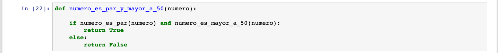

¡Estamos listos! Ahora sí, a filtrar nuestra `lista`:

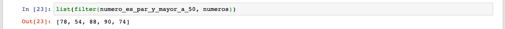

Tenemos ahora una `lista` con puros números pares y mayores a 50. ¡Qué cosas maravillosas podremos hacer con esto!

Vayamos ahora a nuestro segundo `operador`.

##### `or`

`or` une dos `sentencias de comparación` y regresa `True` si **una de las dos o ambas** `sentencias` regresen `True`. Es decir, si hay `True` en nuestra `sentencia`, `or` regresa `True`:

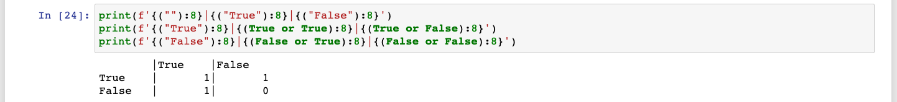

En la siguiente sentencia, la primera comparación es `True`, mientras que la segunda es `False`:

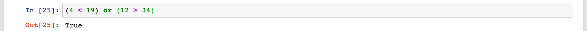

Si ambas comparaciones son `False` es la única forma en la que el `or` puede regresar `False`:

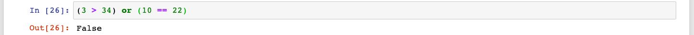

Veamos éste operador usado en nuestra función `filter`. Vamos a usar las mismas funciones que usamos en el ´and´ pero ahora vamos a usar `or` para unirlas. Eso quiere decir que nuestro `filter` va regresar todos los valores que sean pares **o** que sean mayores a 50:

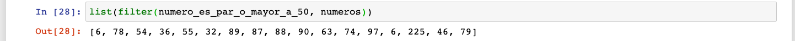

Esto quiere decir que filtramos los valores que eran *menores a 50* **y** *nones*.

##### `not`

El último operador es mucho más sencillo. Lo único que hace este operador es regresar el valor `booleano` opuesto al que recibió:

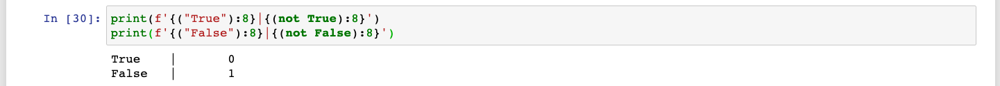

Es como decir "dame el valor opuesto al que te estoy dando". ¿Para qué querríamos hacer algo así? Por ejemplo, nosotros ya tenemos una función que regresa `True` cuando el valor que recibe es par:

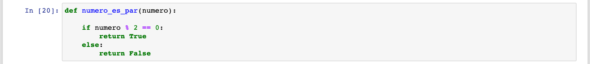

Si la usamos en nuestra lista `numeros`, vamos a obtener una nueva lista donde todos los números son pares:

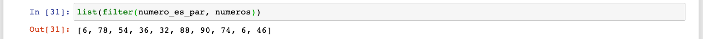

Pero, ¿qué pasa si queremos filtrar ahora los números nones y obtener una lista **sólo** con números nones? Podríamos escribir otra función que regrese `True` cuando nuestro número sea non. Pero también podríamos hacer algo mucho más sencillo, usar la función que ya tenemos y simplemente "revertir" el valor que regresa:

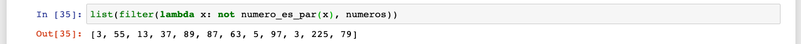

¡Hey, hey, hey! ¿Qué está pasando ahí? ¿"Lambda" quién? Esto que acabamos de hacer requirió una nueva herramienta que será nuestro último tema de la sesión de hoy: `funciones lambda`. Vamos a entender cómo funcionan y luego regresamos a este último ejemplo y lo analizamos.

#### Funciones lambda

Las funciones `lambda` son simplemente maneras simplificadas de escribir las funciones que ya conocemos tan bien. No necesitamos entender ningún nuevo concepto, sólo aprender una nueva sintaxis. La sintaxis de una función `lambda` es la siguiente. Primero escribimos la palabra `lambda`:

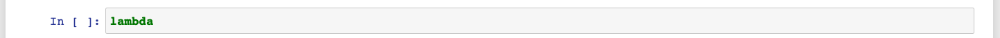

Ahora, agregamos los nombres de nuestro parámetro (o parámetros):

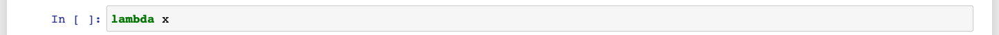

En este caso tenemos un sólo parámetro llamado `x`.

Nuestro siguiente paso es agregar dos puntos (`:`). Todo lo que esté escrito después de los dos puntos será nuestro "bloque" de la función:

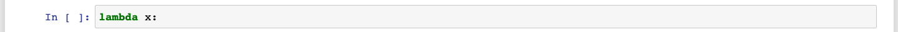

Como las funciones `lambda` son funciones simplificadas, no podemos escribir como tal todo un bloque completo para nuestra función. Lo único que podemos hacer es escribir una única sentencia que sería la que estaría escrita después de nuestro `return`. Es decir, la única sentencia de nuestra función `lambda` es la que regresa el valor final de nuestra función:

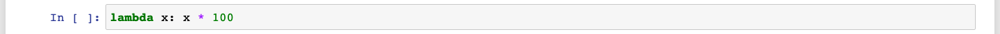

Como puedes ver, las funciones `lambda` sólo sirven si queremos realizar procesos muy sencillos. En este caso, nuestra función recibe un solo parámetro `x` y regresa `x * 100`. Cualquier función que podamos escribir en una sóla línea podría ser una función `lambda`.

Ahora, ¿cómo es que usamos una de estas funciones `lambda`? Podemos pasarlas directamente a nuestras funciones `map` y `filter`. Si nuestra función es muy sencilla, podemos ahorrarnos tiempo y espacio y definir nuestra función ahí mismo en lugar de tener que declararla primero usando `def`. Por ejemplo:

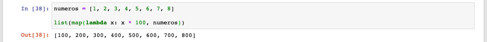

¿Ves? Le hemos pasado nuestra función `lambda` al `map` y obtenido de regreso una `lista` con todos nuestros valores multiplicados por 100.

Veamos otro ejemplo usando `map`:

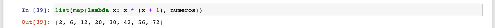

Esta función `lambda` nos regresa el número `x` multiplicado por la suma de `x + 1`.

Ahora veamos cómo usarlas con `filter`:

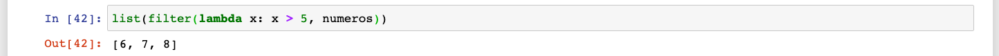

Aquí estamos filtrando todos los números iguales o menores a 5 con una sola línea.

Veamos ahora qué pasaba en nuestro ejemplo de arriba:

Lo que está pasando aquí es que la función `lambda` recibe nuestro número (`x`), lo pasa a la función `numero_es_par` y luego regresa el opuesto usando `not`. ¡Así podemos revertir el funcionamiento de nuestra función original en una sola línea!

Podríamos incluso rehacer nuestra función `numero_es_par_o_mayor_a_50` en una sola línea:

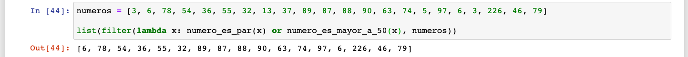

¿No te parece genial?

---

Con todo lo que aprendimos el día de hoy estamos ya listos para sumergirnos en el mundo de la ciencia de datos. Asegúrate de entender todos estos temas a la perfección para que te sientas cómodo con lo que veremos a continuación. ¡Feliz aprendizaje!
