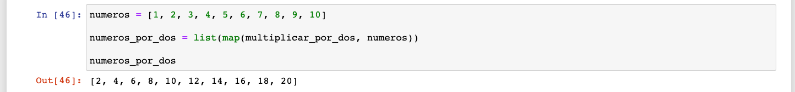
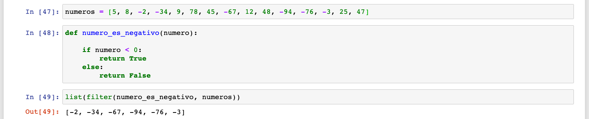

## Sesión 03: Programación funcional, operadores lógicos y funciones lambda

### 1. Objetivos

1. Usar las dos funciones más importantes de la programación funcional: `map` y `filter`.
2. Utilizar `operadores lógicos` para extender la funcionalidad de nuestros `operadores de comparación`.
3. Conocer la sintaxis de las funciones `lambda` par simplificar la definición de funciones.

### 2. Contenido

---

<ins>Programación Funcional</ins>

Aprendimos en el Prework que la `programación funcional` es un paradigma de programación. Básicamente, es un conjunto de herramientas, métodos y reglas que sirven para organizar nuestro código y darle coherencia.

En este curso no nos interesan los detalles de la `programación funcional`, pero vamos a aprender a usar dos de sus funciones más comunes: `map` y `filter`. ¿Por qué? Porque la manera como funcionan se parece mucho a la manera como programan los científicos de datos.

Entendiendo `map` y `filter` al 100 te será más fácil aproximarte a las funciones universales en `numpy` y `pandas` y a cómo funcionan sus filtros.

¡Vamos adelante!

> Elegí los temas de `map` y `filter` en lugar de los ciclos porque se parecen mucho más a los paradigmas que utilizan los científicos de datos. Es poco común (y a veces incluso es mala práctica) usar ciclos junto con las librerías de `pandas` y `numpy`. Por eso me tomé la libertad impensable de omitirlos.

---

<ins>`map`</ins>

La primera función que vamos a aprender es la función `map`. `map` toma una función y una lista y nos regresa una nueva lista donde la función a sido aplicada a cada elemento de la lista original:

<div style="padding: 10px; margin: 20px"></div>

Veamos cómo funciona.

> Es importante que los alumnos entiendan el concepto de aplicar una función "elemento por elemento" ("element-wise") a una `lista`, ya que en esencia eso es lo que sucede cuando aplicamos funciones universales o vectorizadas a un `numpy.array` o a una `Serie` de `pandas`.

[**`Ejemplo 1`**](Ejemplo-01/map.ipynb)
[**`Reto 1`**](Reto-01/map.ipynb)

---

<ins>`filter`</ins>

Nuestra segunda función se llama `filter`. Tal y como su nombre lo dice, `filter` nos ayuda a filtrar elementos que no queremos de la lista.

`filter` recibe una función que regrese `True` o `False` y una `lista`. Después aplica la función "elemento por elemento" a la `lista`. Cada vez que la función regrese `True`, el elemento se queda en la nueva lista; cuando la función regrese `False`, el elemento es descartado:

<div style="padding: 10px; margin: 20px"></div>

Veamos a detalle cómo funciona.

> `filter` nos permitirá tener un primer acercamiento a los filtros, así como también a los `operadores lógicos` que aparecerán innumerables veces en los filtros de `pandas`.

[**`Ejemplo 2`**](Ejemplo-02/filter.ipynb)
[**`Reto 2`**](Reto-02/filter.ipynb)

---

<ins>`and`</ins>

Hasta ahora sólo hemos utilizado `filter` con una función (una sola condición) para filtrar nuestra lista. ¿Pero qué pasa si queremos usar múltiples condiciones? Aquí es donde entran los `operadores lógicos`, que nos permiten unir dos `sentencias de comparación`. El primero es el operador `and`, que regresa `True` cuando las dos comparaciones que está uniendo regresan `True`, y `False` en todos los demás casos:

<div style="padding: 10px; margin: 20px"></div>

Vayamos ahora a algunos ejemplos.

>

[**`Ejemplo 3`**](Ejemplo-03/and.ipynb)
[**`Reto 3`**](Reto-03/and.ipynb)

---

<ins>`or`</ins>

`or` es muy parecido a `and`. También nos sirve para unir dos `sentencias de comparación` y obtener un nuevo resultado. La diferencia es que `or` regresa `True` cuando **una de las dos o ambas** comparaciones regresen `True`:

<div style="padding: 10px; margin: 20px"></div>

Vayamos a algunos ejemplos.

>

[**`Ejemplo 4`**](Ejemplo-04/or.ipynb)
[**`Reto 4`**](Reto-04/or.ipynb)

---

<ins>`not`</ins>

`not` simplemente regresa el `booleano` opuesto al que recibe

<div style="padding: 10px; margin: 20px"></div>

Vamos a ver cómo funciona

>

[**`Ejemplo 5`**](Ejemplo-05/not.ipynb)

---

<ins>Funciones `lambda`</ins>

Las funciones `lambda` son simplemente una manera distinta de declarar nuestras funciones. Tienen el mismo comportamiento de una función, pero una sintaxis y capacidades simplificadas. Se ven así:

```python
lambda x: x * 100
```

Veámoslas en funcionamiento.

>

[**`Ejemplo 6`**](Ejemplo-06/lambda.ipynb)
[**`Reto 5`**](Reto-05/lambda.ipynb)

---

### 3. Postwork

[**`Postwork Sesión 3`**](Postwork/Readme.md)
