
<strong>Curso Data Analysis - Módulo 3 PREWORK de Análisis Exploratorio de Datos y archivos JSON</strong>

<strong>PREWORK SESIÓN 4</strong>

### Introducción

Con todo lo que hemos aprendido hasta ahora ya estamos listos para empezar a hacer procesamiento de datos formalmente. No sé si te has dado cuenta pero de hecho ya hicimos bastante procesamiento de datos. Todo eso de transformar y filtrar listas usando `filter` y `map`. ¡Eso fue procesamiento de datos!

Pero si quisiéramos explorar, limpiar y estructurar grandes cantidades de datos con las herramientas que hemos aprendido hasta ahora, la cosa se pondría algo difícil. Es por eso que los científicos de datos han inventado algunas herramientas hechas especialmente para la ciencia de datos. Estas herramientas nos van a facilitar la vida muchísimo.

El día de hoy aprenderemos la primera de ellas: `Pandas`. Veremos cómo usarla como adquirir conjuntos de datos y explorarlos un poco.

#### Objetivos

- Identificar las características básicas de las Series y DataFrames de Pandas.
- Leer JSONs usando Pandas.
- Utilizar herramientas básicas de exploración de datos.

### Importación de paquetes

`Pandas` es lo que se llama un paquete de Python. Un paquete es un conjunto de módulos. ¿Qué es un módulo? Es un archivo `.py` que contiene código de Python que podemos reutilizar en otras secciones de nuestro programa. Un paquete entonces tiene muchos módulos, cada módulo conteniendo código que cualquier persona puede utilizar para extender las capacidades de su programa.

Podríamos programar todo siempre desde cero, pero en ese caso todo tomaría muchísimo tiempo y además nunca lograríamos tanta eficiencia. Usar paquetes que hen hecho otras personas es muy útil porque nos ahorra tiempo y energía y nos da "super poderes" que podemos utilizar en nuestro programa.

Para poder utilizar un paquete, lo primero que tenemos que hacer que instalarlo, pero afortunadamente Google Colab ya tiene instalados muchos de los paquetes más importantes de ciencia de datos. Por lo tanto, basta con realizar la importación en nuestro programa para poder utilizar estos paquetes.

Abre un Jupyter Notebook, escribe el comando `import pandas as pd` y corre la celda.

¡Listo! Ya podemos acceder a `Pandas` en nuestro programa. ¿Por qué agregamos lo de `as pd`? Bueno básicamente le estamos diciendo a Python que queremos poder escribir `pd` en vez de `pandas` cada vez que queramos usar el paquete en nuestro programa. Nos ahorra un poco de tecleo y además es un a convención. Todos los científicos de datos usan `pd` en vez de `pandas`.

¿Y ahora qué? ¿`pandas` con qué se come o qué?

Bueno, primero vamos a platicar de las dos estructuras de datos que `pandas` nos ofrece que vamos a estar utilizando muy constantemente: Las `Series` y los `DataFrames`. Tú ya conoces dos estructuras de datos: `listas` y `diccionarios`. Las estructuras de `pandas` se parecen bastante a éstas pero extienden sus funcionalidades. ¡Vamos a verlas!

### Series de Pandas

Las `Series` son parecidas a las `listas` en que son secuencias ordenadas de 1 dimensión que pueden contener diferentes tipos de valores. ¿1 dimensión? ¿Dónde estamos, en la Matrix? No, no, tranquilo. No es tan esotérico como parece. En geometría, una línea tiene una sola dimensión. Un punto tiene 0 dimensiones, mientras que un plano tiene 2 y un cubo tiene 3:

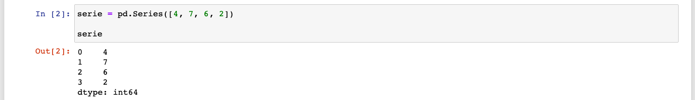

Básicamente, cada vez que agregamos una nueva dimensión, tenemos una nueva "dirección" hacia donde podríamos "avanzar" (escribo "avanzar" entre comillas porque no estamos literalmente parados sobre la línea).

En Python, de las estructuras que conocemos, las `listas` y ahora las `Series` tienen 1 una sola dimensión. Eso significa que sólo puedes avanzar hacia adelante y hacia atrás.

Así se ve una `Serie` de `pandas`:

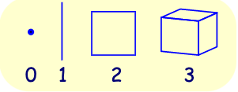

Ok, parece que hay mucho que ver ahí. Vamos a ir paso a paso.

Primero, para crear una `Serie` tenemos que usar el comando `pd.Series`. Aquí lo que estamos haciendo es llamar la librería de `pandas` y luego accediendo a uno de los objetos que ofrece la librería. Para acceder a objetos siempre escribimos el nombre de la librería o módulo (`pd`), seguido de un punto (`pd.`), seguido del nombre del objeto (`pd.Series`).

Ahora, para crear uno de estos objetos y poderlo utilizar, necesitamos "llamarlo". Esto se hace agregando paréntesis, como cuando llamamos funciones (`pd.Series()`). A esta creación le llamamos "instanciar un objeto". A partir de ahora voy a llamar "instanciar" al proceso de creación de un objeto y voy a llamar "instancia" al objeto que ya está creado.

Por último, tenemos que pasarle algún dato a nuestra `Serie` para que pueda ser instanciada. El objeto `Serie` puede recibir una `lista` de Python para convertirla en una `Serie` de `pandas`. Pasémosle entonces una `lista`:

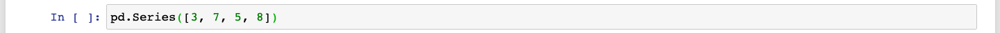

Al correr esta celda, podemos ver en el output cómo se ve la `Serie` que acabamos de crear:

¿Por qué hay dos columnas de números? ¿Y qué es eso de `dtype: int64`? ¿Y por qué Santa nunca me trajo el unicornio alado que le pedí?

#### Índices

Veamos de cerca las columnas:

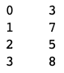

La columna de la derecha es la `lista` que le pasamos, ¿recuerdas? Es lo mismo sólo que aquí está representada verticalmente. Sigue teniendo una sola dimensión, no te preocupes.

La columna de la izquierda es el `índice` de nuestra `Serie`. Esto es algo nuevo que las `listas` de Python no tienen. En una `Serie`, cada elemento de la `Serie` tiene un índice asociado. Esto es similar a los `diccionarios` donde cada `valor` tiene una `llave` asociada. 

Entonces, podríamos pensar una `Serie` como una especie de mezcla entre `listas` y `diccionarios`. Se parece a las `listas` en cuanto a que es una secuencia de elementos ordenados en una sola dimensión. Se parece a los `diccionarios` en que cada elemento tiene un índice asociado. Si accedemos a uno de los índices en nuestra `Serie`, obtendremos el elemento que está asociado a ese ìndice:

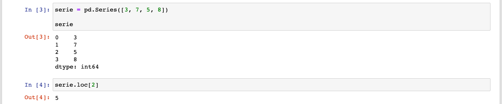

Bueno, ¡esto es prácticamente igual a cuando accedemos una `lista` por su ìndice! ¿Cuál es la diferencia? Primero, que tenemos que usar el operador `loc` para indicarle a la `Serie` que vamos a acceder a los elementos por el **nombre del índice**. Otra gran diferencia es que el índice de una `Serie` puede tomar diferentes valores y diferentes órdenes. Si no le indicamos a la `Serie` de manera explícita qué índice tomar, la `Serie` va a asignar una secuencia numérica ascendente que comienza en `0` (exactamente igual a una `lista`). Pero podemos indicarle distintos ìndices a nuestra `Serie` de esta forma:

¡Wow! Le asignamos un índice que va desde `10` a `13` y a cada elemento le fue asignado el número que le correspondía. Ahora, para acceder a nuestro número `5` tuve que escribir `serie.loc[12]`, ya que ese es el nuevo índice que le fue asignado.

Lo increíble es que también podemos asignarles `strings` como índices:

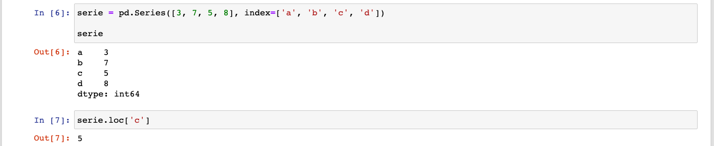

Esto se está poniendo interesante, ¿verdad?

##### Otras acciones relacionadas con índices

Para asignar un valor nuevo a un índice en nuestra `Serie` basta con indexarlo y asignarle el nuevo valor (justo como sucede con las `listas`):

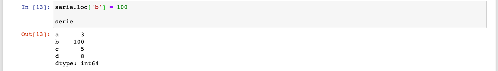

Podemos también acceder a múltiples índices al mismo tiempo. Para pedir explícitamente los índices que queremos, le pasamos al operador de indexación (`[]`) una lista con los índices que queremos:

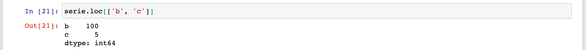

También podemos usar el operador dos puntos (`:`) para indicar lo siguiente:

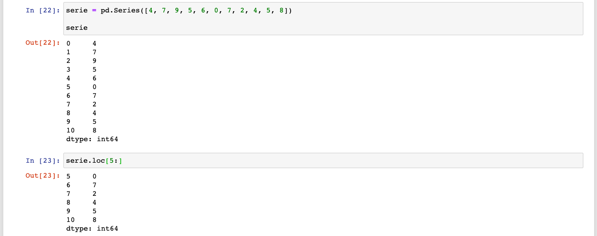

En este primer ejemplo, le pasamos al operador de indexación el índice `5` y después dos puntos (`:`). Esto significa, "dame los índices desde el `5` hasta el final".

También podemos pedir "dame desde el principio hasta el índice `5`" de esta manera:

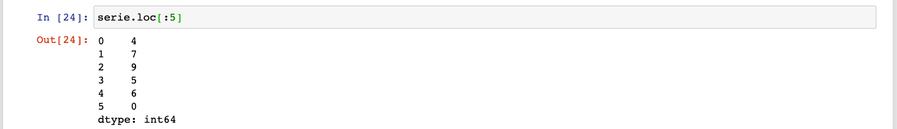

Podemos también pedir rangos explícitos:

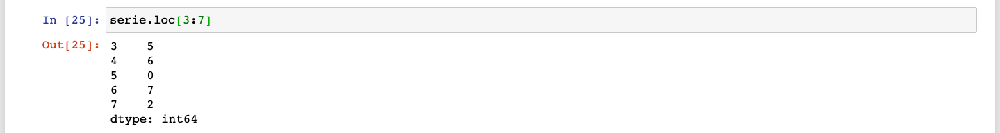

#### Tipos de dato

Regresemos por un momento a la primera `Serie` que creamos, pero ahora vamos a fijarnos en la información que viene en la parte inferior de nuestro output:

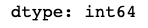

¿Qué significa esto? Bueno, `pandas` tiene también sus tipos de dato, como los que tiene Python (`int`, `float`, `bool`, etc). Los tipos de datos más comunes en `pandas` son los siguientes:

1. `object`
2. `int64`
3. `float64`
4. `bool`

Hay otros, pero esos sólo te los toparas en sesiones más avanzadas.

Podemos pensar a `int64` y a `float64` como los equivalentes de `int` y `float` que ya conocemos. Veamos una serie con cada uno de estos tipos de datos. Primero `int64`:

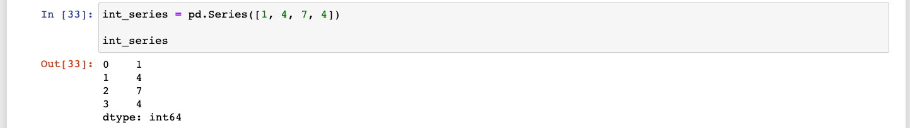

Ahora `float64`:

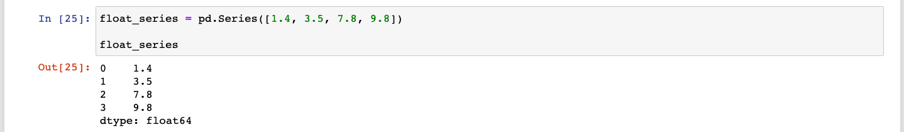

`bool` es exactamente lo mismo tanto en Python estándar como en `pandas`, como puedes ver:

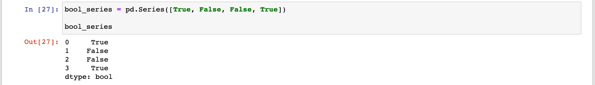

`object` es el tipo de dato que es un poco inusual. Si hacemos una `Serie` con puras `strings`, `pandas` nos indica que el tipo de dato es `object`:

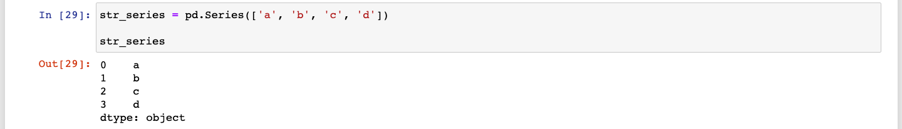

Pero también nos da `object` si tenemos una `Serie` con `strings` y otras cosas. O con una combinación entre números y otro tipo de dato:

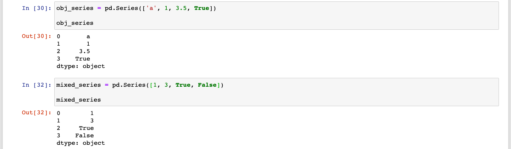

Entonces, cuando nos topemos con el tipo de dato `object`, lo más apropiado es asumir que pueden ser `strings` o una combinación de tipos de datos.

Ahora que conocemos las características principales de las `Series`, vamos a pasar a la otra estructura de dato que nos ofrece `pandas`: los `DataFrames`.

### DataFrames

A diferencia de las `Series`, que son estructuras de 1 dimensión. Los `DataFrames` son estructuras bidimensionales. Esto quiere decir que podemos "recorrerlas" en dos direcciones. Una referencia muy sencilla para entender cómo están estructurados los `DataFrames` son las tablas de MySQL o de Excel. Una tabla es una estructura bidimensional organizada en filas y columnas. Pues bueno, eso es exactamente cómo están organizados los `DataFrames`: como tablas. Vamos a ver cómo se ve uno:

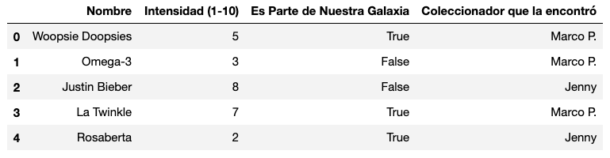

Es una tabla, ¿ves? Cada una de las columnas en un `DataFrame` es en realidad una `Serie`. Así que podemos pensar a un `DataFrame` como un diccionario de `Series` que comparten el mismo índice. Mira cómo fue que creamos este `DataFrame`:

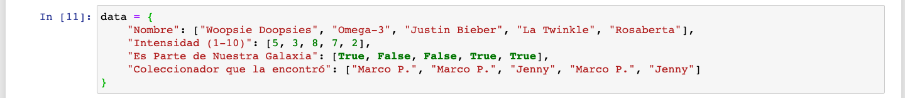

¡Es un diccionario de `listas`! Las `llaves` se convierten en los nombres de las columnas, mientras que las `listas` contienen los valores que corresponden a cada fila de la tabla. Una vez creado el `DataFrame`, esas `listas` son convertidas automáticamente en `Series`.

#### Índexación

Después de crear nuestro `DataFrame` podemos revisar columnas por separado usando el operador de indexación con el nombre de la columna que queremos ver:

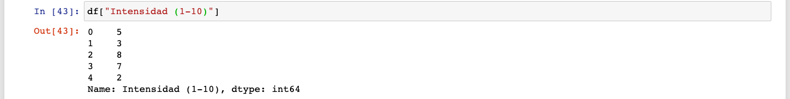

¿Viste? Nuestra `Serie` tiene una nueva propiedad llamada `Name`. Esta propiedad es el nombre de la `Serie` y cuando esa `Serie` está en un `DataFrame` se convierte en el nombre de la columna.

También podemos observar más de una columna al mismo tiempo:

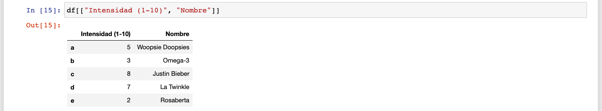

Uso la palabra "observar" porque estas `Series` y `DataFrames` que obtenemos no son copias del `DataFrame` original. Sólo son "ventanas" para ver y modificar el `DataFrame` original con más detalle.

También podemos pedir combinaciones de filas y columnas usando el operador `loc`. El operador `loc` recibe nombres que se encuentren en nuestro índice y regresa la fila que le corresponde a ese índice:

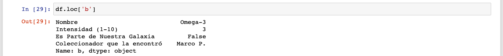

Podemos también pedir múltiples filas:

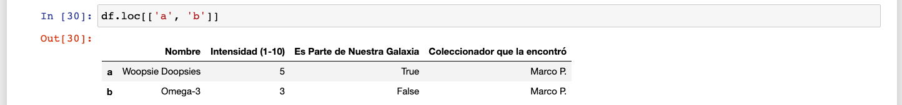

Podemos pasarle un segundo argumento específicando también las columnas que queremos:

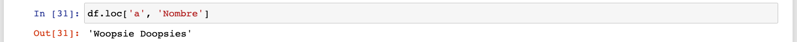

¡También funciona con múltiples filas y columnas! Mira:

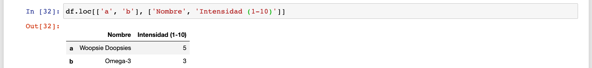

¡Genial!

#### Manipulación de columnas

La asignación y creación de columnas nuevas a nuestro `DataFrame` funciona de una manera muy similar a cómo funcionan los `diccionarios`. Para asignar nuevos valores a una columna, simplemente accede a la columna y asígnale una `Serie` con los nuevos valores:

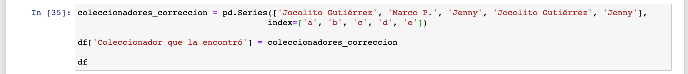

Para que todo funcione correctamente, la nueva `Serie` tiene que tener la misma longitud que el número de filas en el `DataFrame`, y además debe de compartir el mismo índice.

Si quiero crear una nueva columna, basta con "acceder" a ella y pasarle una nueva `Serie`:

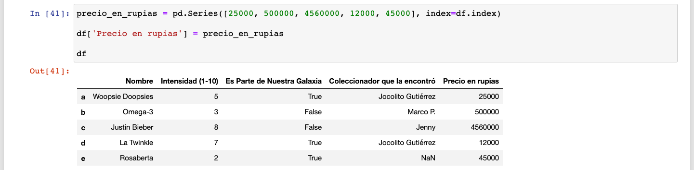

En este último ejemplo usé un pequeño truco para evitar tener que volver a escribir el índice del `DataFrame` al crear la nueva `Serie`. Usé `df.index` para obtener el índice del `DataFrame` y se lo pasé directamente a la `Serie`. `DataFrame.index` entonces nos regresa el índice del `DataFrame` desde donde lo llamemos:

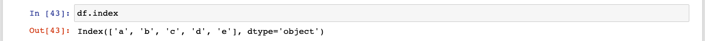

Por último, vamos a ver como eliminar una columna. Los `DataFrames` de `pandas` tienen un método llamado `drop`, que podemos usar para eliminar columnas (o filas) en nuestro `DataFrame`. Simplemente llamamos la variable donde tenemos guardado nuestro `DataFrame`, llamamos el método `drop` y le pasamos a `columns` una lista con las columnas que queremos eliminar:

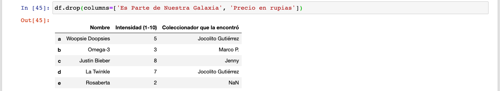

Como todos estos métodos sólo regresan "vistas" de nuestro `DataFrame` original (como si fueran lupas a través de las cuales vemos nuestro `DataFrame` desde distintas perspectivas), si queremos obtener un `DataFrame` nuevo donde las columnas que eliminamos ya no existan, tenemos que asignar el resultado a una nueva variable:

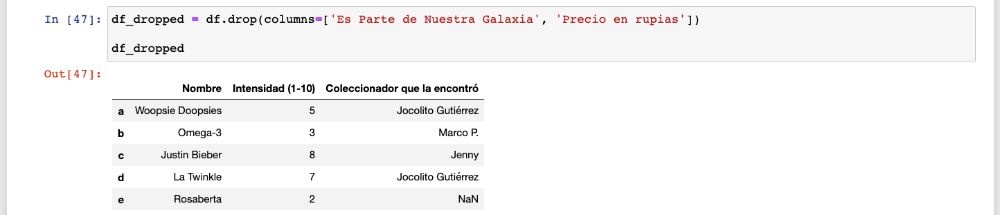

Nuestro `DataFrame` original está intacto:

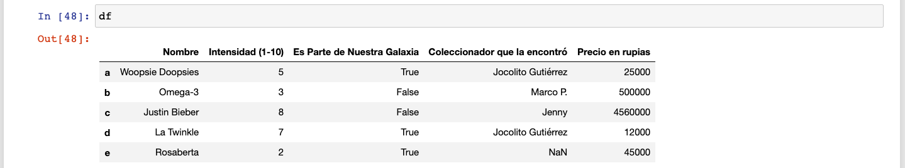

### Adquisición de Datos

Al fin ha llegado nuestro momento. Hasta ahora hemos estado usando puros conjunto de datos inventados por mí (sí, aunque no lo crean, esos conjunto de datoss eran inventados). Ha llegado el momento de explorar conjuntos de datos de verdad.

El primer paso en todo proyecto de Ciencia de Datos es la llamada **Adquisición de Datos**. La adquisición de datos es el proceso a través del cual nosotros (los científicos de datos) obtenemos datos para procesarlos, analizarlos y visualizarlos.

Hay veces que los conjuntos de datos que queremos o necesitamos no existen. En estos casos toca salir al mundo (o al Internet) a hacer una recolección de datos. Esto puede suceder a través de experimentos científicos, encuestas, medición de fenómenos, recolección de datos de uso de aplicaciones, web scraping, etc. En este módulo no vamos a aprender cómo hacer esto. Vamos a asumir que el conjuntos de datos que queremos ya existe y está esperándonos en alguna parte.

Ahora, ¿de dónde podemos conseguir estos conjuntos de datos? Los conjuntos de datos pueden estar en diversos lugares y estar almacenados en diversos formatos. 

Los formatos más comunes son los siguientes:

1. JSON
2. CSV

Los datos pueden estar guardados en formato JSON en un archivo .json, o en formato CSV en un archivo .csv. Muchas veces obtenemos estos archivos de plataformas como [Kaggle](https://www.kaggle.com/), que es uno de los repositorios de conjuntos de datos más importantes del mundo (así como una plataforma de aprendizaje y profesionalización para científicos de datos). En estas plataformas, basta con descargar los archivos y utilizarlos en nuestro programa.

Otras veces, los datos no están disponibles como archivos y tenemos que "pedirlos" de algún lado. Estos datos están almacenados remotamente y a veces podemos acceder a ellos usando algún tipo de interfaz. Las dos fuentes más comunes que usamos para "pedir" datos son:

1. APIs
2. Bases de Datos

En esta sesión vamos a aprender a leer archivos JSON. En sesiones posteriores adquiriremos nuestros datos de todas las demás fuentes. 

¡Continuemos!

#### Lectura de JSONs

Vamos a empezar aprendiendo a leer un archivo JSON usando `pandas`. El primer paso hubiera sido ir a una plataforma y descargar este archivo. Ese paso lo he hecho por ustedes, pero si quieren saber de dónde conseguí el conjunto de datos que vamos a usar, pueden seguir [este link](https://www.kaggle.com/shrutimehta/zomato-restaurants-data?select=file2.json).

El conjunto de datos que vamos a usar ha sido pre-procesado por mí para que sea adecuado para esta sesión. Entonces, ¿qué tenemos que hacer? El primer paso es importar nuestra librería `pandas` y una librería de Python para manejar formato JSON:

Ahora, primero tenemos que leer el archivo antes de pasárselo a `pandas`. Esto se hace con el siguiente código:

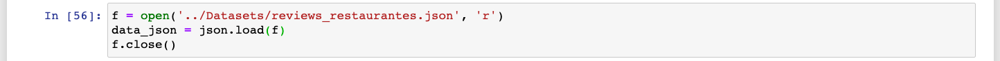

No importa si no entiendes al 100% qué está pasando aquí, pero te voy a dar un pequeño tour de todas maneras.

Con esta parte del código le estamos diciendo a Python que queremos leer un archivo. El comando `open` sirve para leer archivos y recibe dos argumentos:

1. El primero es la ruta (path) a nuestro archivo. Si todavía te confundes mucho con las rutas, la [página de Wikipedia sobre rutas está bastante completa](https://es.wikipedia.org/wiki/Ruta_(inform%C3%A1tica)). 

2. El segundo es el tipo de acceso. En este caso hemos escrito `'r'` que significa `read`. Para gran parte de lo que vamos a hacer como científicos de datos, el acceso `'r'` bastará, pero si quieres conocer otros tipos de acceso y profundizar en el tema, [puedes hacerlo acá](https://www.pythonista.io/cursos/py101/escritura-y-lectura-de-archivos).

Después de leer el archivo, lo hemos asignado a una variable `f`.

El arhivo que hemos leído está en formato `json` y por lo tanto Python requiere convertirlo a un formato que él (Señor Python) pueda entender. Usando el comando `json.load` leemos el objeto en formato JSON y lo convertimos en un `diccionario` de Python. Ya que el formato JSON y los `diccionarios` tienen una estructura muy similar, para Python esto es pan comido.

Al finalizar, usamos `f.close()` para cerrar el archivo que abrimos y evitar que cosas raras puedan pasarle a nuestro programa.

Ahora sí, ¡es hora de ver que es lo que hay dentro!

Vamos a convertir nuestro `diccionario` en un `DataFrame` para poder revisar la información mejor. El objeto `pd.DataFrame` tiene un método llamado `from_dict` con el que podemos construir un `DataFrame` a partir de un `diccionario`:

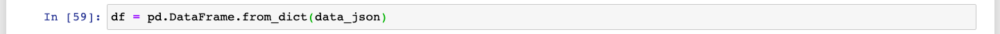

¡Qué emoción! Ya tenemos nuestro conjunto de datos en un `DataFrame`. Y, ¿ahora qué? Bueno, ahora es cuando las cosas se ponen buenas.

### Análisis Exploratorio de Datos

El siguiente paso después de la Adquisición de Datos es lo que se llama Análisis Exploratorio de Datos. Este paso es donde exploramos nuestro conjunto de datos para entenderlo mejor. En este momento, por ejemplo, tenemos un conjunto de datos que estaba almacenado en un archivo llamado 'reviews_restaurantes.json', pero no tenemos la menor idea de qué hay adentro de ese archivo. El Ánalisis Exploratorio de Datos es el proceso a través del cual nos enteramos de qué hay en ese conjunto de datos. Este paso es esencial antes de realizar cualquier tipo de Procesamiento, Análisis Estadístico y Visualización.

Vamos a aprender un poco de exploración de `DataFrames` usando este conjunto de datos que tenemos en este momento.

Lo primero que podemos hacer es simplemente pedirle al Jupyter Notebooks el output de nuestra variable `df` (le puse así por que son las siglas de `DataFrame`):

Ok, ya podemos ver algo de información. Este conjunto de datos tiene información acerca de algunos de los mejores restaurantes en diversas partes del mundo. La información fue extraída originalmente de una plataforma llamada `Zomato`, pero yo descargué el archivo JSON de Kaggle ([de este link](https://www.kaggle.com/shrutimehta/zomato-restaurants-data?select=file2.json)). El conjunto de datos original tiene bastantes más datos pero yo los reduje a lo esencial para que nuestros procesos sean más sencillos (por el momento).

Al ver el output de nuestro `DataFrame` una de las primeras cosas en las que podemos fijarnos es en el tamaño del `DataFrame`. Esta información está localizada en la parte inferior:

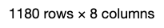

Tenemos un conjunto de datos que tiene 1180 filas y 8 columnas.

Es posible acceder a esta información leyendo la propiedad `shape` de nuestro `DataFrame`:

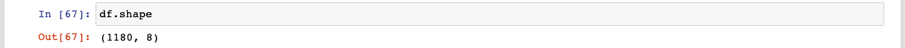

También podemos observar que el índice tiene un orden secuencial, desde `0` hasta `1179`:

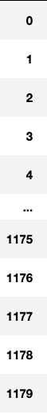

Los 3 puntos que ves en medio (`...`) significan que hay más datos entre los índices `4` y `1175`, pero que son demasiados como para mostrarlos.

También podemos ver los nombres de las columnas en la parte superior:

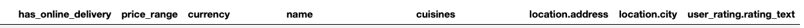

Veamos ahora qué métodos podemos utilizar para explorar un poco más nuestro `DataFrame`.

#### `head` y `tail`

Los métodos `head` y `tail` pueden usarse como un primer acercamiento para ver qué hay dentro de nuestro `DataFrame`. Al llamar `head`, `pandas` nos muestra las primeras `5` filas que hay en el `DataFrame`:

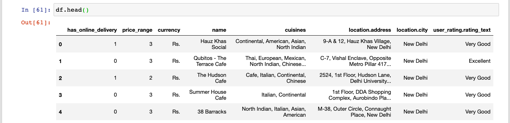

También podemos pasarle un número como argumento para indicarle cuantas filas queremos ver (siempre empezando por la cabeza del `DataFrame`, o sea la primera fila):

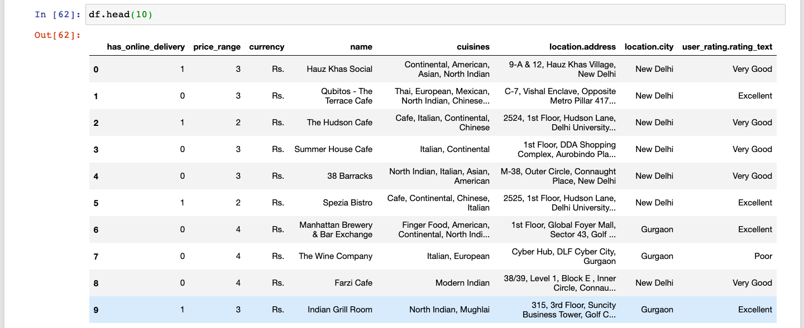

Dándole un primer vistazo a nuestro conjunto de datos vemos que tiene la siguiente información:

1. El nombre del restaurante y el estilo de comida que vende (`name` y `cuisines`)
2. Datos sobre localización (`location.address` y `location.city`)
3. Datos sobre costos (`price_range` y `currency`)
4. Un booleano indicando si el restaurante ofrece pedidos online (`has_online_delivery`)
5. Un pequeño texto que es una evaluación de un usuario (`user_rating.rating_text`)

Usando `tail` podemos echarle un vistazo a las ùltimas filas de nuestro `DataFrame`:

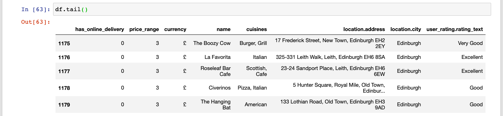

#### Columnas y tipos de datos

Si queremos saber un poco más acerca de la estructura de nuestro `DataFrame` podemos acceder a las propiedades `columns` y `dtypes`.

`columns` nos da un objeto que contiene los nombres de todas las columnas:

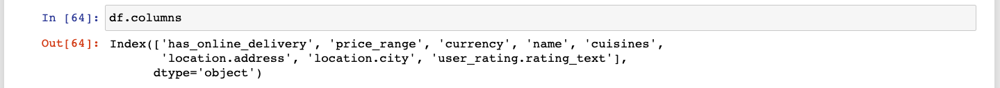

Esto es muy útil cuando tenemos conjuntos de datos muy grandes y queremos saber qué columnas tenemos en un solo vistazo.

La propiedad `dtypes` nos da una `Serie` donde podemos ver cada columna y el tipo de dato que contiene:

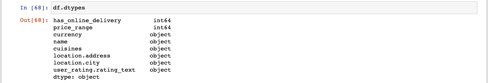

Podemos observar aquí que sólo las columnas `has_online_delivery` y `price_range` tienen valores numéricos. Todas las demás columnas tienen tipo `object` que en este caso parece que se refiere a `strings`.

---

Éste fue un primer acercamiento muy básico al Ánalisis Exploratorio de Datos. En la siguiente sesión aprenderemos a adquirir datos de otras fuentes y exploraremos también herramientas de exploración mucho más poderosas. 

---

## Quiz

1. ¿Cuál de estos tipos de dato *no* es un tipo de dato de `pandas`?

a) `object`
**b) `text`**
c) `int64`
d) `float64`
e) `bool`

2. ¿Qué propiedad de las `Series` de `pandas` utilizamos para indexar nuestra `Serie` y obtener valores específicos?

a) append
b) idx
c) index
**d) loc**
e) pos

3. ¿Cuál es la manera correcta de agregar una columna a mi `DataFrame`?

a) df.add(nueva_columna)
b) df.append(nueva_columna)
**c) df['nueva_columna'] = nueva_columna**
d) df[nueva_columna]
e) df + nueva_columna

4. ¿Cuál de los métodos siguientes puedo usar para obtener las 10 primeras entradas de un `DataFrame`?

**a) df.head(10)**
b) df.tail(10)
c) df[:10]
d) df.get(10)
e) df.head()

5. ¿Qué propiedad puedo pedir para obtener los tipos de datos de cada columna en mi `DataFrame`?

a) df.types
b) df.T
c) types(df)
**d) df.dtypes**
e) df.get('types')
