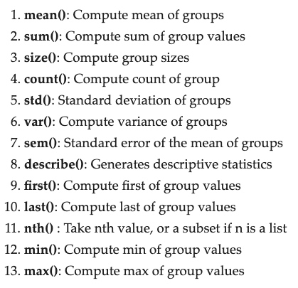

 ## Nombre del Postwork: Limpieza de datos y agregaciones

### OBJETIVO 

- Limpiar nuestro dataset de `NaNs`.
- Reindexar si es necesario
- Renombrar columnas si es necesario
- Experimentar la aplicación de agregaciones para explorar nuestro dataset

#### REQUISITOS 

- Tener un dataset, haberlo leído usando `pandas` y haber realizado una primer exploración básica.
- Tener un problema/curiosidad/hipótesis en mente que quieras responder con este dataset.
- Tener una serie de preguntas que creas que te pueden ayudar a responder esa hipótesis.

#### DESARROLLO

Ya que tenemos nuestro dataset en un `DataFrame` y que hemos realizado una primera exploración, ha llegado la hora de hacer un poco de limpieza. Limpiar tu `DataFrame` es sumamente importante para poder utilizarlo después de manera cómoda y apropiada. También vamos a explorar nuestro dataset usando agregaciones para ver si podemos empezar a responder algunas de las preguntas que nos hemos planteado. Los pasos que debes de seguir son los siguientes:

1. Explora tu dataset con el fin de encontrar los `NaNs` que contiene. Piensa en la distribución de `NaNs` por columna y por fila.
2. Piensa cuáles son los procedimientos que puedes aplicar a tus `NaNs`. ¿Tenemos que eliminar las filas/columnas que tienen esos `NaNs`? ¿O podríamos rellenar esos `NaNs` con algún valor de manera que podamos retener esas filas/columnas?
3. Limpia tu dataset de manera que no quede ningún `NaN`.
4. Reindexa tu dataset si lo consideras necesario.
5. Renombra tus columnas si lo consideras necesario.
6. Prueba aplicar agregaciones a tu `DataFrame` para ver si puedes empezar a responder algunas de las preguntas que te planteaste anteriormente. Aquí tienes una lista de algunas de las funciones que puedes utilizar para agregar/reducir tu dataset:

Si tienes cualquier duda, ¡pregúntale a tu experta!