
<strong>Curso Data Analysis - Módulo 3 PREWORK de Limpieza y Exploración de Datos</strong>

<strong>PREWORK SESIÓN 5</strong>

### Introducción

Ya sabemos cómo leer archivos con `pandas` y cómo realizar una exploración básica del contenido. En esta sesión vamos a aprender algunas técnicas más avanzadas de Exploración de Datos. También vamos a ver los principios de la Limpieza de Datos, que usamos para dejar nuestros conjuntos de datos listos para ser reestructurados, analizados y visualizados.

La Exploración y la Limpieza van totalmente de la mano. No puedes limpiar sin explorar primero, y gran parte de las técnicas de exploración que usamos tienen como objetivo justamente encontrar inconsistencias, errores, redundancias, etc, en nuestro conjunto de datos para poder deshacernos de ellas.

#### Objetivos

- Aprender a leer archivos en formato CSV
- Aprender técnicas más avanzadas de exploración de datos
- Aprender cómo a través de la exploración podemos encontrar inconsistencias, errores y redundancias
- Aprender algunas técnicas básicas de limpieza de datos

#### TODO

### Lectura de CSVs

La sesión pasada aprendimos a leer archivos en formato JSON. El formato JSON, que es muy parecido a los `diccionarios` de Python, es sólo uno de los tantos formatos con los que nos vamos a topar.

Los CSVs pertenecen a una clase de formatos donde las columnas de nuestra tabla se delimitan usando lo que se llama un `separador`. CSV significa Comma-Separated Values y como bien imaginarás significa que se una una `coma` (`,`) para separar las columnas. Un CSV se ve así:

En un archivo de texto donde cada fila de nuestra tabla tiene su propia línea y donde los valores de cada columna se delimitan usando una `coma` (`,`). Leer archivos .csv usando `pandas` es muy fácil. Lo único que tienes que hacer es lo siguiente:

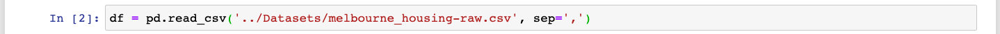

`pandas` tiene un muy conveniente método llamado `read_csv` que nos permite leer archivos .csv directamente. Ése mismo método también puede ayudarnos a leer otros formatos con columnas delimitadas por otros separadores. Por ejemplo, podemos leer .tsv ('tab-separated values'), que son archivos donde cada columna está delimitada por un `tab` (indentación). Sólo basta con llamar el método con el argumento `sep=\t`.

¡Como ves, leer archivos tipo .csv es muy fácil!

### Análisis Exploratorio de Datos

Muy bien, empecemos nuestra exploración con las técnicas que ya conocemos primero:

Ok, algunas cosas importantes:

1. El dataset tiene 19740 filas y 21 columnas
2. Podemos observar que la información que tiene el dataset es básicamente cierta descripción de las propiedades, su locación y tipo y fecha de venta.
3. Hay varias columnas `float64`, `rooms` es `int64`, y el resto son `object`.
4. Tenemos algunos `Nans` en el dataset.

¿`NaNs`? ¿Que quiero decir con eso? Bueno, los `NaNs` son valores `Not a Number` que básicamente son valores nulos en nuestro dataset. Estos valores pueden causar muchos problemas, ya que son valores nulos en columnas numéricas pero no podemos realizar operaciones matemáticas con ellos (son valores **`Not a Number`**, así que las matemáticas están fuera de las posibilidades). En esta sesión vamos a aprender a lidiar con estos valores, pero antes tenemos que aprender algo llamado `funciones vectorizadas`, que nos ayudará mucho durante esta exploración.

### Funciones vectorizadas

¿Recuerdas nuestras funciones `map` y `filter`? A esas funciones les pasábamos nosotros una función y una lista y nos regresaban una lista con los resultados de aplicarle la función a cada uno de los elementos en orden. Las funciones vectorizadas funcionan muy parecido, pero están optimizadas para funcionar con arreglos de `pandas` y de `numpy` (si quieres saber más sobre numpy [lee esto](https://ligdigonzalez.com/introduccion-a-numpy-python-1/)). Si tomas un arreglo de `pandas` (es decir, una `Serie`) y le aplicas una función vectorizada, la función se aplica a todo el arreglo elemento por elemento y te regresa un arreglo del mismo tamaño con el resultado de la aplicación.

Aplicar funciones de manera vectorizada a una `Serie` de `pandas` es facílisimo, incluso más fácil que usar la fución `map`. Basta, por ejemplo, con realizar una operación matemática con la `Serie` para que la operación se aplique a todo el arreglo "elemento por elemento" y regrese el resultado de la aplicación:

Podemos realizar cualquier operación matemática y la aplicación se hará de la misma manera:

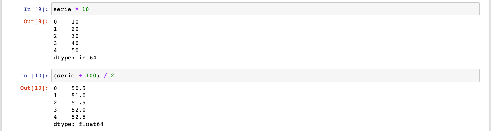

¡Qué genial! No tenemos que usar `map`, ni que declarar una función, ni que usar `lamda`. Basta con una simple operación matemática. `pandas` además está optimizado para funcionar de esta manera, así que la velocidad de aplicación es mucho mayor que la combinación de `map` con `listas`.

Otra manera de aplicar funciones de manera vectorizada a una `Serie` es utilizando funciones de `numpy`. `Numpy` es otra librería que es muy común entre los científicos de datos. Ofrece muchas herramientas para realizar cálculos numéricos a altas velocidades. No usaremos mucho esta librería en este módulo, pero es importante entender que se pueden utilizar funciones de `numpy` para aplicar funciones de manera vectorizada a `Series` de `pandas`. Para importar `numpy` hacemos lo siguente:

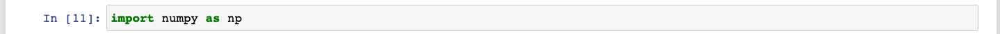

Y por ejemplo, si quisiéramos elevar al cuadrado nuestra `Serie`, podríamos hacer algo como esto:

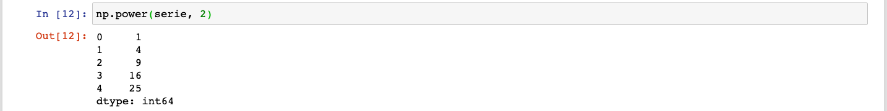

También podemos sacar la raíz cuadrada de nuestra `Serie`:

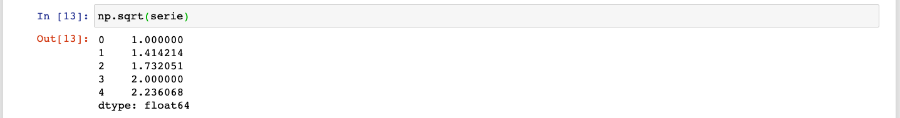

### Agregaciones

Hay una variación de estas funciones vectorizadas llamadas `agregaciones` (o `reducciones`) que lo que hacen es tomar un arreglo, atravesarlo "elemento por elemento" y regresar un solo número que es un "resumen" del arreglo. Este "resumen" es justamente la `agregación` o `reducción`. Podemos aplicar estas funciones usando `numpy` o directamente desde una `Serie` o `DataFrame` de `pandas`. Para efectos prácticos, vamos a utilizar nosotros los métodos que vienen integrados directamente en `pandas`. Por ejemplo, podemos sumar todos los valores de una `Serie` de esta manera:

O podemos contar el número de elementos en una `Serie` así:

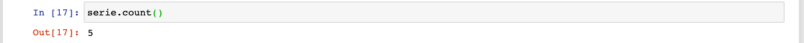

Podemos obtener el valor más pequeño de la `Serie`:

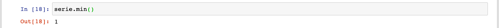

O el valor más grande:

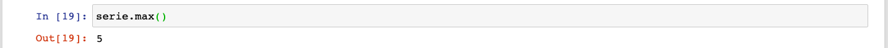

¡Y eso no es todo!

### Funciones vectorizadas y Agregaciones con `DataFrames`

Tanto las funciones vectorizadas como las agregaciones pueden ser aplicadas a `DataFrames` completos. 

Vemos primero las agregaciones. al aplicar una agregación a un `DataFrame`, lo que obtenemos de regreso es el resultado de aplicar la función a cada una de las columnas (que al final de cuentas son `Series`, ¿lo recuerdas?). Por ejemplo, tenemos este `DataFrame`:

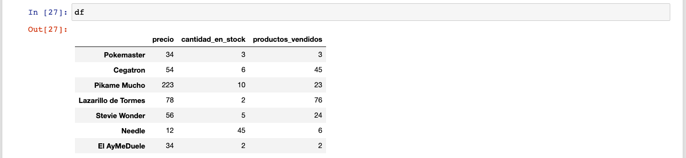

Mira qué pasa cuando le aplicamos la agregación `sum`:

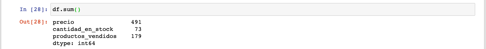

`pandas` toma cada una de las columnas, suma todos los valores dentro de cada columna y nos regresa el resultado de las sumas en una nueva `Serie`, donde el índice son los nombres de las columnas en el `DataFrame` y los valores son las sumas.

También funciona con las demás agregaciones:

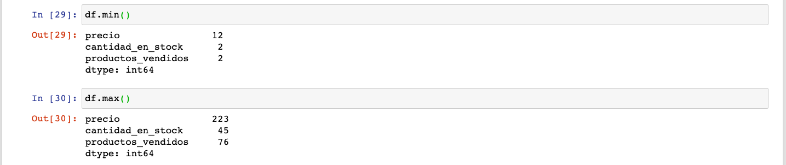

Interesante, ¿no lo crees?

Ahora veamos qué pasa cuando aplicamos funciones vectorizadas a nuestro `DataFrame`:

La función (`x * 100`) fue aplicada a **cada uno de los elementos del `DataFrame`** y obtuvimos un nuevo `DataFrame` con los resultados, ¿ves?

Cualquier función vectorizada que le apliquemos al `DataFrame` va a tener el mismo efecto:

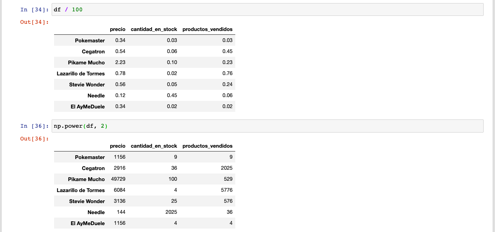

Ahora sí, estamos listos para aprender a lidiar con valores nulos (`NaNs`).

### NaNs

Como ya dijimos, los NaNs (`Not a Number`) son valores nulos en nuestro conjunto de datos. Son valores que por alguna razón no se encuentran en nuestro dataset. A la hora de coleccionar nuestros datos, al momento de transcribirlos o de almacenarlos, algo pasó que algunos de esos datos faltan en el dataset final. `pandas` está diseñado para lidiar con estos datos fácilmente.

Veamos un `DataFrame` con valores NaN (estamos usando el objeto de `numpy` `np.nan` para crear valores Nan):

Como puedes ver, a este `DataFrame` le faltan datos. Los valores `NaN` que contiene son valores nulos, y nos nos dicen nada útil, en realidad. Podríamos asumir cosas acerca de por qué faltan estos datos, pero no serían más que suposiciones.

Ahora, ¿qué pasa con estos datos nulos? Su presencia puede ser problemática para algunos de los análisis que queremos realizar.

En este caso nuestro dataset es muy pequeño y podemos visualizarlo todo de un solo vistazo. Pero vamos a imaginar que nuestro dataset ese mucho más grande y que necesitamos saber si hay `NaNs` y cuántos. Para lograr esto podemos usar una función vectorizada llamada `isna`. `isna` checa cada valor en nuestro `DataFrame`, lo transforma en `True` cuando el valor es igual a `NaN` y a `False` cuando no lo es:

Ok, ¿y ahora qué hacemos con esto? Podemos usar la agregación `sum` para hacer un conteo de nuestros valores nulos. Si recuerdas, `sum` sumaba todos los valores de cada columna y regresaba el total por columna. Si sumas valores `booleanos`, los `Trues` cuentan como `1` y los `False` cuentan como `0`. Esto significa que aplicando la función, obtendremos el total de valores nulos en cada columna:

De esta manera podemos saber si hay columnas que tienen demasiados valores nulos como para ser utilizadas.

También podemos obtener el número de `NaNs` que hay en cada fila pasándole un argumento a `sum`. Podemos indicarle a `sum` el eje en el cual queremos realizar la operación. En el caso de `pandas` eje se refiere a la dimensión de la estructura de datos. A estos ejes se les llama `axis`. Vamos a entender mejor los ejes más adelante cuando veamos `aritmética de Series`; por el momento basta con saber que si le pasamos `axis=1` a `sum`, nos regresa la suma de `NaNs` por ìndice:

La decisión de qué hacer con los `NaNs` depende mucho del contexto. Vamos a ver 3 cosas básicas que podemos realizar para limpiar estos datos indeseables:

1. Eliminar filas con `NaNs`
2. Eliminar columnas con `NaNs`
3. Llenar los `NaNs` con algún valor.

#### Eliminar filas con `NaNs`

