<div style="text-align: right"><strong>Curso Data Analysis - Módulo 4</br>PREWORK de APIs, automatización y concatenación de DataFrames</strong></div>

<div style="text-align: center; color:#FF0000"><strong>PREWORK</br>SESIÓN 6</strong></div>

### Introducción

En este Prework vamos a aprender a adquirir datos de una nueva fuente: las APIs. Vamos a usar la [API de la NASA](https://api.nasa.gov/) para obtener datos acerca de los objetos que orbitan cerca de la Tierra.

También vamos a aprovechar esto para aprender a automatizar procesos. Vamos a aprender un poquito sobre un par de estructuras que podemos usar en Python para hacer automatizaciones: `for loops` y `excepciones`.

Para terminar vamos a realizar un exploración acerca de una de las maneras que tenemos de unir `DataFrames`: la concatenación.

#### Objetivos

- Hacer peticiones a APIs.
- Automatizar peticiones a APIs utilizando For loops y Excepciones. 
- Usar concat para unir múltiples `Series`.
- Indexar usando `Multiíndices` en filas
- Usar concat para unir múltiples `DataFrames`.
- Guardar datasets localmente en formato .csv.

### APIs

Una API es una interfaz para comunicarnos con un software que está corriendo en algún servidor remoto. Normalmente, una API se usa para obtener datos acerca de algún tema en específico. Diferentes compañías, instituciones, universidades, etc, tienen APIs para que nosotros (programadores/desarrolladores/científicos de datos) podamos construir programas usando los datos que ofrecen. Hay una infinidad de APIs que ofrecen una gran diversidad de información.

Hoy vamos a aprender a comunicarnos con una para pedir datos y vamos a aprender a automatizar nuestras peticiones. Pero primero, un poquito de teoría.

#### Peticiones HTTP

Una peticiones HTTP es una solicitud de información de un cliente a un servidor usando el protocolo HTTP. El protocolo HTTP es simplemente una serie de reglas que nos dicen cuál es la manera apropiada de comunicarnos con el servidor.

#### Endpoints y URLs

Los URLs son las direcciones a donde pedimos información. Una API tiene normalmente una documentación donde te indica cuáles son los URLs disponibles. Cada URL apunta hacia información o recursos distintos. Usamos algún tipo de software ([Postman](https://www.postman.com/) o [Request](https://requests.readthedocs.io/en/master/user/quickstart/#make-a-request)) para "llamar" dicho endpoint (URL) y aplicar una acción.

#### Verbos HTTP

Cuando realizamos una petición HTTP usamos 1 tipo de "verbo", que indica la acción que queremos realizar. Hay muchos verbos, pero 5 son los más importantes:

1. GET: Lo usamos cuando queremos pedir información
2. POST: Lo usamos cuando queremos enviar información para crear algo (una cuenta de usuario, por ejemplo)
3. PUT: Lo usamos cuando queremos sustituir algún dato por otro
4. PATCH: Lo usamos cuando queremos modificar algún dato
5. DELETE: Lo usamos cuando queremos eliminar algún dato

Para los propósitos de la adquisición de datos, el verbo que más nos interesa es el verbo GET (si quieres saber más sobre los demás verbos, [puedes ir aquí](https://juanda.gitbooks.io/webapps/content/api/arquitectura-api-rest.html)), así que usaremos solamente ése.

#### Parámetros

Cuando hacemos una solicitud HTTP, normalmente vamos a tener que enviar parámetros para delimitar nuestras búsquedas. Los parámetros funcionan de manera similar a los parámetros de las funciones, tienen un nombre y le pasamos un valor como argumento. Los parámetros que enviemos determinarán qué datos vamos a obtener de regreso y en qué forma.

#### Respuestas

Las respuestas son los datos que recibimos de una API. Normalmente los datos que se transifieren a través de una API están en formato JSON. Las respuestas contienen los datos que solicitamos, algo "metadata" (datos acerca de los datos) y un estatus de la petición.

#### Estatus de la petición

Cuando recibimos una respuesta, vamos también a recibir un código de estatus que sirve para identificar cuál fue el resultado de nuestra solicitud. También hay muchísimos estatus distintos, pero los más importantes son los siguientes:

1. 200: Todo salió bien.
2. 201: Los recursos que querías crear fueron creados con éxito
3. 404: El recurso no fue encontrado en ese URL
4. 400: Los datos que enviaste son incorrectos
5. 500: Hubo un error interno en el servidor

### Librería Requests

¡Estamos listos para hacer nuestras peticiones HTTP! Antes que nada, hay que instalar la librería de Python que usaremos para hacer nuestras peticiones: [requests](https://requests.readthedocs.io/en/master/user/quickstart/#make-a-request). Google Colab no incluye esta librería y por lo tanto es necesario instalarla manualmente

En una celda de tu JN escribe el comando `!pip install requests` y corre la celda para instalar la librería. Ahora se ha instalado esta librería en esta celda. Cada vez que quieras usar esta librería en un JN distinto tendrás que volver a realizar la instalación, puesto que todo se resetea.

Ahora, necesitamos un API. Vamos a explorar un API que ofrece la NASA acerca de objetos en el espacio cuya órbita pasa cerca de la Tierra. [Puedes encontrar dicha API y su documentación aquí](https://api.nasa.gov/). Para poder acceder a la API, necesitamos registrarnos en la página de la NASA y obtener lo que se llama un Api Key, que es un tipo contraseña que necesitamos para hacer peticiones a su API. Puede obtener tu propia Api Key registrándote [aquí](https://api.nasa.gov/#signUp).

Entonces, vamos a importar `requests` en un Jupyter Notebooks:

<div style="padding: 10px; margin: 20px"></div>

Según la documentación, el siguiente es el `url` al que podemos pedir datos acerca de estos objetos que orbitan cerca de la Tierra:

<div style="padding: 10px; margin: 20px"></div>

Vamos a realizar una petición `GET` usando `requests` a ver qué pasa:

<div style="padding: 10px; margin: 20px"></div>

Ok... ¿Y ahora qué?

Un primer paso sería revisar el estatus de la llamada:

<div style="padding: 10px; margin: 20px"></div>

El estatus 403 significa que el recurso está prohibido. Podemos ver un poco más de información pidiendo el cuerpo de la respuest en formato `json`:

<div style="padding: 10px; margin: 20px">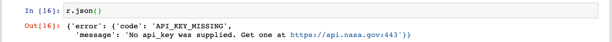</div>

¡Lo que pasa es que no hemos mandado la API Key!

Según la documentación, la API Key tiene que ser mandada como parámetro en la petición. Podemos agregarla a los parámetros de la siguiente manera:

<div style="padding: 10px; margin: 20px">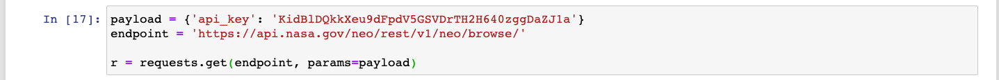</div>

Veamos la respuesta:

<div style="padding: 10px; margin: 20px">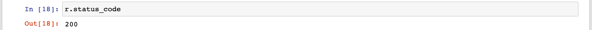</div>

¡Éxito!

Si revisamos los datos enviados en la respuesta podemos ver que ya tenemos algo que parece útil:

<div style="padding: 10px; margin: 20px">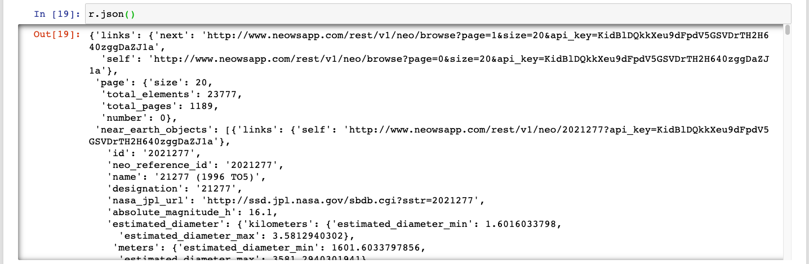</div>

Para entender mejor este json, vamos a revisar las `keys` primero:

<div style="padding: 10px; margin: 20px">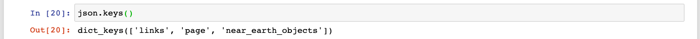</div>

Ok, veamos qué hay en `links`:

<div style="padding: 10px; margin: 20px">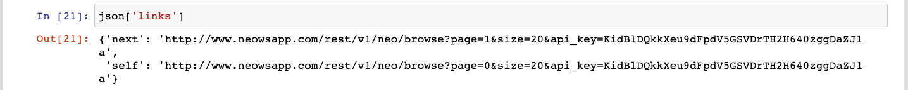</div>

Esta metadata nos dice qué link es el que solicitamos (`self`) y el siguiente link que tendríamos que usar para pedir los datos posteriores (`next`). Esto está buenísimo porque nos permite automatizar nuestras llamadas. Al siempre saber cuál es el link que sigue, podemos extraerlo de ahí y realizar una  nueva llamada.

Veamos qué hay en `pages`:

<div style="padding: 10px; margin: 20px">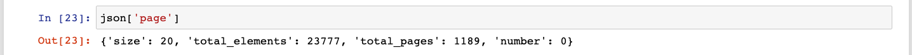</div>

Esta es información sobre la "página" que hemos pedido. Como si fuera un libro, cada página tiene una cierta cantidada de información. Podemos ver que esta página tiene 20 entradas (`size`), que el total de elementos que hay en la base de datos es de 23777 (`total_elements`), que el total de páginas es de 1189 (que como podrás imaginar, es 23777 dividido entre 20), y que la página actual es la 0 (`number`).

Ahora veamos `near_earth_objects`:

<div style="padding: 10px; margin: 20px">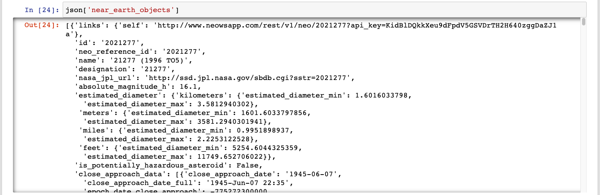</div>

¡Estos son nuestros datos! Podemos ver que tenemos una `lista` con `diccionarios` dentro. Esto es algo que podemos leer directamente en `pandas`. Vamos a hacer eso. Debido a que el `json` que tenemos tiene muchos datos "anidados" (`diccionarios` dentro de `diccionarios` dentro de `diccionarios`), necesitamos primero "normalizar" nuestros datos. Esto básicamente significa extraer los datos anidados para convertirlos en su propia columna (puedes aprender más sobre este proceso [aquí](https://www.kaggle.com/jboysen/quick-tutorial-flatten-nested-json-in-pandas)). Simplemente hay que usar el siguiente código:

<div style="padding: 10px; margin: 20px"></div>

Y ahora creamos un `DataFrame` usando `from_dict`:

<div style="padding: 10px; margin: 20px">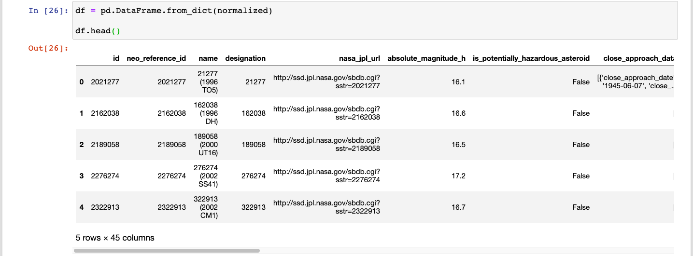</div>

¡Listo! Ya tenemos un `DataFrame` con nuestros datos.

Ahora, estos son sólo 20 entradas de un total de 23777. Si queremos hacer un verdaero análisis, vamos a necesitar un poco más de datos. Hacer estas peticiones manualmente nos tomaría años, así que vamos a utilizar algunas herramientas de Python para automatizar este proceso.

### For Loops

Los `for loops` son operadores de control de flujo que sirven para realiza iteraciones, lo cual puede ser utilizado para ejecutar un mismo código repetidas veces. Un `for loop` se ve así:

<div style="padding: 10px; margin: 20px"></div>

Vamos a diseccionarlo.

`range(0, 10)` le indica a Python que queremos iterar en el rango de `0` a `9` (el último número nunca se incluye).

`for i in` significa que "cada iteración que realicemos, el valor que le corresponda a dicha iteración va a ser asignado a una variable llamada `i`".

Después escribimos dos puntos (`:`) y el bloque del `for loop`. En este caso, en el bloque estamos imprimiendo el valor de `i` que es el valor obtenido de `range(0, 10)` en cada iteración.

Vamos a usar un `for loop` para realizar 10 peticiones a la API de la NASA de manera automática.

En cada iteración hacemos la llamada, revisamos el estatus, extraemos los datos correspondientes y después usamos `[links][next]` para obtener el nuevo link y repetir la operación. Como el valor del `for loop` no va a ser utilizado (sólo queremos repetir el código 10 veces y ya), podemos escribir `_` en vez de `i`:

<div style="padding: 10px; margin: 20px">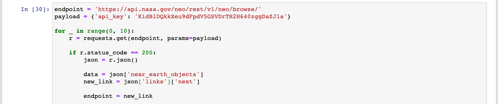</div>

Fíjate en la última línea donde asignamos `endpoint = new_link` para que en la siguiente iteración la petición se haga al nuevo link.

Es una buena práctica esperar un poco entre cada petición. Para eso vamos a usar la librería `time` para esperar 5 segundos entre cada petición:

<div style="padding: 10px; margin: 20px">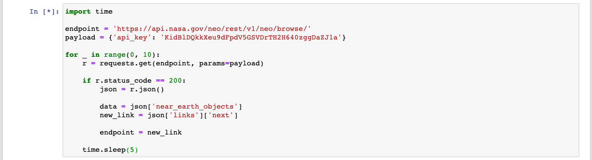</div>

Ahora, ¿qué hacemos con nuestros datos? ¿Como los podemos guardar para utilizarlos después? Podríamos tener un diccionario donde guardemos los nuevos datos en cada iteración. La llave va a ser el número de iteración. Para lograr esto necesitamos volver a definir `i` y agregar los datos a un diccionario llamado `dict_datos`:

<div style="padding: 10px; margin: 20px">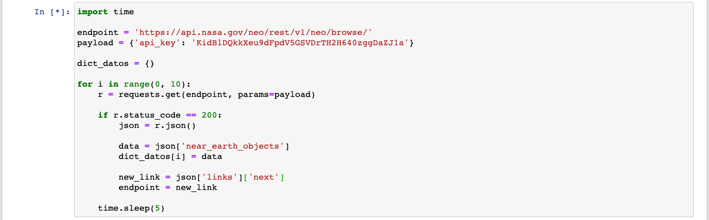</div>

Veamos qué hay en `dict_datos`:

<div style="padding: 10px; margin: 20px">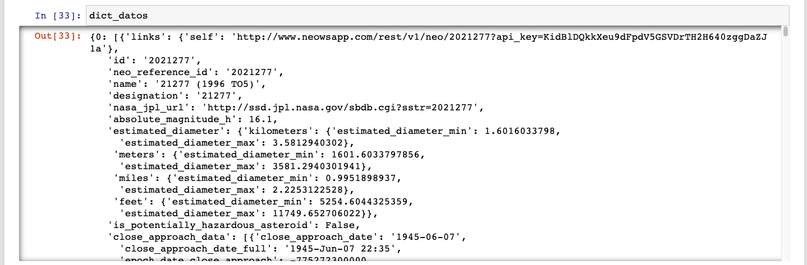</div>

¿Ves? Tenemos un `diccionario` donde cada llave contiene una de las `listas` de `jsons` que obtenemos en cada llamada.

Ahora, vamos a poner un método de seguridad para asegurarnos que nuestra automatización no vaya a fallar.

### Excepciones

Hay veces que algún error (una `Exception`) sucede durante la ejecución de nuestro programa, Python lo detecta y detiene el programa completo para evitar que el error cause problemas. Por ejemplo, aquí tenemos un error que sucede durante la lectura de una llave inexistente en un `diccionario`:

<div style="padding: 10px; margin: 20px">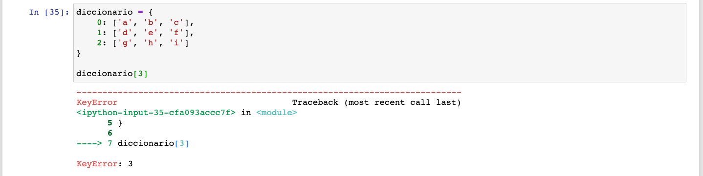</div>

Este error podría suceder durante la lectura de la respuesta a nuestra petición, cuando accedemos a `near_earth_object` o a `links`. Si este error sucediera, nuestro programa se detendría. Dado que lo que queremos es automatizar este proceso, dejar que nuestro programa se detenga suena a una muy mala idea. Para evitar que eso suceda, usamos una estructura llamada `try except`. Básicamente lo que sucede es que cierto código se intenta correr durante el bloque de `try`, y si ese código lanza una `excepción` (un error), en vez de detener el programa el bloque de `except` se corre para que tú puedas hacer algo para lidiar con el problema. En nuestro ejemplo, esto se vería así:

<div style="padding: 10px; margin: 20px"></div>

Vamos a agregar un `try except` a nuestro `for loop` para evitar que haya errores que arruinen nuestro programa. También voy a agregar un parámetro `timeout=5` a mi petición `GET`. Esto significa que cada vez que hagamos una llamada, vamos a esperar durante 5 segundos a obtener una respuesta. Si no obtenemos respuesta, se lanza un error. Esto sirve para evitar que nuestro programa se quede esperando durante años para obtener una respuesta. Dado que la agregación del timeout significa que puede haber un error de timeout, vamos a envolver todo el código del bloque `for loop` con nuestro `try except`. De esta manera "cachamos" cualquier error que suceda ahí:

<div style="padding: 10px; margin: 20px"></div>

En el bloque de `except` lo único que estoy haciendo es agregar un `continue`. Esto le indica a Python "si hay un error, simplemente continua con la siguiente iteración". Obviamente la petición se va a realizar a la misma URL de la iteración que falló. Podríamos agregar lógica para intentar evitar esto, pero eso se quedara pendiente para alguna otra ocasión.

Observa también que cambié el lugar de `time.sleep(5)`, para asegurarme de que se corra ese código en cada iteración, sin importar si hay un error o no.

Ahora que ya tenemos nuestro programa para obtener nuesros datos, necesitamos saber qué hacer con esos datos. Sobre todo, es necesario aprender a juntar todos nuestros datos obtenidos en un mismo `DataFrame`. Para eso vamos a aprender a concatenar `DatFrames`.

### Concatenación de `DataFrames`

Otra de las principales tareas de un Data Wrangler es la de unir conjuntos de datos en un solo `DataFrame`. Dado que los datos que hemos estado obteniendo están separados en pedazos (chunks, como les dicen en su casa), vamos a aprender una de las técnicas que existen para unir `DataFrames`, la concatenación. En realidad, en esta instancia en particular, una opción más directa hubiera sido simplemente unir la lista que obtenemos en cada iteración con una lista principal que contenga todas las entradas. Pero vamos a aprovechar la fragmentación de nuestro dataset para aprender sobre concatenación.

Primero que nada, voy a usar otro `for loop` para iterar por todas las llaves de nuestro diccionario. Si uso la misma estructura, pero en lugar de `range(0, 10)` itero sobre el diccionario, cada `i` se convierte en una de las llaves de nuestro diccionario:

<div style="padding: 10px; margin: 20px">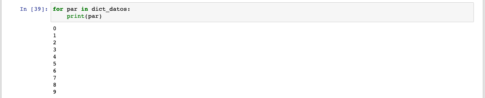</div>

Entonces, en cada iteración voy a normalizar la lista de diccionarios, voy a convertirla en un `DataFrame` y la voy a guardar en el mismo diccionario, reemplazando el valor anterior por uno nuevo:

<div style="padding: 10px; margin: 20px">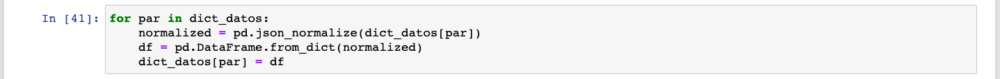</div>

Ahora todos nuestros valores son `DataFrames`:

<div style="padding: 10px; margin: 20px">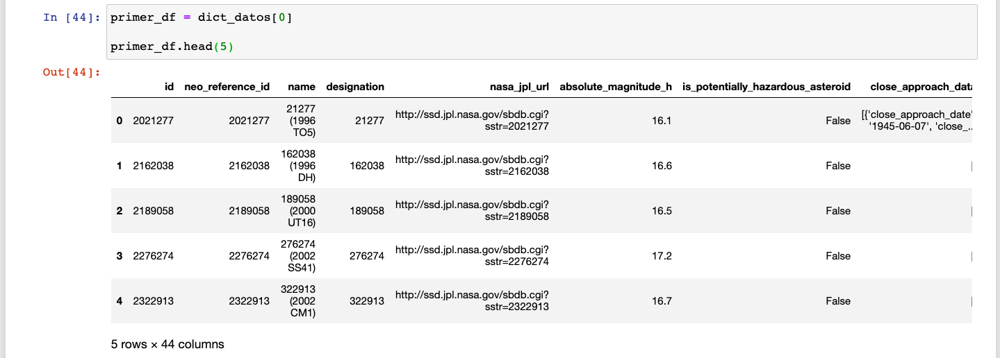</div>

Vamos a juntarlos todos en un gran, rechoncho y sanote `DataFrame`. Pero primero, vamos a entender bien cómo funciona `pd.concat`.

`pandas` ofrece varias maneras de unir `DataFrames` un solo `DataFrame`. Una de ellas es la función `pd.concat`. `pd.concat` te permite concatenar `Series` y `DataFrames` usando diferentes `axis`. Comencemos con las `Series`.

#### `pd.concat` con `Series`

Tenemos las siguientes dos `Series`:

<div style="padding: 10px; margin: 20px">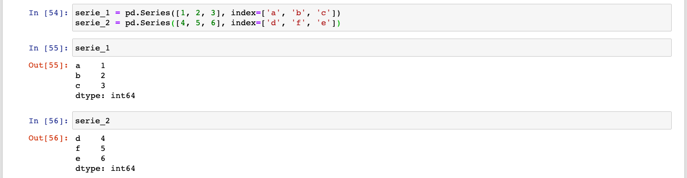</div>

Podemos unirlas de manera vertical llamando `pd.concat` con `axis=0`. Observa que tenemos que pasarle las dos `Series` dentro de una `lista`:

<div style="padding: 10px; margin: 20px"></div>

Si queremos unirlas horizontalmente, podemos llamar la función usando `axis=1`:

<div style="padding: 10px; margin: 20px"></div>

Aquí hay dos cosas que observar:

1. Usé el argumento `keys` para ponerle nombre a las columnas (ya que las `Series` originales no tenían nombres).
2. Debido a que las `Series` tienen diferentes índices, la concatenación horizontal deja muchos valores vacíos. Esto se debe a que la `serie_1` no tiene valores que correspondan a los índices 'd', 'f', y 'e'; mientras que la `serie_2` no tiene valores que correspondan a los índices 'a', 'b', y 'c'.

Mira lo que pasa si concatenamos dos `Series` que compartan el mismo índice:

<div style="padding: 10px; margin: 20px">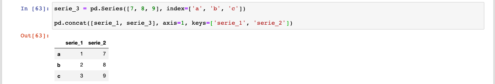</div>

Si concatenamos verticalmente dos `Series` que comparten el mismo índice, tenemos un pequeño problema:

<div style="padding: 10px; margin: 20px">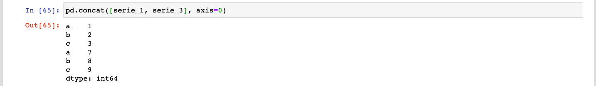</div>

Como ves, el índice se repite. Hay veces que esto es justo lo que queremos, pero en este caso, no parece muy deseable. En este caso tenemos dos opciones.

1. Si no nos interesa mucho el índice actual, podemos resetearlo para obtener uno nuevo donde no haya repeticiones:

<div style="padding: 10px; margin: 20px"></div>

2. En caso de que sí nos interese el índice, pero queramos poder diferenciar entre los índices que vienen de la `serie_1` y los que vienen de la `serie_3`, podemos usar el argumento `keys` para agregar un segundo nivel en el índice:

<div style="padding: 10px; margin: 20px">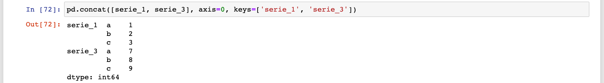</div>

¡¿Khá?! ¿Y eso qué es? ¿Un segundo nivel de índice? Pues sí, aunque no lo creas, podemos crear diferentes niveles de índices que nos ayudan a segmentar nuestros datos a más detalle. Existen los `Multiíndices` de filas y también de columnas. En este caso, tenemos uno de filas.

##### Pequeña digresión para hablar sobre Multíndices en Filas

Que no cunda el pánico. Si quisieras acceder a tus datos usando `loc` simplemente tendrías que hacer algo como esto:

<div style="padding: 10px; margin: 20px"></div>

¿Ves? como primer argumento a nuestro `loc`, en vez de un solo valor, le pasamos una `tupla` de valores. Una `tupla` es eso que ves dentro de dos paréntesis (`('serie_1', 'b')`). Es una manera de contener dos o más valores. En este caso, nuestros dos valores son los dos niveles de nuestro índice que queremos acceder: primero `serie_1` y después `b`. Si queremos acceder al índice `b` de la `serie_3`, haríamos lo siguiente:

<div style="padding: 10px; margin: 20px"></div>

Podríamos concatenar muchas `Series` con los mismos índices y mantenerlas segmentadas usando `multiíndices`:

<div style="padding: 10px; margin: 20px">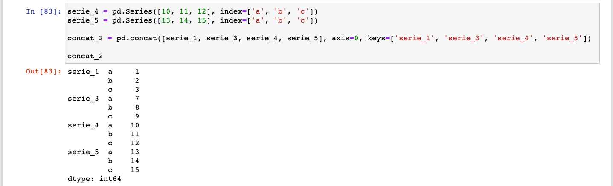</div>

Lo más genial es que si accedemos a la nueva `Serie` usando sólo el primer nivel, obtenemos una de nuestras `Series` completa:

<div style="padding: 10px; margin: 20px">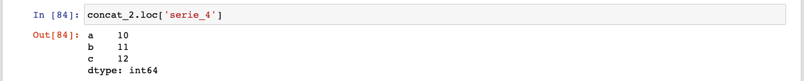</div>

Pero bueno, salgamos de nuestra pequeña digresión para hablar sobre concatenación de `DataFrames`.

#### `pd.concat` con `DataFrames`

La misma lógica aplica para la unión de `DataFrames`. Tenemos ahora dos `DataFrames`:

<div style="padding: 10px; margin: 20px"></div>

Usamos `axis=0` para concatenarlos verticalmente:

<div style="padding: 10px; margin: 20px"></div>

Si usamos `axis=1` de nuevo vamos a tener valores `NaN` porque los `DataFrames` no comparten índice:

<div style="padding: 10px; margin: 20px"></div>

Si tenemos dos `DataFrames` que comparten índice, pasa lo siguiente:

<div style="padding: 10px; margin: 20px">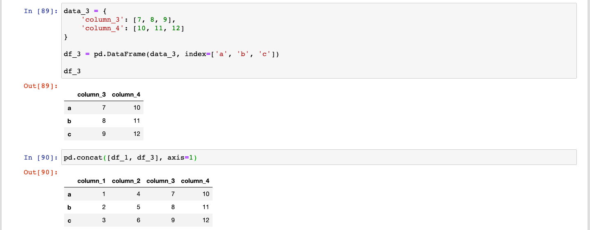</div>

Si los `DataFrames` comparten índice y queremos concatenarlos verticalmente, también podemos usar un multiíndice en las filas para diferenciarlos:

<div style="padding: 10px; margin: 20px">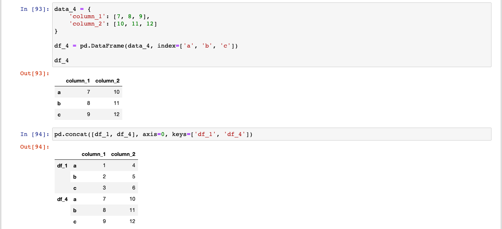</div>

Al igual que con las `Series` podemos acceder a ese `DataFrame` usando un solo nivel o ambos niveles:

<div style="padding: 10px; margin: 20px">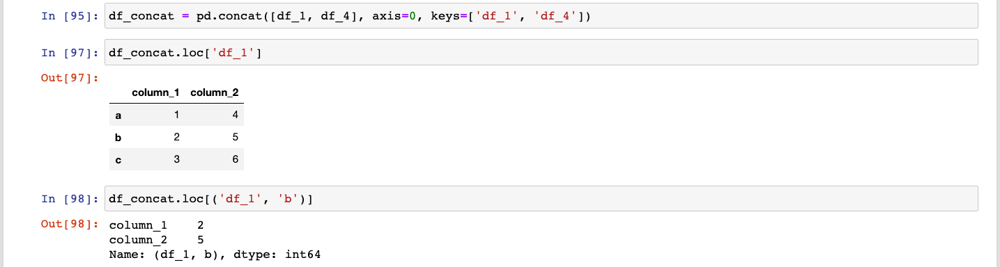</div>

Observa bien que en la primera indexación lo que obtuvimos es un `DataFrame`, pero en la segunda indexación ¡obtuvimos una `Serie`! Esto tiene mucho sentido, ya que en el índice `('df_1', 'b')` en realidad hay dos valores, el que le corresponde a la `column_1` y el que le corresponde a la `column_2`. Ya habrá tiempo de practicar, no te preocupes.

### Uniendo nuestro dataset usando `pd.concat`

Regresemos al fin a nuestro dataset original, el que obtuvimos de la API. Vamos a usar nuestras nuevas habilidades para unir los `DataFrames` en uno solo. También vamos a resetear el índice porque no nos interesa mantenerlo. Aquí está una posible solución:

<div style="padding: 10px; margin: 20px"></div>

<div style="padding: 10px; margin: 20px">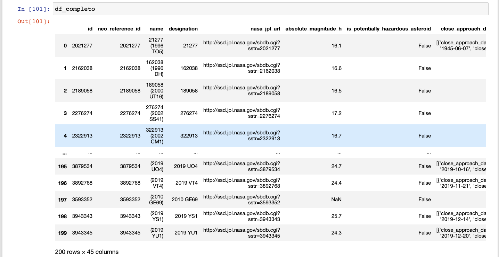</div>

Ya que tenemos las primeras 10 páginas de la API guardadas en un `DataFrame`, no queremos tener que volver a repetir todo el proceso. Para evitar esto, podemos guardar nuestro `DataFrame` en un archivo .csv para acceder a él después:

Ahora podríamos llevar a cabo el Procesamiento de Datos pertinente, pero eso lo llevaremos a cabo en otra sesión. Por lo pronto "¡hasta luego y gracias por todos los pescados!".

---

## Quiz

1. ¿Qué verbo HTTP utilizamos cuando queremos modificar un recurso de nuestra API?

a) PUT
b) POST
**c) PATCH**
d) DELETE
e) GET

2. ¿Qué estatus te regresa una API cuando los datos que enviaste en tu llamada son incorrectos?

a) 200
b) 201
c) 404
**d) 400**
e) 500

3. ¿Cuál es la sintaxis correcta para crear un `for loop` que imprima los valores del 0 al 9 uno tras otro?

a) 
```python
for i in 9:
    print(i)
```

b) 
```python
for 0 in 9:
    print(num)
```

c) 
```python
for i in len(9):
    print(i)
```

**d) 
```python
for i in range(0, 10):
    print(i)
```
**

e) 
```python
for i in range(0, 9):
    print(i)
```

4. Tenemos un `DataFrame` con multiíndice de 2 niveles. ¿Cuál es la sintaxis correcta para acceder al valor encontrado en el índice `level_1` del nivel 1 y el índice `level_2` del nivel 2:

a) `df.loc[['level_1', 'level_2']]`
**b) `df.loc[('level_1', 'level_2')]`**
c) `df.loc['level_1']['level_2']`
d) `df.loc(('level_1', 'level_2'))`
e) `df.loc.level_1.level_2`

5. ¿Qué bandera tengo que utilizar para concatenar dos `Series` de manera vertical?

**a) `axis=0`**
b) `axis=1`
c) `ax=0`
d) `axis=2`
e) `vertical=True`
