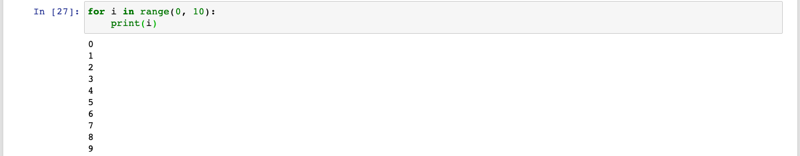
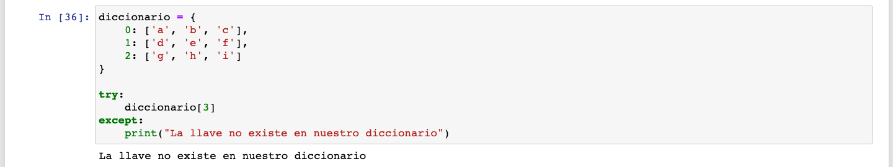
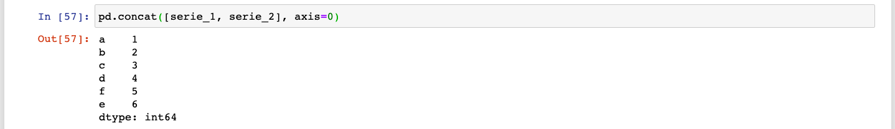
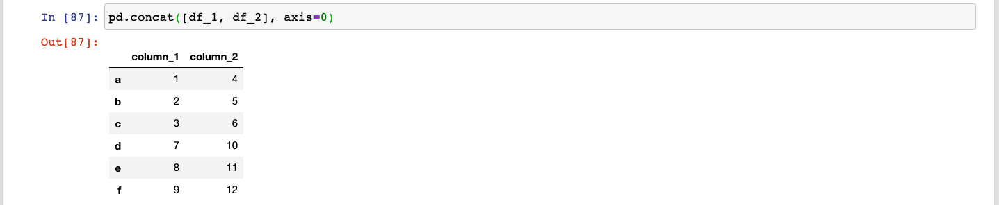

## Sesión 06: APIs, automatización y concatenación de DataFrames

### 1. Objetivos

- Hacer peticiones a APIs.
- Automatizar peticiones a APIs utilizando For loops y Excepciones. 
- Usar concat para unir múltiples `Series`.
- Indexar usando `Multiíndices` en filas
- Usar concat para unir múltiples `DataFrames`.
- Guardar datasets localmente en formato .csv.

### 2. Contenido

---

<ins>Introducción</ins>

Hoy vamos a aprender a adquirir datos de una manera que difiere mucho de las que hemos visto hasta ahora. No vamos a obtener los datos directamente de un archivo que descargamos o que obtenemos directamente de alguien más, sino que vamos a usar una API para obtener nuestros datos programáticamente y convertirlos en un `DataFrame` que podamos utilizar.

En el proceso no sólo veremos APIs sino que también aprenderemos a automatizar procesos usando Python, a concatenar `DataFrames` y a indexar `Series` y `DataFrames` usando `multiíndices` en las filas.

---

<ins>APIs</ins>

En el Prework vimos una descripción detallada de lo que son las APIs y cómo funcionan. Vimos que para hacer una petición a una API, tenemos que tomar en cuenta las siguientes cosas:

1. URL: la "dirección" a donde vamos a realizar nuestra petición
2. Verbo HTTP: El tipo de acción que vamos a realizar (i.e. GET, POST, PUT, PATCH, DELETE, etc.)
3. Parámetros: Valores que agregamos a nuestra petición para enviar información relevante a la API (datos de acceso, filtros, etc)
4. Estatus de la respuesta: Un código que nos dice si nuestra petición fue realizada exitosamente o no (i.e. 200, 201, 400, 404, 500, etc.)
5. Cuerpo de la respuesta: Los datos que nos fueron enviados de regreso al finalizar la petición.

Veamos esto en acción.

>

---

<ins>Librería Request</ins>

Vamos a usar la librería Request para realizar nuestras peticiones en Python. Primero que nada, tenemos que instalarla usando:

`!pip install requests`

Ahora vamos a ver cómo usarla.

>

[**`Ejemplo 1`**](Ejemplo-01/request.ipynb)
[**`Reto 1`**](Reto-01/request.ipynb)

---

<ins>Automatización con `for loops`</ins>

Podemos usar `for loops` para automatizar la realización de múltiples peticiones a distintos URLs. Primero que nada, vamos a ver cómo es que funcionan los `for loops`. Un `for loop` se ve así:

>

[**`Ejemplo 2`**](Ejemplo-02/for_loop.ipynb)
[**`Reto 2`**](Reto-02/for_loop.ipynb)

---

<ins>Protegiendo nuestro programa con `try except`</ins>

Cuando automatizamos cosas, no queremos tener que estar revisando todo el proceso continuamente. Si tuviéramos que hacer eso, el proceso no estaría muy automatizado que digamos. Durante la ejecución de nuestro programa pueden suceder errores que hagan que nuestro programa deje de correr.

Para evitar que estos errores detengan nuestro programa, podemos usar estructuras `try except` para indicarle a Python qué hacer cuando un error suceda:

>

[**`Ejemplo 3`**](Ejemplo-03/excepciones.ipynb)
[**`Reto 3`**](Reto-03/excepciones.ipynb)

---

<ins>Concatenación de `Series`</ins>

Cuando obtenemos nuestros datos en "cachitos", como cuando hacemos peticiones a una API, necesitamos luego unir todos nuestros datos en un solo `DataFrame`. Para eso podemos usar la función `pd.concat` de `pandas`. Primero vamos a aprender los principios básicos usando `Series`, para luego poder aplicar esos mismos principios a los `DataFrames`.

>

[**`Ejemplo 4`**](Ejemplo-04/concat_series.ipynb)

---

<ins>Concatenación de `DataFrames`</ins>

Los mismos principios de concatenación aplican tanto a `Series` como a `DataFrames`. Vamos a verlos en acción y realizar una práctica para que nos quede todo súper claro.

>

[**`Ejemplo 5`**](Ejemplo-05/concat_dataframes.ipynb)
[**`Reto 4`**](Reto-04/concat.ipynb)

---

<ins>Uniendo todo</ins>

Ahora sí, ha llegado el momento de la verdad. Vamos a usar `for loops`, `try except` y concatenaciones para automatizar las peticiones a nuestra API.

¡Abróchate los cinturones, viajero espacial, que esto se va a poner bueno!

>

[**`Ejemplo 6`**](Ejemplo-06/automatizando_peticiones.ipynb)
[**`Reto 5`**](Reto-05/automatizando_peticiones.ipynb)

---

### 3. Postwork

[**`Postwork Sesión 6`**](Postwork/Readme.md)
