
<strong>Curso Data Analysis - Módulo 3 PREWORK de Transformación, filtración y ordenamiento</strong>

<strong>PREWORK SESIÓN 7</strong>

### Introducción

En esta sesión vamos a aprender 3 de las herramientas más importantes que tenemos como Procesadores de Datos: transformación, filtración y ordenamiento. Veremos como convertir tipos de datos a otros tipos de datos, cómo manipular strings y cómo aplicar funciones custom a un `DataFrame`. También aprendemos a filtrar nuestros datos para crear subconjuntos y a ordenarlos usando índices y columnas para su fácil comprensión.

#### Objetivos

- Hacer casting de tipos de datos.
- Manipular strings usando el módulo `str`.
- Aplicar funciones custom a un `DataFrame`.
- Aplicar filtros a nuestros datos.
- Ordenar nuestro dataset por columnas.

### Transformación de Datos

Uno de los pasos más importantes en todo este proceso es el de la Transformación de Datos. Transformar datos significa exactamente lo que suena: tomar un dato y convertirlo en otro dato o en otro tipo de dato. La razón por la que necesitamos transformar nuestros datos es porque pocas veces vienen en el formato que lo necesitamos. Ya hemos realizado algunas transformaciones de nuestro dataset, como por ejemplo cuando convertimos `NaNs` en `0s`. El día de hoy aumentaremos las herramientas que tenemos para transformar datos con varias técnicas que son ampliamente utilizadas por los Procesadores de Datos.

### Casting

Una de las cosas más comunes con la que nos toparemos es la transformación de un tipo de dato a otro tipo de dato. Es muy normal que los datos que obtengamos no estén exactamente en el tipo de dato que necesitamos. En ese caso, es importante entender qué tipo de dato es el que necesitamos y también cómo lograr una transformación exitosa.

Primero que nada, vamos a importar un dataset:

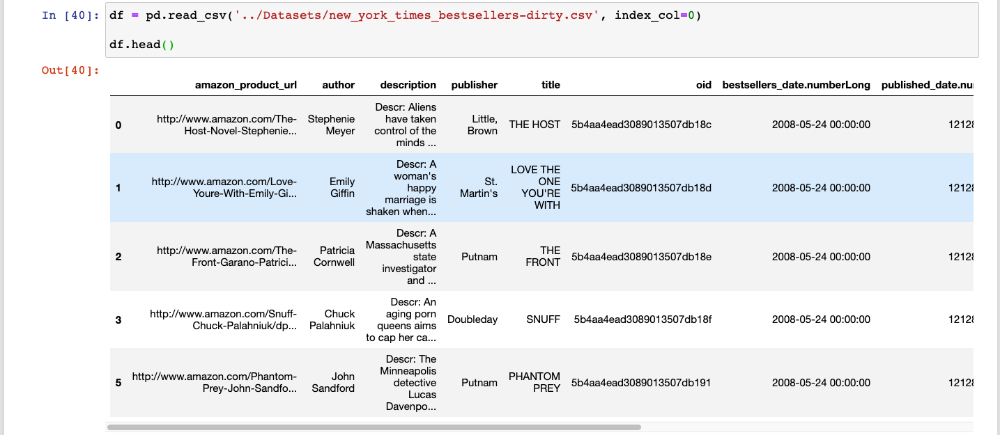

Éstas son las columnas restantes que no podíamos ver en la primera vista:

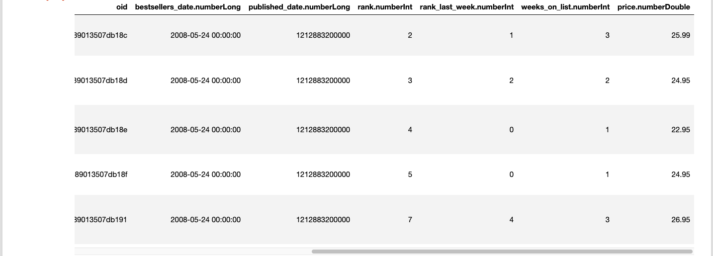

Veamos los tipos de datos que contiene:

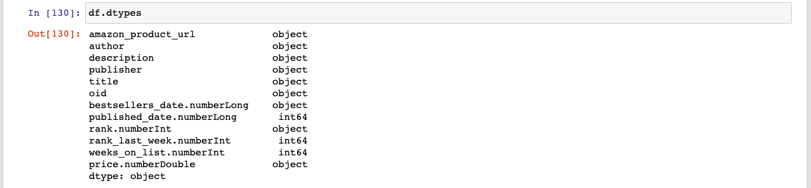

Hay 3 cosas que llaman mi atención:

1. `price.numberDouble` es tipo `object` y debería de ser `float`.
2. `rank.numberInt` es tipo `object` y debería de ser `int` (como si nombre bien lo dice).
3. `bestsellers_date.numberLong` y `published_date.numberLong` son tipo `object` e `int64` respectivamente, mientras que deberían de ser algún tipo de dato de fecha y tiempo.

¿Por qué ha pasado esto?

Veamos cada caso uno por uno.

#### `astype`

La manera más sencilla de transformar un dato en otro tipo de dato es usando el método `astype`. Basta con seleccionar la `Serie` que quieres transformar, llamar el método y pasarle el tipo de dato final:

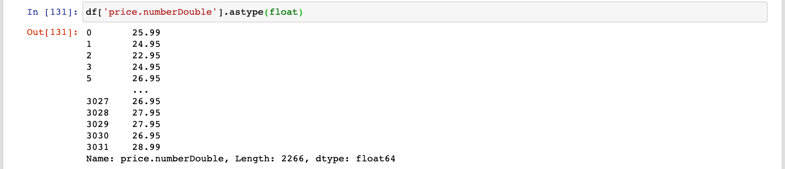

¡Uh la la! Ahí está nuestra `Serie` ya convertida a `float64` (que si recuerdas es el tipo de datos en `pandas` equivalente a `float` de Python). Ahora, para que esa nueva `Serie` sea parte de nuestro `DataFrame` tenemos que reasignar el resultado a la columna original:

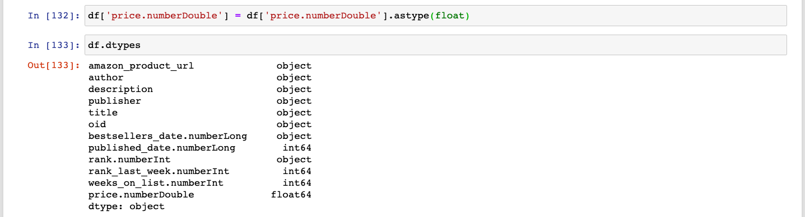

¡Listo!

Ahora, ¿qué pasa si quisiéramos convertir varias columnas al mismo tiempo? En vez de tener hacer este mismo proceso columna por columna podemos escribir un diccionario que sea un mapa entre las columnas que queremos transformar y el tipo de dato al que queremos transformarlas. Por ejemplo, imaginemos que además de la columna `price.numberDouble` tenemos otras columnas con los tipos de datos incorrectos. Podríamos hacer algo como esto:

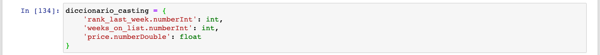

Ahora podemos usar ese diccionario y pasárselo al método `astype` del `DataFrame` completo:

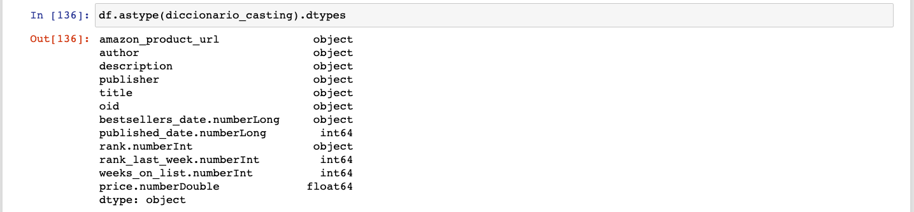

Y ahora necesitamos reasignar el `DataFrame` completo para que los cambios persistan:

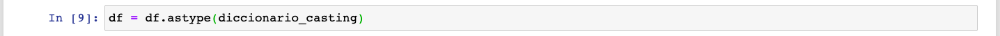

Esto está facílisimo, ¿no? Sólo hay un problema. Mira lo que pasa cuando intentamos convertir `rank.numberInt` a `int`:

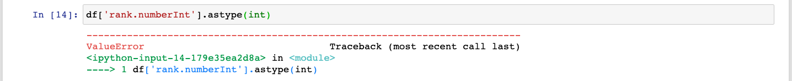

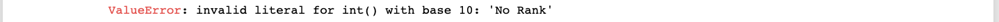

Al parecer hay por ahí algunas celdas con el valor 'No Rank' que (obviamente) no pueden ser convertidas a `int`. Hasta ahora nuestras conversiones habían sido muy sencillas porque nuestros datos se podían transformar fácilmente. Pero cuando hay datos que no pueden ser transformados al tipo que queremos, necesitamos usar otro método.

#### `to_numeric`

`pandas` tiene toda una serie de métodos que están hechos específicamente para hacer conversión (casting) a un tipo de dato. Para convertir datos a datos numéricos tenemos `to_numeric`. Primero, vamos a ver qué onda con ese dato que no podemos convertir. Vamos a usar un filtro para obtener sólo las filas donde tenemos el valor 'No Rank' (no te preocupes si no entiendes este paso, ¡más adelante en esta misma sesión aprendemos filtros!):

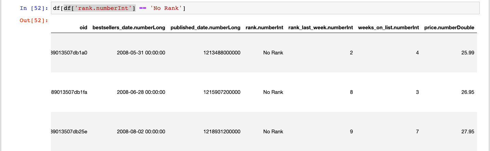

Efectivamente, hay por ahí algunos datos que no pueden ser convertidos a `int`. Para lograr la conversión podemos usar entonces `to_numeric`. Llamamos `to_numeric` de esta forma:

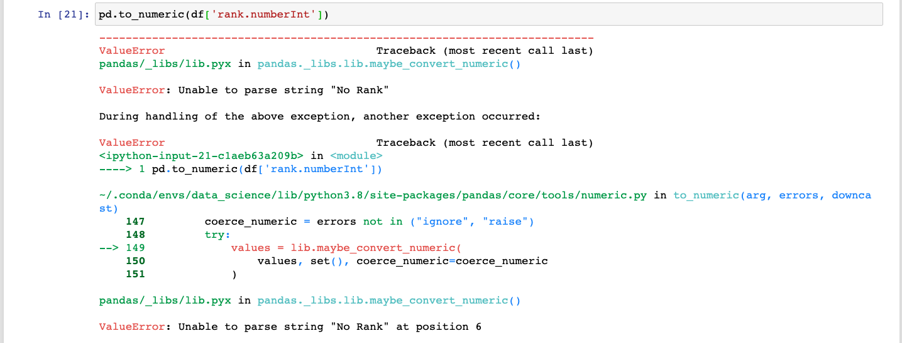

Ok... Eso no salió muy bien. Lo que sucede es que tenemos que avisarle a nuestro método qué hacer con los datos que no pueden ser convertidos. Para esto usamos el argumento `errors=` y le pasamos una de 3 opciones:

1. 'ignore': Cuando encontremos un dato que no pueda ser convertido, simplemente regresamos el dato original (lo cual no queremos porque al final de cuenta el tipo de dato de la `Serie` va a ser `object`).
2. 'raise': Cuando no podamos convertir un dato, lancemos un error (esto es justo lo que acaba de suceder).
3. 'coerce': Cuando no podamos un convertir un dato, lo convertimos a `NaN` y continuamos con la conversión.

Vamos a usar `coerce`:

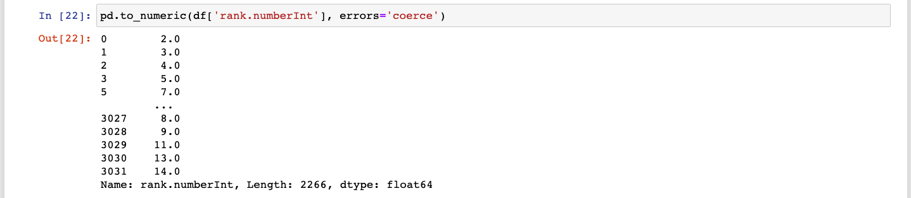

Esto está mucho mejor. Hemos obtenido una `Serie` con tipo de dato `float64`. Ya es un dato numérico, aunque esta columna claramente debería de ser `int64`. Lo que podemos hacer ahora que tenemos `NaNs`, es limpiar los `NaNs` y convertir a `int` los valores restantes. Primero, reasignamos nuestra columna:

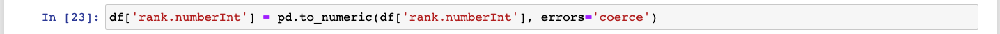

Ahora, limpiamos los `NaNs`:

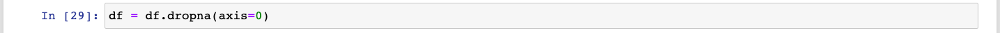

Ahora reseteamos el índice:

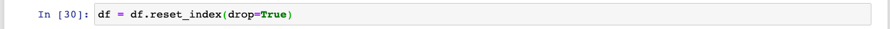

Y para finalizar, realizamos ahora sí la conversión a `int`:

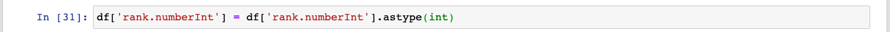

Veamos el resultado:

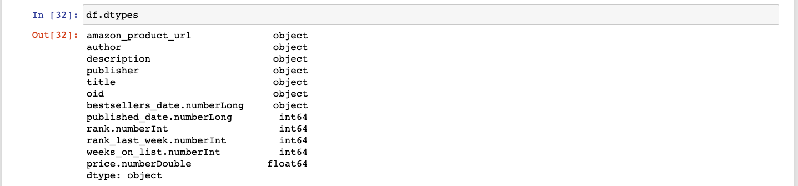

¡Éxito!

Vamos a ver ahora qué onda con las fechas.

#### `Datetime64`

No hemos todavía hablado acerca del tipo de dato `datetime64`. Este tipo de dato, como su nombre lo indica, sirve para trabajar con fechas y horarios. En este módulo no vamos a trabajar a detalle con `datetime64`, pero es importante que sepas que utilizando objectos de este tipo puedes manipular fechas y horarios con muchísima flexibilidad ([aquí puedes ver la documentación](https://pandas.pydata.org/pandas-docs/stable/user_guide/timeseries.html)). Por lo pronto vamos a aprender simplemente cómo transformar datos en tipo `datetime64`. Esto puede lograrse muy fácilmente con el método `to_datetime` de `pandas`.

Es importante observar que hay dos tipos diferentes de fechas en nuestro `DataFrame`:

`bestsellers_date.numberLong` (que además tiene un pésimo nombre) es una `string` que representa la fecha junto con hora, minutos y segundos (aunque estos últimos están en ceros). `published_date.numberLong` es un `int` que representa el número de milisegundos que han transcurrido desde "la Época". La "Época" es la medianoche UTC del 1 de enero de 1970, y si quieres saber por qué a veces contamos el tiempo a partir de esa fecha [puedes ir aquí para aprender sobre Tiempo Unix](https://es.wikipedia.org/wiki/Tiempo_Unix). Ambos pueden ser convertidos a `datetime64` usando el mismo método. Para `bestsellers_date.numberLong` es tan sencillo como hacer lo siguiente:

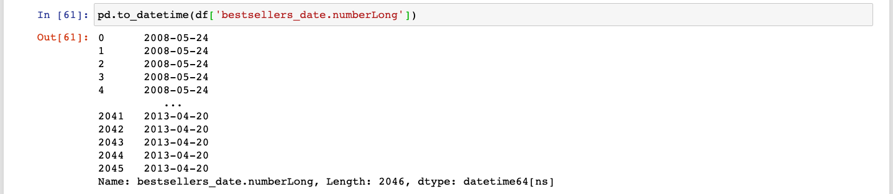

Si intentamos convertir `published_date.numberLong` obtenemos el siguiente resultado:

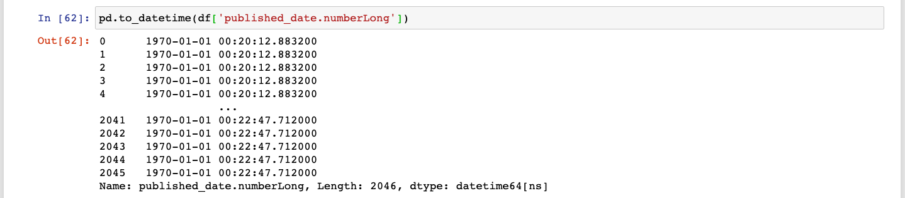

Ok, eso está un poco raro... ¿1970? Lo que está sucediendo es que `pandas` no está seguro de cuál es la unidad que estamos usando. El default es asumir que la fecha está representada en 'nanosegundos' desde "la Época", pero la fecha que nosotros tenemos está en milisegundos. Vamos a darle esa información a `pandas` de manera explícita:

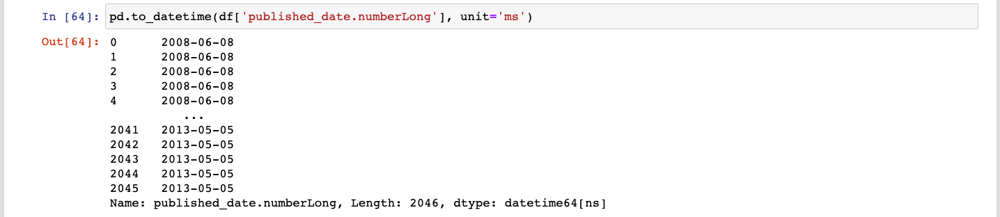

¡Listo! Ahora vamos a asignar los resultados a nuestro `DataFrame`:

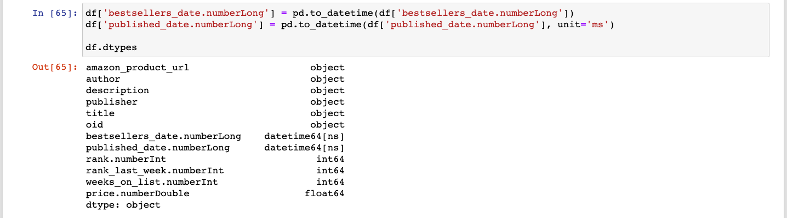

Qué belleza.

Para terminar esta fase, voy a cambiar los nombres de las columnas para que no incluyan los tipos de datos:

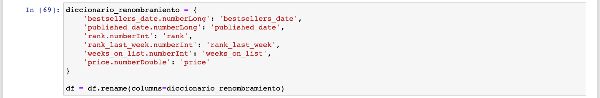

### Manipulación de `strings`

Las `strings` son un bicho raro y requieren a veces de mucho trabajo para ser limpiadas y estructuradas de manera que resulten útiles para nuestros análisis. Es por eso que hay toda una serie de herramientas especializadas en trabajar con `strings`. Vamos a conocer algunas de ellas en este momento.

#### `replace` y `strip`

Comencemos viendo qué hay dentro de nuestra columna `description`:

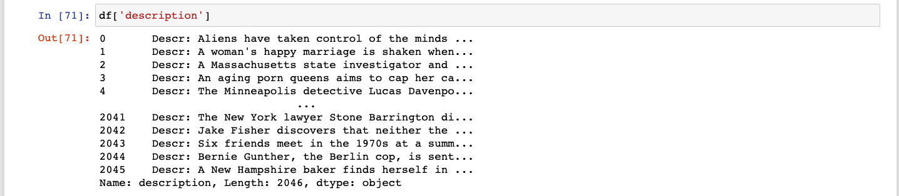

Todas las `strings` comienzan con el texto 'Descr:' que es en realidad bastante redundante puesto que pertenecen a la columna `description`. Podemos remover esa parte del texto usando el método `replace` de la propiedad `str` de nuestra `Serie`. Dentro de la propiedad `str` podemos encontrar muchos métodos que sirven para realizar manipulación de `strings` en nuestras `Series`. El método `replace` recibe la secuencia de caracteres que queremos buscar en nuestras `strings` y también la secuencia de caracteres que queremos usar para reemplazarla. En este caso, vamos a reemplazar 'Descr:' por una `string` vacía (`''`):

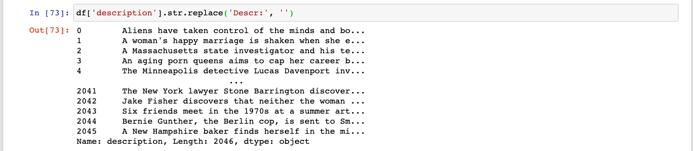

Tan fácil como eso. Recuerda siempre reasignar tu resultado para modificar el `DataFrame` original:

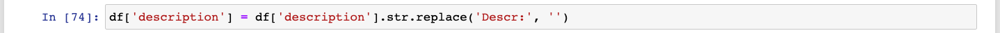

Revisemos una sola de nuestras `strings` para ver si ya tienen el formato adecuado:

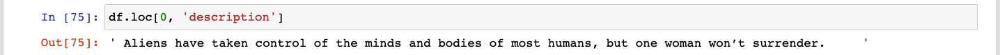

Interesante... Parece ser que hay espacios vacíos al principio y al final de la `string`. Obviamente no queremos eso. Afortunadamente, `str` también ofrece un método para remover espacios vacíos al principio y al final de una `string`:

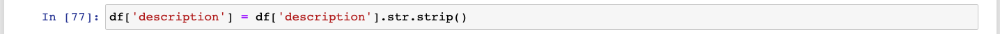

Veamos ahora la `string` que revisamos anteriormente:

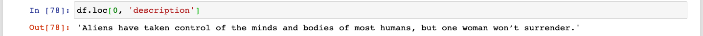

Perfecto. La columna 'description' está lista.

#### `title`, `upper`, `lower`

Los métodos `title`, `upper` y `lower` pueden ser utilizados para modificar el patrón de mayúsculas y minúsculas en una `string`.  `title` convierte a mayúsculas la primera letra de cada palabra y a minúsculas el resto; `upper` convierte todo a mayúsculas; y `lower` todo a minúsculas.

Tenemos una columna llamada "title" que tiene los títulos de nuestros libros. Pero los títulos están todos en mayúsculas:

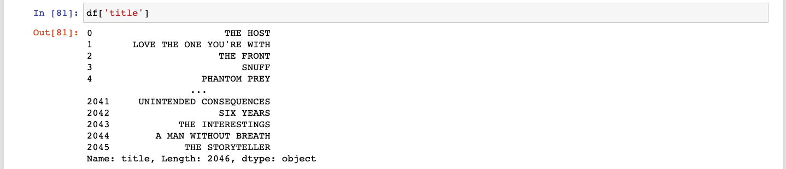

Podemos darles un formato más adecuado usando el método `title`:

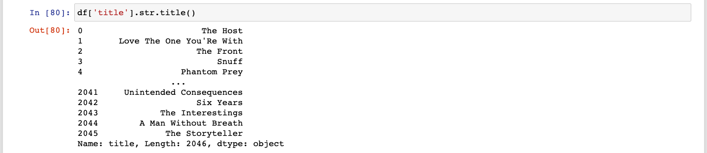

Asignemos nuestra nueva `Serie` al `DataFrame` original y estamos listos:

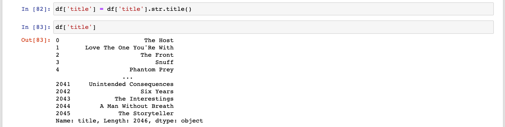

#### `split`

Hay veces que tienes una `string` y lo que quieres hacer es dividirla en varias partes. Para dividir una `string` tienes que saber cuál es el "separador" o "delimitador" que será usado para realizar la división. Cada vez que dicho "separador" es encontrado, la `string` se separa en ese punto específico y la parte anterior y posterior al "separador" se vuelven independientes. Esto puede suceder una vez o múltiples veces a través de la `string`.  Una vez que todas las divisiones se realizan, se regresa una `lista` que contiene todas las partes segmentadas.

Digamos que queremos separar la columna `author` en dos columnas: `autor_first_name` y `author_last_name`. La columna `author` tiene todos los datos que queremos (el primer nombre y el apellido). El separador en este caso es un espacio vacío, ya que es lo que está dividiendo el primer nombre del apellido. Podríamos entonces separar estos nombres en dos usando el método `split`:

Usamos el identificador regex `\s` que significa "espacios vacíos"  para encontrar todos los espacios vacíos y separar la `string` a partir de los hallazgos. Como puedes ver, obtenemos una `Serie` cuyos valores son `strings` con formato de `listas` que contienen los dos valores obtenidos a partir de la separación. Para obtener dos columnas que contengan esos valores, en vez de una sola, podemos usar la bandera `expand=True`:

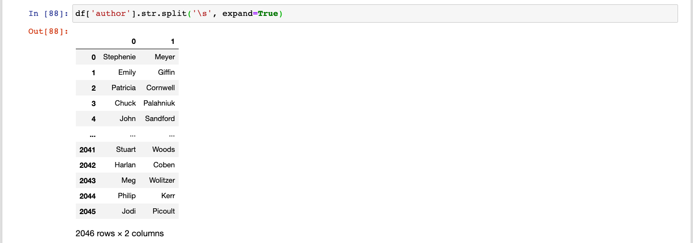

Ahora, podemos agregarla a nuestro `DataFrame` usando una doble asignación:

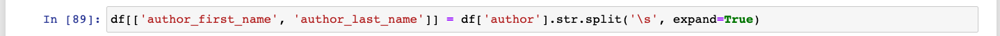

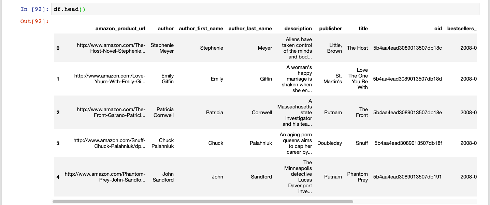

### Aplicando funciones y mappeos a nuestro `DataFrame`

Otra manera de transformar nuestros datos es usando funciones y mappeos. ¿Recuerdas la función `map`? ¿Y las funciones vectorizadas? Bueno, pues eso era tansformación de datos. Ahora vamos a ver un par de métodos que permiten transformar datos aplicando mapas o funciones custom.

#### `map`

`map` es un método de `Series` que sirve para sustituir un valor con otro valor. Hay dos maneras de especificar la sustitución: usando un "mapa" o usando una función. Un "mapa" es básicamente un `diccionario` que "mappea" de un valor a otro valor. Entra un valor (la "llave") y sale otro valor (el "valor" que corresponde a dicha "llave"). Por ejemplo, digamos que queremos mappear los valores de la columna 'rank' de `ints` a letras. En la vida real esto tal vez no sería la mejor idea, pero es un ejemplo de juguete.

Primero tenemos que ver qué valores tenemos en esa columna:

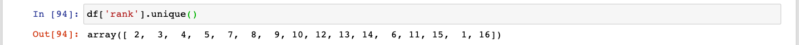

Usando el agregador `unique` podemos ver todos los valores únicos que tenemo en esa columna. Ahora vamos a crear nuestro mapa:

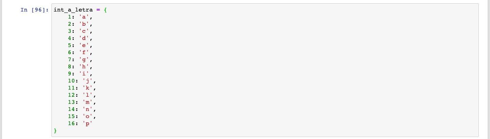

Ahora usemos el método `map` para transformar nuestros datos:

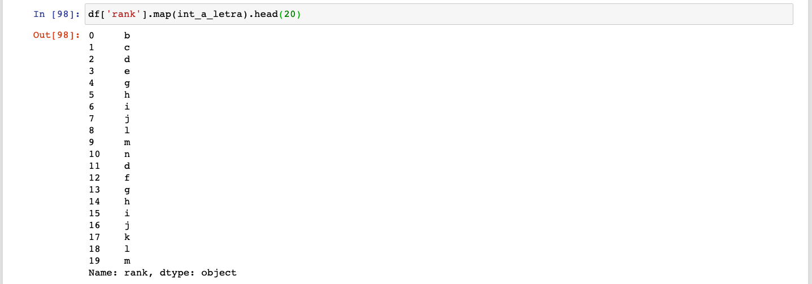

Excelente.

`map` también puede recibir una función que sea el "mapa". Una función al final de cuentas también "mappea" un valor con otro valor. En este caso, un `diccionario` es definitivamente mucho más eficiente. Pero podríamos haber realizado la transformación usando una función:

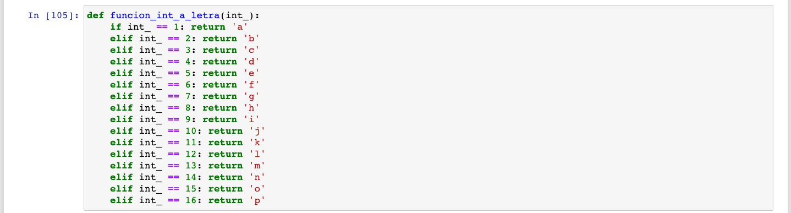

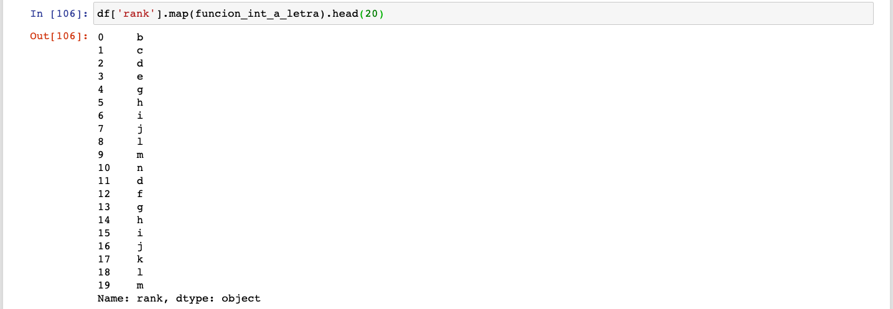

Obviamente en este caso usar una función es algo absurdo, pero el ejemplo sirve para que comprendas la idea.

#### `apply`

También podemos usar la función `apply` para aplicar una función a una `Serie` o a un `DataFrame`. Si la aplicamos a una `Serie`, podemos aplicar una función "elemento por elemento" o como agregación. Si la aplicamos a un `DataFrame` podemos elegir si aplicarla a través del `axis 0` (aplicar la función a cada columna) o a través del `axis 1`(a cada fila).

Digamos que queremos crear una columna llamada `gender_in_description` que contenga 'Women' si la palabra 'woman' o 'women' aparece en la columna `description`; 'Men' si `description` contiene la palabra 'man' o 'men'; 'Both' si ambos géneros aparecen en `description`; o 'Neither' si ninguna de estas palabras está contenida en la descripción.

Podríamos generar esa columna aplicando una función custom a la columna `description`. Primero voy a crear dos objetos `regex` que sirvan para encontrar las palabras que busco (tampoco vamos a hablar de `regex` en este módulo, pero si quieres profundizar puedes ir [aquí](https://robologs.net/2019/05/05/como-utilizar-expresiones-regulares-regex-en-python/)):

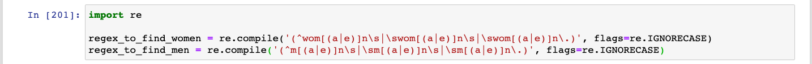

Ahora, voy a crear una función que revise una `string` y me regrese qué género está presente en dicha `string`:

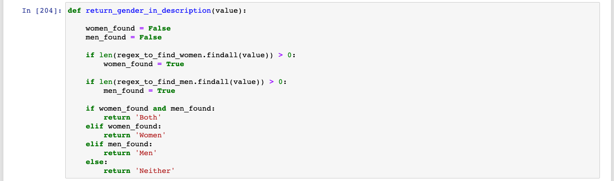

Mira qué pasa si aplicamos la función a la columna `description` (la función se aplica "elemento por elemento" y regresa una `Serie` de la misma longitud que la `Serie` original):

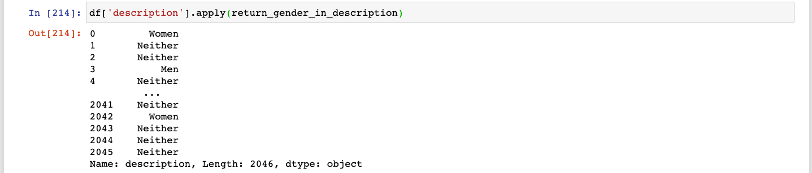

¡Genial!

Ahora, vamos a asignarla a nuestro `DataFrame` con el nombre `gender_in_description`:

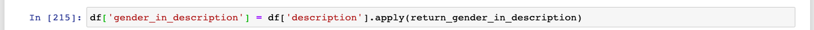

Podemos revisar si todo salió bien filtrando nuestro `DataFrame` para obtener las filas donde `gender_in_description` sea igual a 'Both':

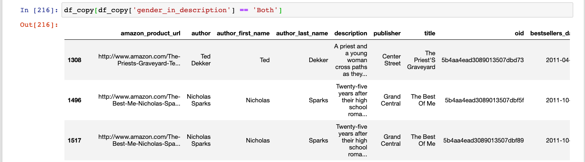

Y ahora veamos la descripción de una de las filas que debería de tener ambos géneros en la descripción:

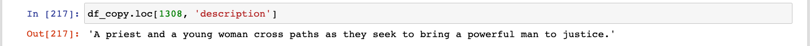

¡Éxito!

Creo que ya hemos hablado mucho de filtros como para no revisarlos. Vamos a ver cómo funcionan entonces.

### Filtros

Los filtros sirven para filtrar nuestro `DataFrame` (duh).

Primero, usamos un `operador de comparación` para realizar una comparación "elemento por elemento" de alguna `Serie`. Por ejemplo, vamos a ver el filtro que acabamos de usar:

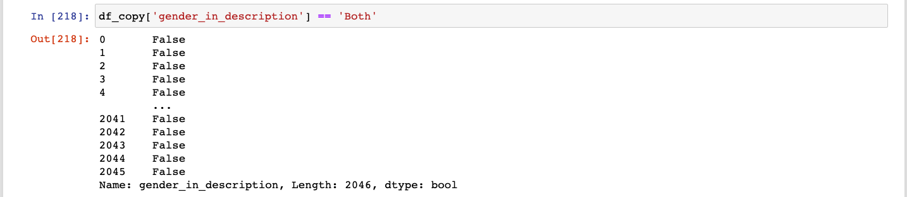

Al realizar la comparación lo que obtenemos de regreso es una `Serie` con la misma longitud que la `Serie` original. La comparación se aplica "elemento por elemento", cuando la comparación es cierta, regresamos `True`, cuando es false, regresamos `False`. Entonces lo que obtenemos es una `Serie` con `Trues` y `Falses` que nos indica en qué índices la comparación fue cierta y en cuáles no.

Esta "serie-filtro" podemos guardarla en una variable y luego usarla como filtro para pedirle al `DataFrame` **solamente** las filas donde el valor correspondiente sea `True`:

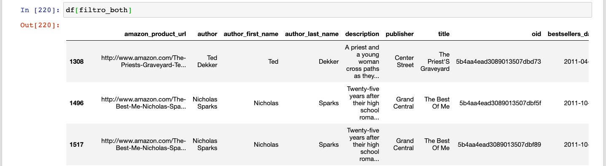

Para saber cuántas filas regresó el filtro podemos usar el método `count`:

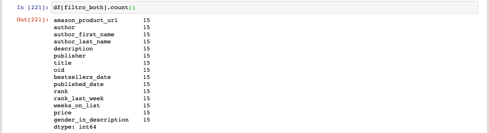

Podemos ver que hay 15 filas (en cada columna, pero son la misma en todas) donde la `gender_in_description` es igual a "Both".

No es necesario asignar el filtro a una variable para después pasarlo al `operador de indexaciòn` del `DataFrame`. Mira cómo aplicamos otro filtro directamente. Este filtro nos regresa las filas donde el nombre en la columna `author_first_name` empiece con la letra 'A':

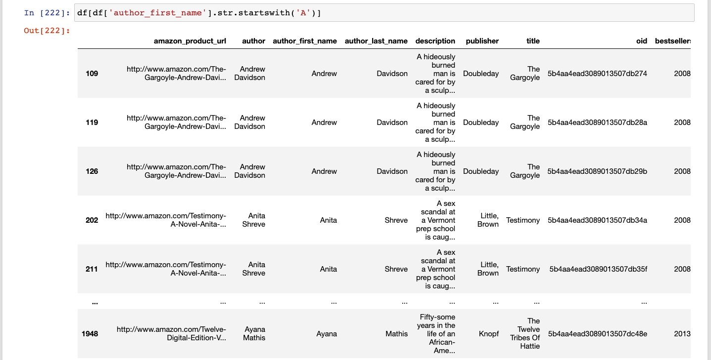

Y este filtro nos regresa todas las filas donde el valor de la columna `price` sea mayor a 20:

Si eres observador, ya te habrás percatado de que hay libros repetidos en nuestros filtros. Esto significa que hay múltiples entradas por libro en nuestro conjunto de datos. Algo que podríamos hacer (en otro momento) sería eliminar los libros duplicados.

Lo último que vamos a ver nos sirve para plantearnos la siguiente pregunta: Si tengo todos los libros con un precio mayor a 20, ¿cuál es el libro más caro de todos?

### `sort`

Una de las maneras en las que podríamos responder esta pregunta es filtrando nuestro `DataFrame` para obtener los libros cuyo precio sea mayor a 20 y después ordenarlos del mayor valor al menor valor en `price` (es decir, en orden descendente). Si hacemos esto, la primera fila de nuestro `DataFrame` resultante va a contener el libro más caro de todos:

Como puedes, esto se logra usando el método `sort_values` que recibe el nombre de la columna que quieres usar para ordenar tu `DataFrame` y luego una bandera `ascending` para indicar si quieres orden "ascendente"  o "descendente".

También podríamos ordenar nuestro `DataFrame` para ver cuáles fueron los 5 libros que se mantuvieron más tiempo en la lista de "best sellers":

¡108 semanas! ¡Felicidades, Kathryn Stockett! Como puedes, el misterio ha sido revelado. Hay una entrada en nuestro `DataFrame` por cada semana en la que un libro fue "best seller". Es por eso que "The Help" aparece en las 5 primeras entradas: porque no hay ningún otro libro que haya estado más de 104 semanas como "best seller".

---

## Quiz

1. ¿Qué método usarías para convertir una columna a valores numéricos si es probable que en esa columna haya valores que no pueda ser convertidos a valores numéricos?

a) `astype`
b) `force_numeric`
**c) `to_numeric`**
d) `to_int`
e) `coerce`

2. Describe con tus propias palabras qué significa "Tiempo Unix" (tiene que ver con fechas y horas).

3. ¿Qué método usaría si quisiera dividir todas las `strings` de una columna usando `,` como separador?

a) df['columna'].str.strip(',')
b) df['columna'].split(',')
c) ','.split(df['columna'])
**d) df['columna'].str.split(',')**
e) df['columna'].str.split_by(',')

4. ¿Qué código usaría si quisiera ordenar descendentemente mi `DataFrame` usando la columna 'valores'?

a) df.sort_values('valores')
b) df.sort_by('valores', asc=True)
**c) df.sort_values('valores', ascending=False)**
d) pd.sort(df, by='valores', ascending=False)
e) df.sort_index(drop=True)

5. ¿Qué código usaría para filtrar mi `DataFrame` por valores mayores a 50 y obtener un conteo de cuántas entradas quedaron?

a) df[df['valores'] > 50].sum()
b) (df['valores'] > 50).count()
c) df['valores'].count() > 50
d) df.max(50).count()
**e) df[df['valores'] > 50].count()**
