
<strong>Curso Data Analysis - Módulo 4 PREWORK de Bases de datos, merge y agrupaciones</strong>

<strong>PREWORK SESIÓN 8</strong>

### Introducción

¡Felicidades! Has llegado a la última sesión de este módulo. En esta última sesión vamos a trabajar con otra fuente de adquisición de datos con la que probablemente te toparás muy seguido: las bases de datos. Vamos a aprender a leer datos de una base de datos MySQL y a convertirlos a `DataFrames`. Recuerda que la maravilla de los `DataFrames` es que una vez que tus datos se encuentran en ese formato todas las técnicas que hemos aprendido durante este curso se pueden aplicar de manera idéntica.

También vamos a aprovechar que el dataset de esta sesión está dividido en múltiples tablas para aprender a unir `DataFrames` usando el método `merge`.

Vamos a finalizar con una de las herramientas más poderosas que nos ofrece `pandas`: las agrupaciones. Vamos a aprender a agrupar y a agregar nuestros grupos para obtener nuevos `DataFrames` e información útil.

#### Objetivos

- Leer una base de datos MySQL usando un programa de Python.
- Convertir datos provenientes de una base de datos en `DataFrames`.
- Unir múltiples tablas usando el método `merge`.
- Usar `grouby` para agrupar nuestros datos.
- Aplicar agregaciones a nuestros grupos.

### MySQL

Como seguramente ya sabrás, MySQL es un Sistema de Gestión de Bases de Datos. Según [Wikipedia](https://es.wikipedia.org/wiki/Base_de_datos), una base de datos es "un conjunto de datos pertenecientes a un mismo contexto y almacenados sistemáticamente para su posterior uso". Cuando estés trabajando en startups o compañías más grandes, trabajando en proyectos a largo plazo o colaborando con científicos en sus investigaciones, muy probablemente te toparás con la necesidad de almacenar grandes cantidades de datos de una manera que permita el fácil acceso. Usar un SGBD, como MySQL, PostgreSQL, MariaDB, MongoDB, etc, va a ser la mejor opción. Esto se debe a que un SGBD puede correr no solamente en tu computadora local, sino en un servidor remoto. Al tener tu base de datos disponible en un servidor, tanto tú como los demás miembros de tu equipo pueden tener acceso a los datos rápidamente.

El día de hoy vamos a estar trabajando con una base de datos que está almacenada en un servidor remoto. Todos los procesos de adquisición de datos se realizarán a través de una librería que permite la conexión entre mi programa y el SGBD.

#### MySQL Connector

Para conectarnos a una base de datos, lo primero que necesitamos es, obviamente, un Sistema de Gestión de Bases de Datos que esté corriendo en algún servidor y que contenga los datos que queremos obtener. Para este Prework me voy a conectar a una instancia de MySQL que está corriendo en mi computadora en un servidor local. Durante el Work trabajarás con una base de datos que ha sido instanciada en un servidor remoto.

La base de datos con la que vamos a trabajar proviene del siguiente link: [Movielens dataset](http://files.grouplens.org/datasets/movielens/). Vamos a utilizar el conjunto de datos llamado `ml-1m`. Este dataset contiene 3 tablas: "movies", "users" y "ratings".

La tabla "movies" contiene datos acerca de películas y sus géneros. La tabla "users" contiene datos acerca de algunos usuarios que realizaron valoraciones (ratings) de dichas películas. Finalmente, la tabla "ratings" contiene los datos de dichas valoraciones.

Otras dos tablas fueron creadas en la base de datos para tener cierta información de decodificación de algunas de las columnas de la tabla "users". Estas tablas llevan como nombre "age_ranges" y "occupations".

Vamos a utilizar la librería MySQL Connector para realizar la conexión a la base de datos. Instala la librería corriendo el siguiente comando:

`!pip install mysql-connector-python`

Ahora, en nuestro programa de Python, tenemos que importar la librería:

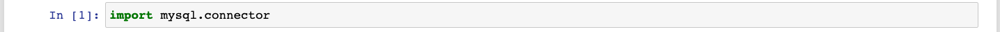

Ahora, para conectarnos a la base de datos, necesitas cierta información acerca del servidor que está corriendo la base de datos y el usuario que tiene acceso a ella. Más específicamente, `mysql.connector` te pide el `host` y `port` (el `dominio` y `puerto` donde está corriendo tu servidor), el `user` (el usuario o uno de los usuarios que tiene permiso de acceso a la base de datos), la `password` (la contraseña de dicho usuario) y la `database` (la base de datos almacenada en MySQL a la que queremos acceder). En el caso de mi servidor local, ésta es la información adecuada:

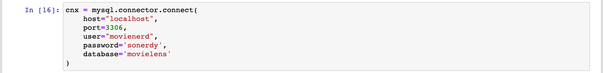

Ya que la conexión está realizada, tengo que crear un objeto `cursor`, que es el encargado de realizar las operaciones de consulta y modificación de la base de datos:

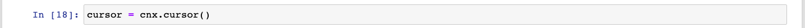

Ahora podemos simplemente utilizar este objeto `cursor` para correr código SQL y realizar operaciones con nuestra base de datos. Lenguaje SQL no es el tema de este módulo, pero basta con conocer un solo comando para poder solicitar la información contenida en una de las tablas de nuestra base de datos:

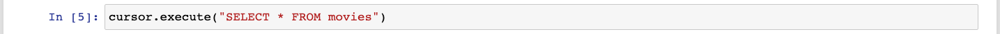

El comando `SELECT * FROM nombre_de_la_tabla` sirve para pedir **todas** (`*`) las entradas en la tabla `nombre_de_la_tabla`. Usualmente el lenguaje SQL se utiliza también para filtrar y estructurar nuestros datos, pero nosotros vamos a realizar esos procesos con `pandas`. Una vez que el comando SQL ha sido ejecutado, podemos usar el método `fetchall` para obtener nuestros datos:

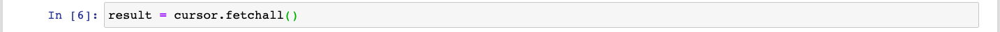

Después, hay que cerrar nuestro `cursor` ya que hayamos terminado:

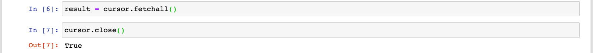

Ahora, ¿qué es lo que hay almacenado en nuestra variable `result`? Vamos a ver el tipo de dato:

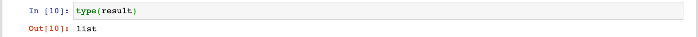

¡Es una lista!

Veamos el primer elemento de nuestra lista:

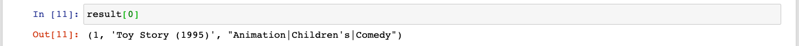

Es una `tupla`. Una `tupla` es un tipo de estructura de datos de Python que es básicamente una `lista` que no puede ser modificada. Afortunadamente, `pandas` puede recibir `listas` de `tuplas` como input para crear `DataFrames`. Lo único que necesita es que le digamos el nombre de cada columna al momento de crear el `DataFrame`. Dicha información acerca de las tablas viene incluida en el [Readme del dataset](../Datasets/Movielens/Readme.md) . Vamos entonces a crear nuestro `DataFrame` usando los datos obtenidos:

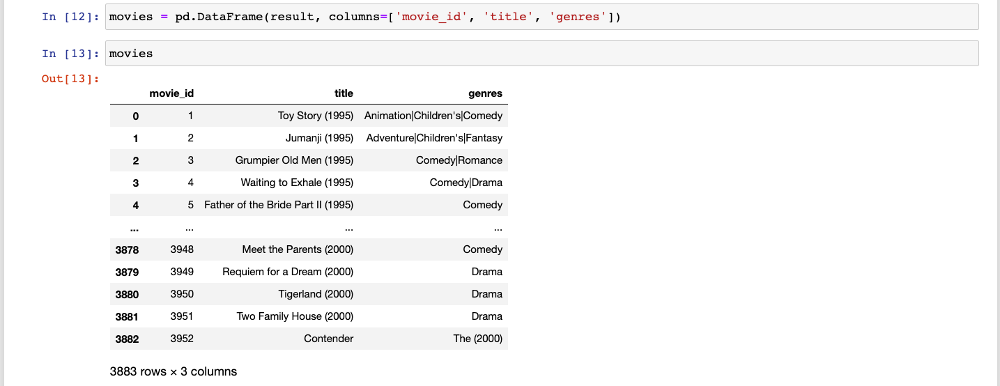

¡Éxito!

Vamos entonces a usar el mismo proceso para adquirir todas las tablas que hay en nuestro dataset y convertirlas a `DataFrames`:

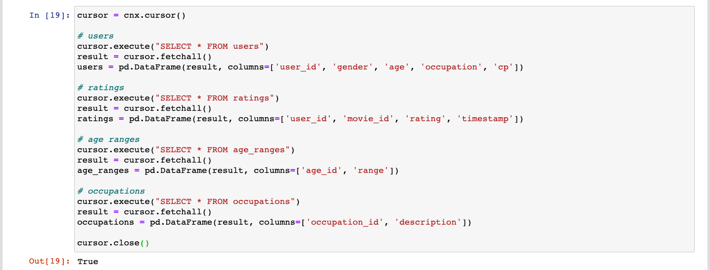

¿Viste qué sencillo?

Ahora tenemos todas nuestras tablas hechas `DataFrames`. Vamos a aprender cómo lidiar con datos fragmentados como estos a continuación.

### `merge`

Ya aprendimos a concatenar `DataFrames` usando el método `concat`. Ahora vamos a conocer `merge` que nos permite realizar uniones entre `DataFrames` de una manera muy similar a como funcionan los `joins` en SQL.

Primero vamos a ver qué hay dentro de algunas de nuestras tablas:

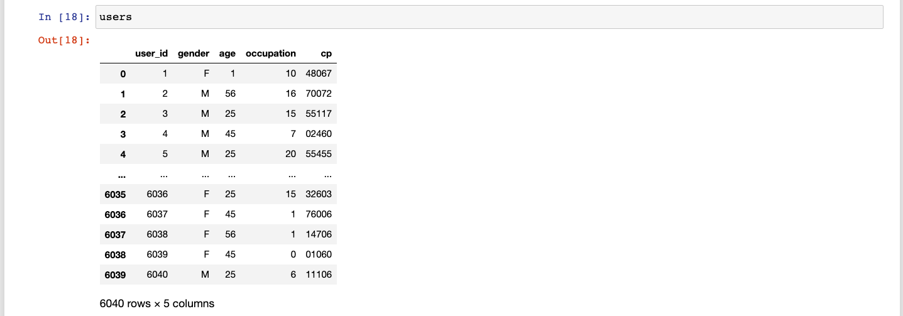

Tenemos 6040 entradas de usuarios con diversos datos acerca de ellos. Pero tenemos, por ejemplo, una columna "occupation" que sólo contienen `ids`, no los nombres reales de las ocupaciones. Por suerte tenemos otra tabla llamada `occupations` que contiene esa información:

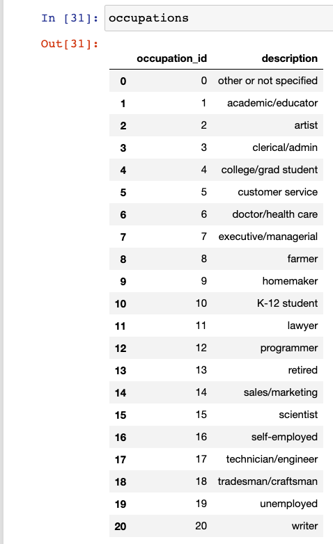

Primero que nada, me he percatado de que `user_id` y `occupation_id` podrían ser los índices de sus respectivos `DataFrames`. Voy a modificarlos para que así sea y evitar tener información redundante:

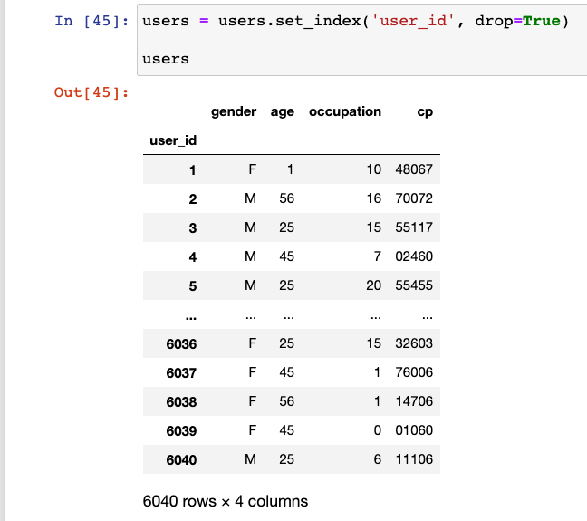

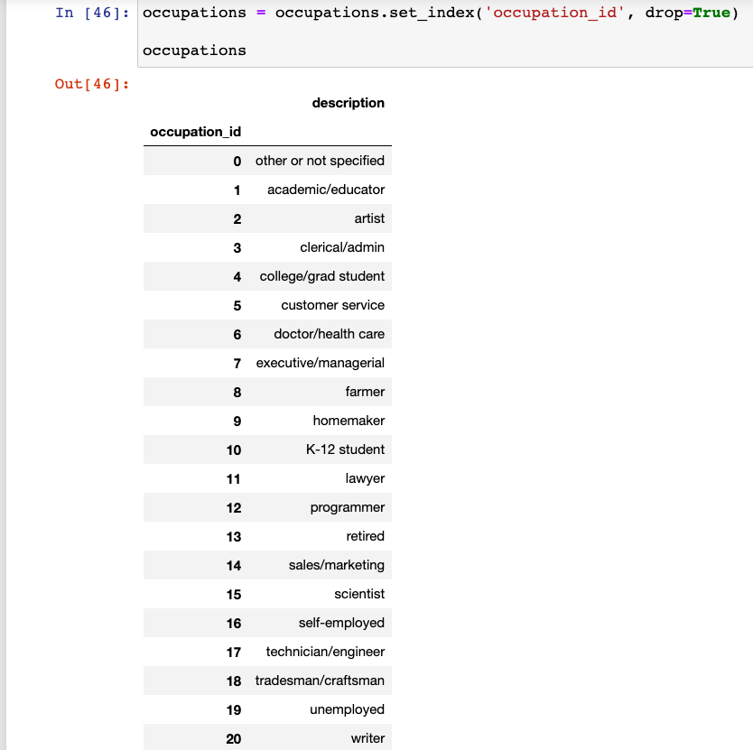

Ahora, realizamos el `merge` de la siguiente manera:

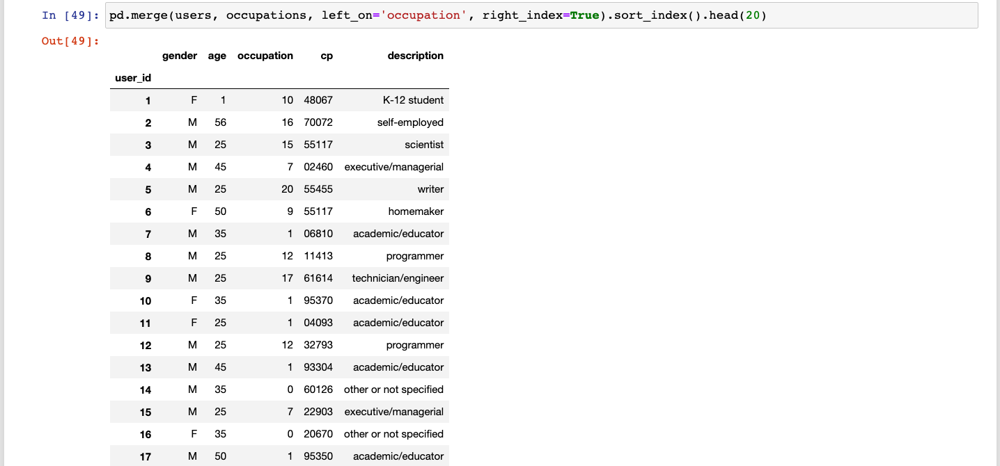

Lo que hicimos entonces fue lo siguiente:

1. Usamos el método `pd.merge`.
2. Le pasamos el `DataFrame` `users` como "left".
3. Le pasamos el `DataFrame` `occupations` como "right".
4. Le indicamos que la tabla "left" va a usar la columna `occupation` para hacer el merge (`left_on='occupation'`).
5. Le indicamos que la tabla "right" va a usar el índice para hacer el merge (`right_index=True`).
6. Ordenamos el resultado por índice de manera ascendente.

`pd.merge` hace por default un 'left join' que básicamente significa que la tabla "right" es la que se agrega a la tabla "left" y no al revés. Vamos a guardar nuestro resultado y a renombrar algunas columnas para que tengan más sentido:

Ahora, sabemos por el Readme.md que la columna `age` no indica en realidad la edad del usuario sino que es un código que indica en realidad un rango de edades. Los rangos de edades están en la tabla `age_ranges`, así que vamos a agregarlos:

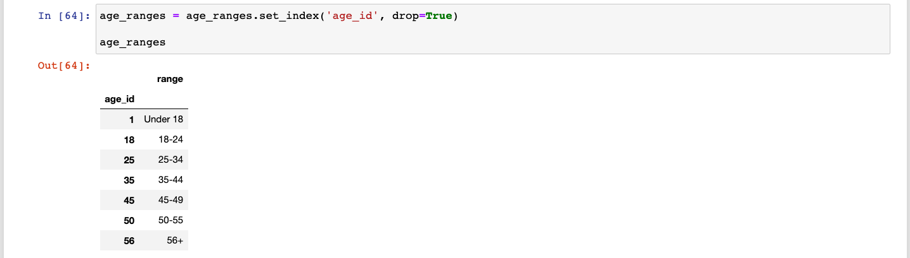

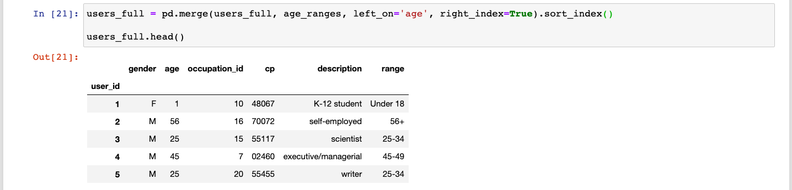

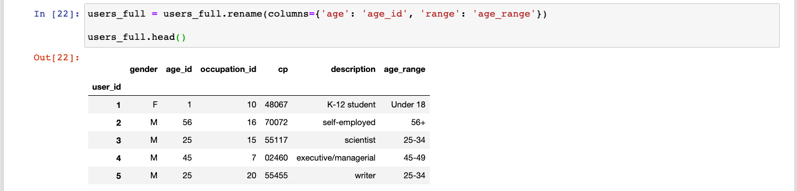

Interesante, ¿no es así?

En este dataset tenemos varias categorías. Todavía ni siquiera hemos revisado las tablas `ratings` y `movies` (ésas se quedarán pendientes para los Retos), pero tan sólo en nuestro `DataFrame` `users` tenemos 3 categorías:

1. `gender`
2. `age_range`
3. `occupation`

Ahora que ya hemos aprendido a *unir* `DataFrames`, vamos a aprender una de las técnicas que tenemos para *segmentar* `DataFrames` por categorías. Veremos cómo un dataset tiene en realidad múltiples perspectivas y "dice" diferentes cosas dependiendo de cómo esté estructurado.

### `GroupBy`

Hay múltiples formas de segmentar y dividir `DataFrames`. Una de ellas ya la hemos usado varias veces: los `filtros`. Existe otra manera que implica agrupar nuestros `DataFrames` por categorías usando el método `groupby`.

Por ejemplo, digamos que queremos segmentar nuestro `DataFrame` `users` por la columna `gender`. El primer paso sería hacer esto:

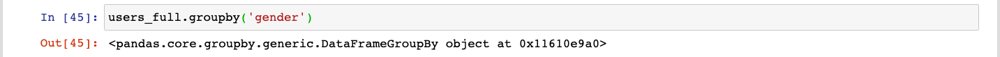

Ok... ¿y eso en qué nos ayuda? Ese objeto tiene la información necesaria para segmentar nuestro dataset usando la columna `gender`.

Ahora, tenemos que elegir qué columna (o columnas) queremos de regreso en cada grupo:

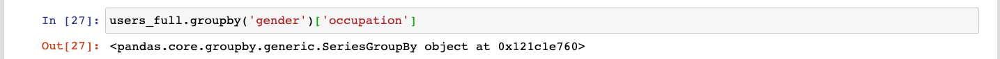

Y para finalizar, tenemos que aplicar una función agregadora. ¿Recuerdas las `agregaciones` y `reducciones` que vimos anteriormente? Bueno, pues ésas son las funciones que podemos utilizar para agregar los datos de cada uno de nuestros grupos. Por ejemplo:

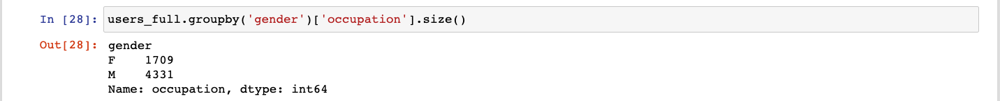

`size` nos dice el tamaño de nuestros grupos. En este caso la columna `occupation` fue irrelevante, pero logramos obtener un conteo de cuántos hombres y cuántas mujeres hay en nuestro dataset.

Ahora podríamos hacer un conteo de cuántas mujeres y cuántos hombres tienen una cierta ocupación en nuestro dataset. `value_counts` toma cada una de las categorías en la `Serie` (en este caso `occupation`) y cuenta cuántas veces aparece cada categoría en cada grupo:

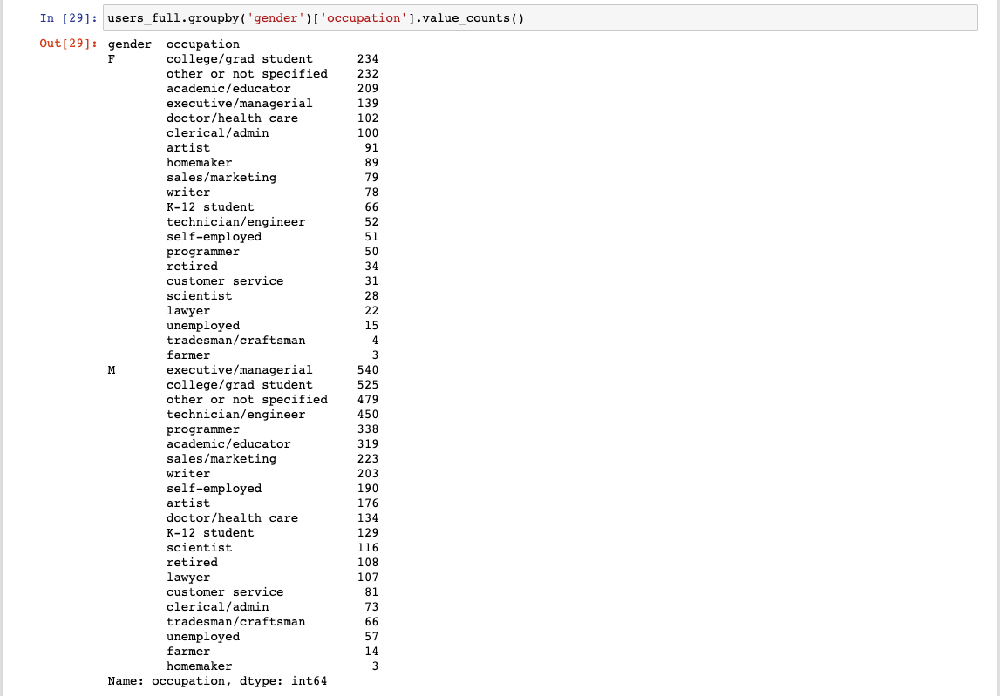

¡Wow!

También podemos agrupar usando múltiples columnas. Por ejemplo, queremos hacer una primera agrupación por `gender` y luego, dentro de cada uno de los grupos, queremos volverlos a agrupar usando `age_range`. Después queremos saber cuántas entradas hay por subgrupo:

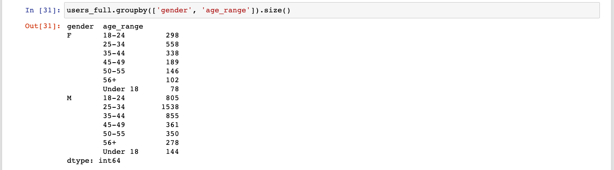

Como puedes ver, obtenemos una `Serie` con un `multiíndice`. Esto quiere decir que para obtener un dato específico tenemos que indexarlo de esta manera:

Sabemos entonces que tenemos 361 hombres ("Male") en el rango de edad de 45 a 49.

Mucho más importante para el tema que nos concierne en este momento. Podríamos dividir nuestro dataset entre un dataset de hombres y otro de mujeres donde tenemos un conteo del número de personas que practican cada una de las ocupaciones:

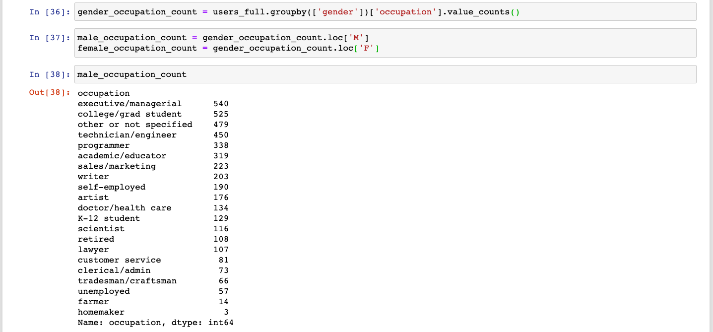

Como ves, hemos creado un dataset distinto a partir de nuestro dataset original. Este nuevo dataset podría ser utilizado para visualizar, por ejemplo, cuántas personas tienen cada ocupación por género (eso lo haremos en alguno de nuestros Retos).

Ahora, no todas las funciones pueden ser utilizadas como agregaciones directamente, ya que no todas están implementadas en los objetos `groupby`. Pero podemos aumentar las posibilidades utilizando el método `agg`.

#### `agg`

Podemos nosotros utilizar algunas funciones que no están implementadas directamente, pasándole al método `agg` una función que tome una `Serie` o `DataFrame` como input y regrese una agregación. Por ejemplo, la función `pd.Series.mode` que nos regresa la categoría que más veces aparece dentro de nuestro grupo:

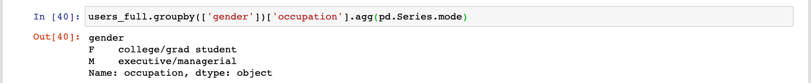

También podemos usar `agg` para aplicar varias funciones a nuestra `Serie` o `DataFrame`. Por ejemplo, vamos a computar el promedio, la desviación estándar y la mediana de las edades de nuestros usuarios (**Por supuesto, en este caso estos cálculos no son correctos, ya que estamos utilizando códigos de edad que se refieren a rangos no a edades específicas**):

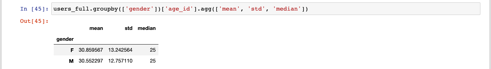

Como ves, le pase a `agg` los nombres de las funciones como `strings` y aún así entendió qué es lo que quería.

También puedo usar `agg` para aplicarle funciones agregadoras a más de una columna en mi tabla:

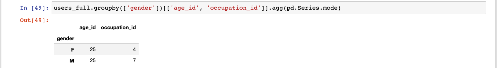

---

Lo importante de todo esto es la posibilidad que tenemos de segmentar nuestro dataset y generar información nueva usando agregaciones. Normalmente lo que haríamos con esta información nueva sería visualizarla de algún modo, y ya verás algunos ejemplos de eso durante la clase.

En esta sesión vimos poca información nueva. Esto se debe a que durante la clase haremos algunas prácticas un poco más extensas cuyo objetivo será aprovechar muchas de las herramientas que hemos aprendido durante todo el módulo.

¡Felicidades por haber llegado hasta aquí! La constancia y la disciplina son el único camino posible para convertirte en un gran Científico de Datos. Esperamos verte en el próximo módulo, donde tomaremos algunos datasets que ya han sido procesados (limpiados, transformados y estructurados) y los convertiremos en información estadística valiosa y hermosas visualizaciones.
